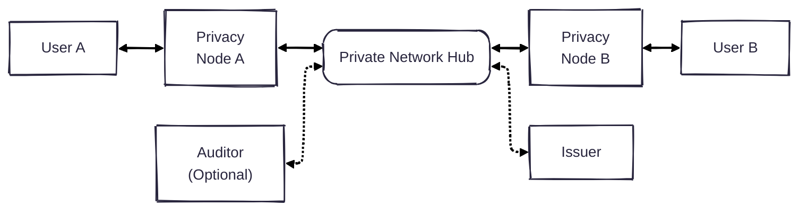

# Enygma
At Rayls, we have created a new suite of privacy protocols, which we call Enygma. There are two variants: 

* [Enygma Payments](./enygma_payments) (Account-based)
* [Enygma Retail Payments](./enygma_retail_payments) (UTXO-based)
* [Enygma Delivery-vs-Payment (DvP)](./enygma_dvp) (UTXO-based)

## System Architecture

* **Users**: Traditional users of the system who want to transact with other users. 

* **Privacy Node(s)**: High-performance single node EVM blockchain(s) designed to support the needs of financial institutions and high-throughput. 

* **Private Network Hub**: Underlying blockchain that acts as a global ledger, (ZK) verifier, and bulletin board for Privacy Nodes to use for transactions and (encrypted) communications. 

* **Auditor** (optional): The auditor is an entity that oversees the transactions that take place in the system. This exists solely in case the system is deployed in a permissioned setting with the involvement of financial institutions. We note that the auditor only has a complete view of transactions that happen in the network iff the participants share the 'view' key with the auditor. We note that the auditor has no ability to spend funds on behalf of any system entity.

* **Issuer**: Entity that issues and is the admin of a specific token. In specific settings, the issuer may also be the auditor (e.g., a government entity issues a token that must follow strict compliance rules). 

### Adversarial Model
We assume that the Private Network Hub runs a Byzantine Fault Tolerant consensus and provides both safety and liveness. 

We assume an active network adversary with complete view of the network. Therefore, the adversary actively tries to infer which parties are transacting given the inboud/outbound messages in the system. 

We assume every Privacy Node runs a full node of the underlying blockchain (i.e., the Private Network Hub). As a result, Privacy Nodes can always have access to the latest block(s) of the Private Network Hub. As a result, Privacy Nodes can also perform a trivial Private Information Retrieval (PIR) protocol that downloads the latest block and executes lookups locally on their own database. This ensures that, when trying to obtain information for a specific transaction, the Privacy Nodes do not reveal which item is being queried, thus ensuring that any sensitive information involving which data is being queried is never leaked to external parties. 

Additionally, if present, we assume that the auditor is honest/trusted. In other words, the auditor will ensure the privacy of all the key material and sensitive data that falls under their responsibility. 

## Helpful Mental Model
If the reader is familiar with the Ethereum ecosystem, the easiest way to think about our approach is probably the following:

The Private Network Hub is equivalent to an underlying L1. The Privacy Nodes are effectively high-performance custom (validium) L2s. The balance (aka TVL) of each L2 is in the underlying L1 in a shielded manner to ensure the privacy of each institution. Moreover, all of the different shielded balances are recorded in a single L1 contract to ensure the liquidity is unified, as opposed to fragmented across different contracts. This approach ensures that entities can quickly transact with each other without very expensive operations on the underlying L1. 
