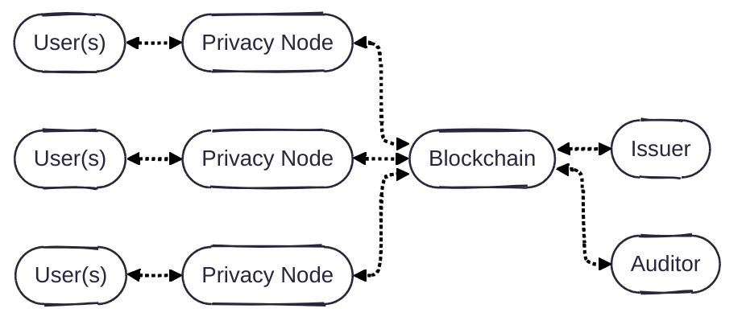
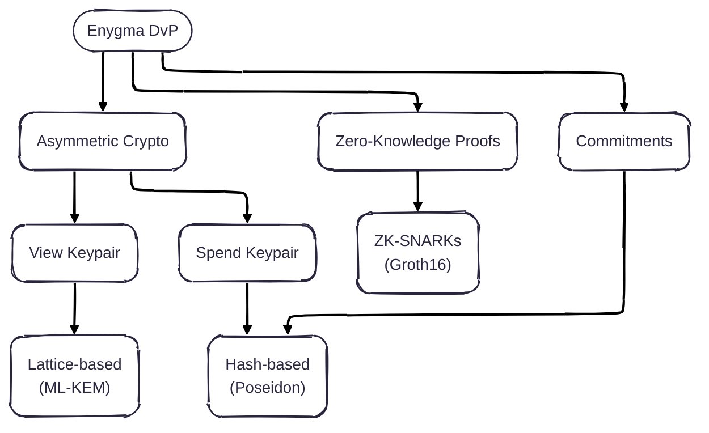

# Enygma Delivery-vs-Payment (DvP)

## System Architecture
Our system is simple: **users** (e.g., a bank customers) are directly connected to **privacy nodes** (i.e., a high-performance single-node EVM blockchain). Each of the privacy nodes, is connected to a **private network hub**, which effectively acts as a bulletin board for all privacy nodes to leverage as a universal (encrypted) messaging layer and verification layer. **Issuer(s)** are the managers/admins of specific assets on the private network hub. Optionally, there is an **auditor** that oversees (some of) the transactions that take place in the network. A more formal protocol description is documented [here](./protocol_description.md).




## Cryptographic Primitives



Note: We intend to update the ZK module to use a quantum-secure ZK scheme, which will make the entire system quantum-secure (as opposed to quantum-private). We also intend to leverage the ability of having [Single-Server Private Outsourcing of zk-SNARKs
](https://eprint.iacr.org/2025/2113) to allow clients to submit ZK proofs to the Private Network Hub component of the system without incurring in unnecessary hardware costs. 

## Repository Structure

```
enygma_dvp/
├── contracts/          Solidity smart contracts (Hardhat project)
├── artifacts/          Hardhat compilation outputs — DO NOT overwrite PoseidonT3/T5 (see Poseidon.sol)
├── build/              Deployment receipts (receipts.json) + gnark VK exports consumed by init.go
├── src/                Go core library (provers, crypto, Merkle tree, scan helpers)
├── gnark_circuits/     ZK proof server — REST API wrapping gnark Groth16 circuits
├── scripts/            Go deployment and initialization scripts (deploy.go, init.go)
├── test/               Go integration tests (requires Hardhat node + gnark server)
├── docs/               Flow documentation and Mermaid diagrams
├── node_modules/       Node.js packages for Hardhat and circomlibjs (do not delete)
└── hardhat.config.js   Hardhat configuration (network, compiler settings)
```

### Go module layout

Four independent Go modules — no shared `go.work`, each must be built from its own directory.

| Directory | Module name | Depends on |
|-----------|-------------|------------|
| `src/` | `enygma_dvp/src_go` | external only |
| `test/` | `enygma_dvp/test` | `enygma_dvp/src_go` (via `replace => ../src`) |
| `scripts/` | `enygma_dvp` | `enygma_dvp/src_go` (via `replace => ../src`) |
| `gnark_circuits/` | `gnark_server` | external only (gnark, no dependency on src/) |

The `_go` suffix in `enygma_dvp/src_go` disambiguates the Go module from the Solidity
contracts at the same repo root. The folder on disk is `src/`, not `src_go/`.

## Implementation Details
TBD


## Performance
To show that our protocol runs on commodity hardware and does not come with extreme hardware requirements, we measured the performance of our design using a Mac mini M1 from 2020 with 16GB of memory. We obtained the following numbers: 

* **Constraints:** TBD
* **(Groth16) Prover time:** TBD
* **(Groth16) Verifier cost:** TBD

## Peer-Reviewed Publications
TBD
