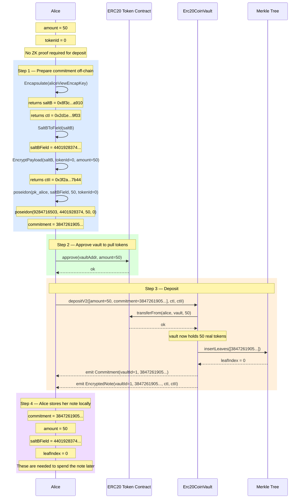

# Flow 01 — ERC20 Deposit

## Overview

The deposit is the entry point into the private note system. Alice locks real ERC20 tokens inside
the vault and registers a cryptographic commitment on-chain. **No ZK proof is required** — the
commitment is computed entirely off-chain and submitted directly.

The result is a single **note** owned by Alice: a leaf in the on-chain Merkle tree that encodes
her balance without revealing it publicly.

---

## Participants

| Participant    | Role                                                             |
| -------------- | ---------------------------------------------------------------- |
| Alice          | Depositor — owns the ERC20 tokens and the resulting private note |
| ERC20 Contract | Holds the real tokens; transfers them to the vault               |
| Erc20CoinVault | Accepts the commitment, inserts the Merkle leaf, emits events    |
| Merkle Tree    | On-chain incremental tree; every leaf is a commitment            |

---

## Diagram



---

## Step-by-Step Function Calls

### Step 1 — Prepare commitment off-chain

All computation happens locally on Alice's machine. No network call to the gnark server is needed.

**1.1 — ML-KEM encapsulation**

```
Encapsulate(aliceViewEncapKey)                     src/core/utils.go:216
  mlkem.NewEncapsulationKey768(aliceViewEncapKey)
  ek.Encapsulate()
  → saltB    = 0x8f3c...a910   (32-byte shared secret, kept private)
  → ctI      = 0x2d1e...9f03   (1088-byte capsule, published on-chain)
```

Alice generates a fresh ML-KEM keypair for this note. The capsule `ctI` is published on-chain so
she can recover her own `saltB` later by running `Decapsulate` with her view key.

**1.2 — Reduce saltB to a SNARK field element**

```
SaltBToField(saltB = 0x8f3c...a910)                src/core/utils.go:239
  new(big.Int).Mod(0x8f3c...a910, SNARK_SCALAR_FIELD)
  → saltBField = 4401928374...
```

The raw 32-byte `saltB` is reduced modulo the BN254 scalar field so it can be used inside
Poseidon hashes inside ZK circuits.

**1.3 — Encrypt payload**

```
EncryptPayload(saltB, tokenId=0, amount=50)        src/core/utils.go:317
  chacha20poly1305.New(saltB)
  plaintext = 32-byte tokenId=0 || 32-byte amount=50
  nonce     = 0x3f2a1c...  (random 12 bytes)
  → ctII = 0x3f2a...7b44   (published on-chain)
```

`ctII` lets Alice (or any intended recipient) rediscover the note amount and tokenId by
decrypting with the recovered `saltB`.

**1.4 — Compute commitment**

```
Erc20CommitmentV2(pk_alice, saltBField, amount=50, tokenId=0)
                                                   src/core/utils.go:563
  poseidon.Hash([9284716503..., 4401928374..., 50, 0])
  → commitment = 3847261905...
```

The commitment is a Poseidon hash binding the owner's public key, the salt, the amount, and the
token ID. It reveals nothing about any of those values to an observer.

---

### Step 2 — Approve vault

```
erc20.approve(vaultAddr, amount=50)
```

Standard ERC20 approval. The vault will call `transferFrom` in the next step.

---

### Step 3 — Submit on-chain

**3.1 — Call depositV2**

```
vault.depositV2(                                   Erc20CoinVault.sol:68
  params     = [amount=50, commitment=3847261905...],
  ciphertextI  = 0x2d1e...9f03,
  ciphertextII = 0x3f2a...7b44
)
```

**3.2 — Pull tokens into vault**

```
IERC20.transferFrom(alice, vault, 50)              Erc20CoinVault.sol:76
```

50 real ERC20 tokens move from Alice's wallet to the vault contract. From this point on, the
vault is the custodian.

**3.3 — Insert Merkle leaf**

```
insertLeaves([3847261905...])                       Erc20CoinVault.sol:85
  → leafIndex = 0
```

The commitment is appended to the on-chain incremental Merkle tree. The resulting root changes
and is stored; Alice will need this root when she later generates a transfer proof.

**3.4 — Emit events**

```
emit Commitment(vaultId=1, 3847261905...)           Erc20CoinVault.sol:87
emit EncryptedNote(vaultId=1, 3847261905...,        Erc20CoinVault.sol:88
                   ctI=0x2d1e..., ctII=0x3f2a...)
```

- `Commitment` signals a new leaf was inserted. Indexed by `vaultId` and `commitment`.
- `EncryptedNote` carries the ML-KEM capsule and AEAD payload so Alice can later rediscover
  this note by scanning the chain with her view key.

---

### Step 4 — Alice stores her note locally

Alice must retain the following values to spend this note in a future `transferV2`:

| Value        | How obtained                       | Used for                           |
| ------------ | ---------------------------------- | ---------------------------------- |
| `commitment` | Computed in Step 1.4               | Merkle proof lookup                |
| `saltBField` | Computed in Step 1.2               | Witness `WtSaltsIn` in next proof  |
| `leafIndex`  | From `insertLeaves` return / event | Merkle path generation             |
| `amount`     | Known at deposit time              | Witness `WtValuesIn` in next proof |

Alternatively, Alice can always recover her notes by scanning `EncryptedNote` events and running
`ScanForErc20Notes` (`src/core/scan.go:62`), which calls `Decapsulate` → `DecryptPayload` →
`Erc20CommitmentV2` to verify each note.

---

## What deposit does NOT do

- **No ZK proof** — the commitment is trusted because it is simply a hash. The vault does not
  verify that Alice knows the preimage at deposit time. Soundness comes later at spend time,
  when the transfer proof must open the commitment.
- **No nullifier** — depositing does not spend any existing note.
- **No stMessage** — `stMessage` is only part of the ZK circuit used during transfer/withdraw.

---

## Key contract references

| Symbol               | File                                                    | Line |
| -------------------- | ------------------------------------------------------- | ---- |
| `depositV2`          | `contracts/core/contracts/vaults/Erc20CoinVault.sol`    | 68   |
| `insertLeaves`       | `contracts/core/contracts/vaults/AbstractCoinVault.sol` | —    |
| `emit Commitment`    | `contracts/core/contracts/vaults/Erc20CoinVault.sol`    | 87   |
| `emit EncryptedNote` | `contracts/core/contracts/vaults/Erc20CoinVault.sol`    | 88   |
| `Encapsulate`        | `src/core/utils.go`                                     | 216  |
| `SaltBToField`       | `src/core/utils.go`                                     | 239  |
| `EncryptPayload`     | `src/core/utils.go`                                     | 317  |
| `Erc20CommitmentV2`  | `src/core/utils.go`                                     | 563  |
| `ScanForErc20Notes`  | `src/core/scan.go`                                      | 62   |
