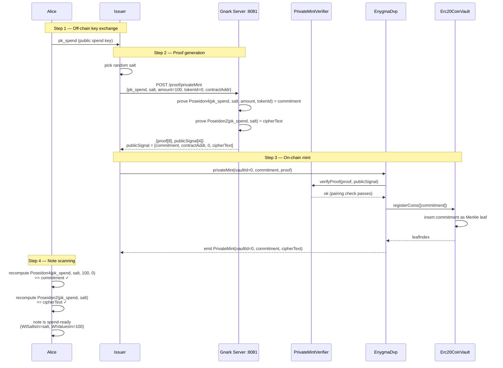

# 01 — ERC20 Private Mint

**Test:** `TestV2Erc20OnChain_PrivateMint`
**File:** `test/01_v2_erc20_private_mint_test.go`

The Issuer privately mints tokens directly into Alice's note without a public on-chain transfer.
No ERC20 `transfer` ever occurs — the token balance appears inside the vault atomically with the ZK proof.

---

## Diagram

---

## Public Signal Layout

| Index | Name | Value |
|-------|------|-------|
| 0 | `commitment` | `Poseidon4(pk_spend, salt, amount, tokenId)` |
| 1 | `contractAddress` | `uint256(EnygmaDvp address)` |
| 2 | _(unused)_ | `0` |
| 3 | `cipherText` | `Poseidon2(pk_spend, salt)` |

## Key Contracts

| Contract | Function | Purpose |
|----------|----------|---------|
| `EnygmaDvp` | `privateMint(vaultId, commitment, proof)` | Entry point; role-gated to DEFAULT_OWNER_ROLE |
| `PrivateMintVerifier` | `verifyProof(proof, publicSignal)` | Groth16 verifier with hardcoded VK |
| `Erc20CoinVault` | `registerCoins([commitment])` | Inserts Merkle leaf |
