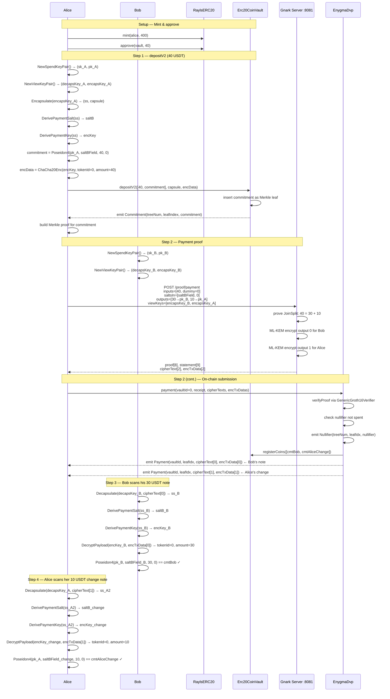

# 02 — ERC20 Payment (JoinSplit with Change)

**Test:** `TestV2Erc20Payment`
**File:** `test/02_v2_erc20_payment_test.go`

Alice deposits 40 USDT and privately pays 30 USDT to Bob, keeping 10 USDT as change.
The Payment circuit consumes 2 input notes and produces 2 output notes.
Each output is encrypted with the recipient's ML-KEM public key so only they can decrypt it.

---

## Diagram

---

## Circuit Statement Layout (interleaved, 9 elements)

| Index | Field | Description |
|-------|-------|-------------|
| 0 | `stMessage` | `0` (standalone payment) |
| 1 | `treeNumber[0]` | ERC20 vault tree number (Alice's note) |
| 2 | `merkleRoot[0]` | Merkle root at time of proof |
| 3 | `nullifier[0]` | Nullifier for Alice's 40 USDT note |
| 4 | `treeNumber[1]` | `0` (dummy input) |
| 5 | `merkleRoot[1]` | `0` (dummy) |
| 6 | `nullifier[1]` | `0` (dummy) |
| 7 | `commitment[0]` | Bob's 30 USDT commitment |
| 8 | `commitment[1]` | Alice's 10 USDT change commitment |

## Key Contracts

| Contract | Function | Purpose |
|----------|----------|---------|
| `Erc20CoinVault` | `depositV2(amounts, capsule, encData)` | ML-KEM deposit |
| `EnygmaDvp` | `payment(vaultId, receipt, ciphers, encDatas)` | JoinSplit entry point |
| `GenericGroth16Verifier` | `verifyProof(vk, proof, statement)` | On-chain proof check |
