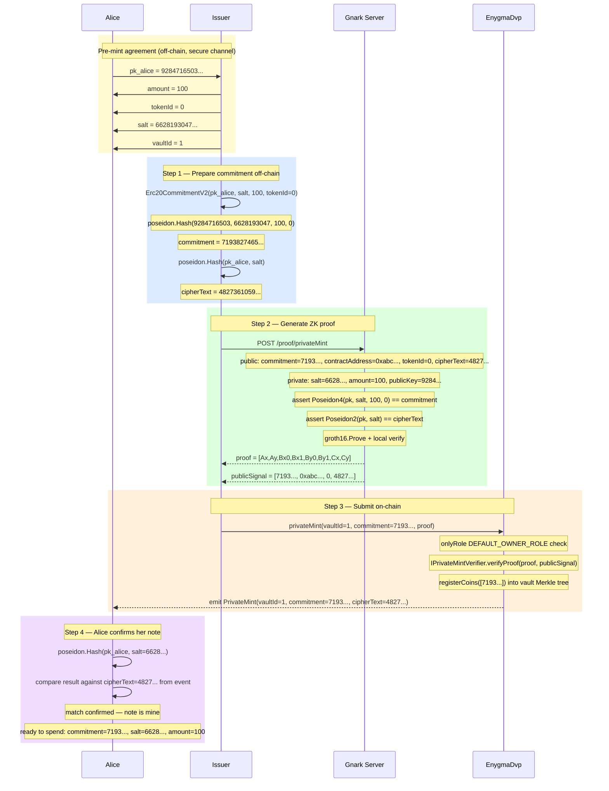

# Flow 02 — Private Mint

## Overview

Private mint allows a privileged **Issuer** to inject a private note directly into a vault's
Merkle tree **without any real token transfer**. It is the mechanism by which the Issuer creates
initial liquidity in the private system.

Unlike `deposit` (Flow 01), which is open to any user and requires transferring real tokens,
`privateMint` is:

- **Restricted** — gated by `DEFAULT_OWNER_ROLE` on the `EnygmaDvp` contract.
- **Proven** — a Groth16 ZK proof is required to guarantee the commitment is well-formed.

The result is a single note owned by the recipient (e.g. Alice), identical to one created by a
regular deposit, and fully spendable in any future `transferV2`.

---

## Key difference from deposit

|                | `depositV2` (Flow 01)          | `privateMint` (Flow 02)                        |
| -------------- | ------------------------------ | ---------------------------------------------- |
| Who calls      | Any user                       | Issuer only (`DEFAULT_OWNER_ROLE`)             |
| Token transfer | Yes — `ERC20.transferFrom`     | No                                             |
| ZK proof       | No                             | Yes — `PrivateMintCircuit`                     |
| Verifier       | None                           | `PrivateMintVerifier` (standalone)             |
| Tree insertion | `insertLeaves`                 | `registerCoins`                                |
| Event emitted  | `Commitment` + `EncryptedNote` | `PrivateMint(vaultId, commitment, cipherText)` |

---

## Circuit

**File:** `gnark_circuits/templates/PrivateMint.go`

### Public inputs (statement)

| Index | Name              | Value                                                    |
| ----- | ----------------- | -------------------------------------------------------- |
| 0     | `Commitment`      | `Poseidon4(pk_spend, salt, amount, tokenId)`             |
| 1     | `ContractAddress` | EnygmaDvp deployment address — binds proof to this chain |
| 2     | `TokenId`         | ERC20 token identifier                                   |
| 3     | `CipherText`      | `Poseidon2(pk_spend, salt)` — note tag for scanning      |

### Private witnesses

| Name        | Value                                       |
| ----------- | ------------------------------------------- |
| `Salt`      | Random field element chosen by the Issuer   |
| `Amount`    | Number of tokens being minted into the note |
| `PublicKey` | `pk_spend` of the recipient                 |

### Constraints (in-circuit)

```
assert Poseidon4(PublicKey, Salt, Amount, TokenId) == Commitment
assert Poseidon2(PublicKey, Salt)                  == CipherText
```

The circuit proves that the commitment and cipherText are consistent with the same
`(pk_spend, salt)` pair, without revealing `salt` or `amount` on-chain.

---

## Participants

| Participant  | Role                                                                                         |
| ------------ | -------------------------------------------------------------------------------------------- |
| Issuer       | Privileged caller — holds `DEFAULT_OWNER_ROLE`, generates the proof and submits on-chain     |
| Alice        | Recipient — her `pk_spend` is embedded in the commitment; she will scan to discover the note |
| Gnark Server | Generates the Groth16 proof for the `PrivateMintCircuit`                                     |
| EnygmaDvp    | Entry point — verifies the proof via `PrivateMintVerifier`, inserts the commitment           |

---

## Pre-mint agreement

Before the private mint can start, Alice and the Issuer must agree on the following values
out-of-band (e.g. via a secure channel, KYC process, or API call):

| Value | Who provides | Why it is needed |
|---|---|---|
| `pk_alice` | Alice → Issuer | Embedded in the commitment; only the holder of the matching `sk_alice` can spend the note |
| `amount` | Issuer → Alice | How many tokens the note will represent |
| `tokenId` | Issuer → Alice | Which ERC20 token (usually `0` for a single-token vault) |
| `salt` | Issuer → Alice | Random blinding factor; Alice needs it as `WtSaltsIn` to spend later |
| `vaultId` | Issuer → Alice | Which vault the commitment will be inserted into |

Alice must share her `pk_spend` with the Issuer before the flow begins.
The Issuer must share `amount`, `tokenId`, `salt`, and `vaultId` with Alice after the mint
so she can reconstruct and spend the note.

---

## Diagram



---

## Step-by-Step Function Calls

### Step 1 — Prepare commitment off-chain

**`Erc20PrivateMintProof()` — `src/core/prover_erc.go:1353`**

**1.1 — Generate a random salt**

```
RandomInField()                                    src/core/utils.go
  → salt = 6628193047...   (random BN254 scalar field element)
```

Unlike `depositV2`, there is no ML-KEM step here. The Issuer picks the salt directly.
Alice cannot derive the salt from on-chain data — the Issuer must deliver it to Alice
out-of-band, or Alice must brute-force scan using her spend key (see Step 4).

**1.2 — Compute commitment**

```
Erc20CommitmentV2(pk_alice, salt, amount=100, tokenId=0)   src/core/utils.go:563
  poseidon.Hash([9284716503..., 6628193047..., 100, 0])
  → commitment = 7193827465...
```

Same V2 commitment formula as in `depositV2`. The note will be fully spendable in any
`transferV2` proof once it is in the tree.

**1.3 — Compute cipherText (note tag)**

```
poseidon.Hash([pk_alice, salt])                    src/core/prover_erc.go:1365
  → cipherText = 4827361059...
```

This is published as a public signal. Alice can confirm a `PrivateMint` event is addressed
to her by checking `Poseidon2(pk_alice, salt) == cipherText` without the Issuer revealing
the actual amount on-chain.

---

### Step 2 — Generate ZK proof

**`PostProof("/proof/privateMint", payload)` — `src/core/prover_gnark.go:48`**

**2.1 — POST request**

```
POST http://localhost:8081/proof/privateMint

{
  "commitment":      "7193827465...",
  "contractAddress": "987654321...",
  "tokenId":         "0",
  "salt":            "6628193047...",
  "amount":          "100",
  "publicKey":       "9284716503...",
  "cipherText":      "4827361059..."
}
```

**2.2 — Gnark server: compile and prove**

```
frontend.Compile(BN254, r1cs.NewBuilder, &circuitPrivateMint)   handler.go:63
frontend.NewWitness(&witness, BN254.ScalarField())              handler.go:65
groth16.Prove(ccs, pk, witnessFull)                             handler.go:70
```

The circuit checks two constraints:

```
Poseidon4(pk_alice, salt, 100, 0) == 7193827465...   ← commitment is correct
Poseidon2(pk_alice, salt)         == 4827361059...   ← cipherText is correct
```

**2.3 — Verify locally, serialize and return**

```
groth16.Verify(proof, vk, witnessPublic)                        handler.go:72

publicSignal = [
  7193827465...,   // commitment      [0]
  987654321...,    // contractAddress [1]
  0,               // tokenId         [2]
  4827361059...,   // cipherText      [3]
]

→ PrivateMintOutput{Proof: [8]string, PublicSignal: [4]string}  handler.go:132
```

---

### Step 3 — Submit on-chain

**`EnygmaDvp.privateMint()` — `contracts/core/contracts/EnygmaDvp.sol:914`**

**3.1 — Role check**

```
onlyRole(DEFAULT_OWNER_ROLE)                       EnygmaDvp.sol:918
```

Any non-Issuer address reverts here. This is the key access control separating
private mint from regular deposit.

**3.2 — Verify ZK proof**

```
IPrivateMintVerifier.verifyProof(                  EnygmaDvp.sol:927
  proof.proof[8],
  proof.public_signal[4]         // [commitment, contractAddress, tokenId, cipherText]
)
```

`PrivateMintVerifier` is a standalone Solidity contract with VK constants baked in at
deploy time (exported from gnark via `ExportSolidity`). It does not use the generic
`IVerifier` registry.

**3.3 — Extract cipherText and emit event**

```
cipherText = proof.public_signal[3]                EnygmaDvp.sol:933
emit PrivateMint(vaultId=1, 7193827465..., 4827361059...)
                                                   EnygmaDvp.sol:936
```

Unlike `depositV2`, no `EncryptedNote` event is emitted. Scanning uses the `cipherText`
note tag instead of ML-KEM decapsulation (see Step 4).

**3.4 — Insert into vault Merkle tree**

```
IAbstractCoinVault.registerCoins([7193827465...])  EnygmaDvp.sol:941
  → insertLeaves([7193827465...])
  → leafIndex = 0
```

`registerCoins` is a privileged vault function callable only by the `EnygmaDvp` contract
(via the `DEFAULT_DVP_ROLE`). It bypasses the normal deposit token-transfer path.

---

### Step 4 — Alice scans for her note

Unlike `depositV2`, there is no `EncryptedNote` event with an ML-KEM capsule.
Alice discovers her note by watching `PrivateMint` events and checking the `cipherText`:

```
// For each PrivateMint event on-chain:
poseidon.Hash([pk_alice, candidate_salt])
  == cipherText from event?   → note is mine, amount = what Issuer told me
```

Alice must already know her `salt` (shared by the Issuer out-of-band) or must try
candidate salts. Once confirmed, she stores:

| Value        | Source                            | Used for                   |
| ------------ | --------------------------------- | -------------------------- |
| `commitment` | Event `PrivateMint.commitment`    | Merkle proof lookup        |
| `salt`       | Delivered by Issuer out-of-band   | `WtSaltsIn` in next proof  |
| `leafIndex`  | From `registerCoins` / tree state | Merkle path generation     |
| `amount`     | Delivered by Issuer out-of-band   | `WtValuesIn` in next proof |

---

## What private mint does NOT do

- **No token transfer** — the vault receives no real ERC20 tokens. The Issuer is trusted to
  have the backing assets off-chain.
- **No ML-KEM** — scanning uses the `cipherText = Poseidon2(pk, salt)` note tag, not
  `Encapsulate/Decapsulate`.
- **No `EncryptedNote` event** — only `PrivateMint(vaultId, commitment, cipherText)`.
- **No `stMessage`** — the circuit has no message field; it is not used in swap flows.

---

## Key references

| Symbol                             | File                                                    | Line |
| ---------------------------------- | ------------------------------------------------------- | ---- |
| `Erc20PrivateMintProof`            | `src/core/prover_erc.go`                                | 1353 |
| `Erc20CommitmentV2`                | `src/core/utils.go`                                     | 563  |
| `RandomInField`                    | `src/core/utils.go`                                     | —    |
| `PostProof`                        | `src/core/prover_gnark.go`                              | 48   |
| `PrivateMintCircuit.Define`        | `gnark_circuits/templates/PrivateMint.go`               | 29   |
| `NewHandler`                       | `gnark_circuits/server/circuits/privateMint/handler.go` | 25   |
| `groth16.Prove`                    | `gnark_circuits/server/circuits/privateMint/handler.go` | 70   |
| `EnygmaDvp.privateMint`            | `contracts/core/contracts/EnygmaDvp.sol`                | 914  |
| `IPrivateMintVerifier.verifyProof` | `contracts/core/contracts/EnygmaDvp.sol`                | 927  |
| `emit PrivateMint`                 | `contracts/core/contracts/EnygmaDvp.sol`                | 936  |
| `registerCoins`                    | `contracts/core/contracts/EnygmaDvp.sol`                | 941  |
| `Erc20PrivateMintResult`           | `src/core/prover_erc.go`                                | 1325 |
