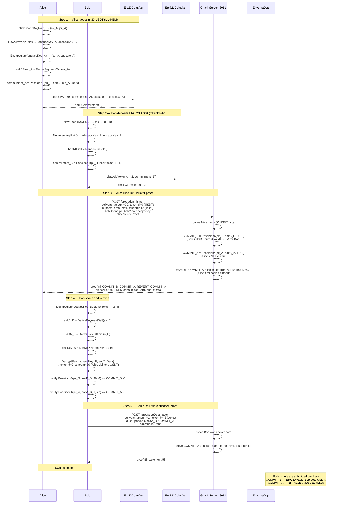

# 03 — DvP Atomic Swap (ERC20 ↔ ERC721)

**Test:** `TestV2DvP`
**File:** `test/03_v2_dvp_test.go`

Alice delivers 30 USDT (ERC20) to Bob. Bob delivers an ERC721 ticket (tokenId=42) to Alice.
The swap is atomic: both legs are proved separately but cross-reference each other's output commitments,
so neither party can claim their asset without the other's proof being valid.

---

## Diagram

---

## Cross-Commitment Consistency

The DvP circuit enforces that Alice's `COMMIT_A` and Bob's `COMMIT_A` reference the same
note — Bob cannot substitute a different tokenId or amount.

| Commitment | Owner | Asset | Derived by |
|-----------|-------|-------|-----------|
| `COMMIT_B` | Bob | 30 USDT | Alice (ML-KEM, `DerivePaymentSalt`) |
| `COMMIT_A` | Alice | ticket tokenId=42 | Alice (ML-KEM, `DeriveDvpSaltInit`) |
| `REVERT_COMMIT_A` | Alice | 30 USDT fallback | Alice (timeout recovery) |

## Key Contracts

| Contract | Function | Purpose |
|----------|----------|---------|
| `Erc20CoinVault` | `depositV2` | Alice's USDT deposit |
| `Erc721CoinVault` | `deposit` | Bob's NFT deposit |
| `EnygmaDvp` | `submitPartialSettlement` | Submit each leg; cross-reference commitments |
| `GenericGroth16Verifier` | `verifyProof` | On-chain proof check for both legs |
