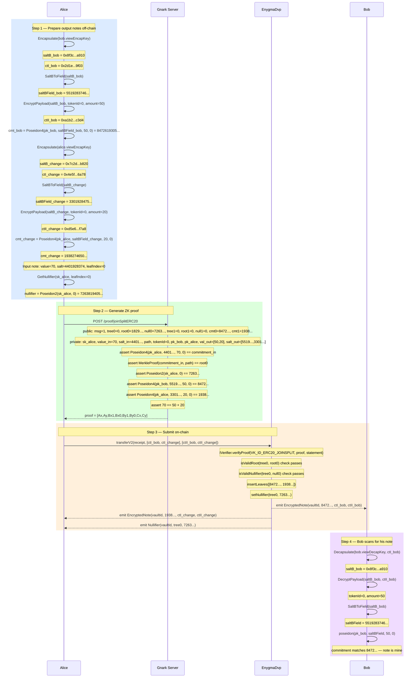

# Flow 03 — ERC20 Transfer (JoinSplit)

## Overview

The ERC20 JoinSplit transfer lets Alice privately send tokens to Bob without revealing amounts,
identities, or the link between sender and recipient on-chain. Alice spends one or two input notes
and produces two output notes: one for Bob (the payment) and one for herself (the change).

**No real tokens move** — both notes remain inside the same vault. Only the on-chain Merkle tree
changes: old leaves are nullified, new leaves are inserted.

The circuit enforces:

1. Alice owns the input notes (she knows the spend keys).
2. Input nullifiers are correctly derived.
3. Input commitments are members of the Merkle tree.
4. Output commitments are well-formed.
5. **Balance is preserved**: `sum(inputs) == sum(outputs)`.

---

## Key facts

| Property       | Value                                                                    |
| -------------- | ------------------------------------------------------------------------ |
| Circuit        | `joinSplitERC20` (2-in / 2-out) or `joinSplitERC20_10_2` (10-in / 2-out) |
| ZK proof       | Groth16 on BN254                                                         |
| Verifier       | Generic `IVerifier` registry (VK_ID_ERC20_JOINSPLIT = 0)                 |
| Tree operation | `insertLeaves` (2 new) + `setNullifier` (≥1 old)                         |
| Events emitted | `EncryptedNote` × 2, `Nullifier` × nIn                                   |
| Token movement | None — vault already holds all tokens                                    |

---

## Circuit

**File:** `gnark_circuits/templates/ERC20.go`

### Public inputs (statement) — interleaved layout

| Index | Name                 | Value                                                |
| ----- | -------------------- | ---------------------------------------------------- |
| 0     | `StMessage`          | Arbitrary public value (e.g. `1` for plain transfer) |
| 1     | `StTreeNumber[0]`    | Tree number for input note 0                         |
| 2     | `StMerkleRoots[0]`   | Merkle root proving note 0 membership                |
| 3     | `StNullifiers[0]`    | `Poseidon2(sk_spend_0, leafIndex_0)`                 |
| 4     | `StTreeNumber[1]`    | Tree number for input note 1 (0 if dummy)            |
| 5     | `StMerkleRoots[1]`   | Merkle root for note 1 (0 if dummy)                  |
| 6     | `StNullifiers[1]`    | Nullifier for note 1 (0 if dummy)                    |
| 7     | `StCommitmentOut[0]` | Bob's output commitment                              |
| 8     | `StCommitmentOut[1]` | Alice's change commitment                            |

### Private witnesses

| Name                   | Value                                                           |
| ---------------------- | --------------------------------------------------------------- |
| `WtPrivateKeysIn[i]`   | `sk_spend` of input note owner (Alice)                          |
| `WtValuesIn[i]`        | Amount in each input note (0 for dummy)                         |
| `WtSaltsIn[i]`         | `saltBField` received when the note was deposited / transferred |
| `WtPathElements[i][j]` | Merkle sibling hashes for note i                                |
| `WtPathIndices[i]`     | Merkle leaf index for note i                                    |
| `WtTokenId`            | ERC20 token identifier (shared across all notes)                |
| `WtSpendPublicKeysOut` | `pk_spend` of each output recipient (`[pk_bob, pk_alice]`)      |
| `WtValuesOut[i]`       | Amount in each output note                                      |
| `WtSaltsOut[i]`        | `saltBField` for each output (derived from `Encapsulate`)       |

### Constraints (in-circuit)

```
for each input i:
  pk_spend_i           = PublicKey(WtPrivateKeysIn[i])
  StNullifiers[i]      = Poseidon2(WtPrivateKeysIn[i], WtPathIndices[i])
  commitment_i         = Poseidon4(pk_spend_i, WtSaltsIn[i], WtValuesIn[i], WtTokenId)
  MerkleRoot(commitment_i, WtPathElements[i], WtPathIndices[i]) == StMerkleRoots[i]
  (Merkle check skipped when WtValuesIn[i] == 0 — dummy input)

for each output i:
  StCommitmentOut[i]   = Poseidon4(WtSpendPublicKeysOut[i], WtSaltsOut[i], WtValuesOut[i], WtTokenId)

balance:
  sum(WtValuesIn) == sum(WtValuesOut)
```

---

## Participants

| Participant    | Role                                                                            |
| -------------- | ------------------------------------------------------------------------------- |
| Alice          | Sender — spends her input note(s), creates Bob's note and her own change        |
| Bob            | Recipient — receives an output commitment; scans `EncryptedNote` to discover it |
| Gnark Server   | Generates the Groth16 JoinSplit proof                                           |
| Erc20CoinVault | Verifies the proof, nullifies inputs, inserts outputs, emits events             |

---

## Diagram



---

## Step-by-Step Function Calls

### Step 1 — Prepare output notes off-chain

**`Erc20JoinSplitProof()` — `src/core/prover_erc.go:26`**

Alice holds one input note: `amount=70, salt=4401928374..., leafIndex=0`.
She wants to send 50 to Bob and keep 20 as change.

**1.1 — Compute nullifier for each real input**

```
GetNullifier(sk_alice, leafIndex=0)              src/core/utils.go (via prover_erc.go:68)
  poseidon.Hash([sk_alice, 0])
  → nullifier = 7263819405...
```

The nullifier is derived from the spend key and the leaf index — not the commitment itself.
Publishing it on-chain marks the note as spent without revealing which leaf it was.

**1.2 — Encapsulate for Bob (output note 0)**

```
Encapsulate(bob.viewEncapKey)                    src/core/utils.go:216
  → saltB_bob    = 0x8f3c...a910
  → ctI_bob      = 0x2d1e...9f03
```

**1.3 — Reduce to field element**

```
SaltBToField(saltB_bob)                          src/core/utils.go:239
  → saltBField_bob = 5519283746...
```

**1.4 — Encrypt payload for Bob**

```
EncryptPayload(saltB_bob, tokenId=0, amount=50)  src/core/utils.go:317
  chacha20poly1305.New(saltB_bob)
  plaintext = 32-byte tokenId=0 || 32-byte amount=50
  → ctII_bob = 0xa1b2...c3d4
```

**1.5 — Compute Bob's output commitment**

```
Erc20CommitmentV2(pk_bob, saltBField_bob, 50, 0) src/core/utils.go:563
  poseidon.Hash([pk_bob, 5519283746..., 50, 0])
  → cmt_bob = 8472619305...
```

**1.6–1.9 — Repeat encapsulate/encrypt/commit for Alice's change note**

```
Encapsulate(alice.viewEncapKey)   → saltB_change, ctI_change
SaltBToField(saltB_change)        → saltBField_change = 3301928475...
EncryptPayload(saltB_change, 0, 20) → ctII_change
Erc20CommitmentV2(pk_alice, saltBField_change, 20, 0)
  → cmt_change = 1938274650...
```

---

### Step 2 — Generate ZK proof

**`PostProof("/proof/joinSplitERC20", payload)` — `src/core/prover_gnark.go:48`**

**2.1 — POST request**

```
POST http://localhost:8081/proof/joinSplitERC20

{
  "StMessage":            "1",
  "StTreeNumber":         ["0", "0"],
  "StMerkleRoots":        ["1829374650...", "0"],
  "StNullifiers":         ["7263819405...", "0"],
  "StCommitmentOut":      ["8472619305...", "1938274650..."],
  "WtPrivateKeysIn":      ["sk_alice", "0"],
  "WtValuesIn":           ["70", "0"],
  "WtSaltsIn":            ["4401928374...", "0"],
  "WtPathElements":       [[...8 siblings...], [...zeros...]],
  "WtPathIndices":        ["0", "0"],
  "WtTokenId":            "0",
  "WtSpendPublicKeysOut": ["pk_bob", "pk_alice"],
  "WtValuesOut":          ["50", "20"],
  "WtSaltsOut":           ["5519283746...", "3301928475..."]
}
```

The second input slot is a **dummy** (value=0, zeroed path). The circuit skips the Merkle check
for dummy inputs via `isZero(WtValuesIn[i])`.

**2.2 — Gnark server: compile and prove**

```
frontend.Compile(BN254, r1cs.NewBuilder, &Erc20Circuit{2,2,8,...})  handler.go:123
frontend.NewWitness(&witness, BN254.ScalarField())                   handler.go:125
groth16.Prove(ccs, pk, witnessFull)                                  handler.go:130
groth16.Verify(proof, vk, witnessPublic)                             handler.go:132
```

The circuit enforces 5 categories of constraints (see Circuit section above).

**2.3 — Serialize proof**

```
proofRemix = [Ax, Ay, BX1, BX0, BY1, BY0, Cx, Cy]    handler.go:166

publicSignal = [
  1,                // StMessage              [0]
  0,                // StTreeNumber[0]         [1]
  1829374650...,    // StMerkleRoots[0]        [2]
  7263819405...,    // StNullifiers[0]         [3]
  0,                // StTreeNumber[1]         [4]
  0,                // StMerkleRoots[1]        [5]
  0,                // StNullifiers[1]         [6]
  8472619305...,    // StCommitmentOut[0]      [7]
  1938274650...,    // StCommitmentOut[1]      [8]
]

→ JoinSplitERC20Output{Proof: [8]big.Int, PublicSignal: [9]big.Int}
```

---

### Step 3 — Submit on-chain

**`Erc20CoinVault.transferV2()` — `contracts/core/contracts/vaults/Erc20CoinVault.sol:115`**

**3.1 — Build on-chain receipt**

```go
// ContractStatement() de-interleaves from prover layout
// to non-interleaved: [msg, tree0,tree1, root0,root1, null0,null1, cmt0,cmt1]
statement := result.ContractStatement()

receipt := ProofReceipt{
  Proof:           proofRemix,     // [8] G1/G2 points
  Statement:       statement,      // [9] big.Int
  NumberOfInputs:  2,
  NumberOfOutputs: 2,
}
```

**3.2 — Call `transferV2`**

```
vault.transferV2(receipt, [ctI_bob, ctI_change], [ctII_bob, ctII_change])
                                                   Erc20CoinVault.sol:115
```

**3.3 — Verify proof**

```
checkReceiptConditions(receipt)                    Erc20CoinVault.sol:126
  isValidRoot(tree0, root0)      — Merkle root is on-chain
  isValidNullifier(tree0, null0) — not already spent
  IVerifier.verifyProof(VK_ID_ERC20_JOINSPLIT=0, proof, statement)
```

**3.4 — Insert output commitments**

```
_insertCommitmentsFromReceipt(receipt)             Erc20CoinVault.sol:127
  insertLeaves([8472619305..., 1938274650...])
  → leafIndex_bob    = 1
  → leafIndex_change = 2
```

**3.5 — Nullify input notes**

```
_nullifyFromReceipt(receipt)                       Erc20CoinVault.sol:128
  setNullifier(tree0, 7263819405...)
  emit Nullifier(vaultId, tree0, 7263819405...)
```

**3.6 — Emit EncryptedNote for each output**

```
emit EncryptedNote(vaultId, 8472619305..., ctI_bob,    ctII_bob)    Erc20CoinVault.sol:134
emit EncryptedNote(vaultId, 1938274650..., ctI_change, ctII_change) Erc20CoinVault.sol:134
```

---

### Step 4 — Recipients scan for notes

**Bob scans `EncryptedNote` events — `src/core/scan.go:62`**

```
ScanForErc20Notes(bob.viewDecapKey, bob.spendPk, events)
  Decapsulate(bob.viewDecapKey, ctI_bob)
    → saltB_bob = 0x8f3c...a910
  DecryptPayload(saltB_bob, ctII_bob)
    → tokenId=0, amount=50
  SaltBToField(saltB_bob)
    → saltBField = 5519283746...
  Erc20CommitmentV2(pk_bob, saltBField, 50, 0)
    → 8472619305... — matches event commitment → note is mine
```

Bob stores:

| Value        | Source                       | Used for                   |
| ------------ | ---------------------------- | -------------------------- |
| `commitment` | Event `EncryptedNote`        | Merkle proof lookup        |
| `saltBField` | Decapsulate → SaltBToField   | `WtSaltsIn` in next proof  |
| `leafIndex`  | From `insertLeaves` / events | Merkle path generation     |
| `amount`     | Decrypted from ctII          | `WtValuesIn` in next proof |

Alice scans her change note identically using her own view key.

---

## Dummy input slot

The circuit always has a fixed number of inputs (2 or 10). When Alice has only one real note to
spend, the second slot is filled with a **dummy input**:

```
WtValuesIn[1]     = 0
WtSaltsIn[1]      = 0
WtPrivateKeysIn[1] = 0    (or any value — commitment check is skipped)
StNullifiers[1]   = 0
StMerkleRoots[1]  = 0
```

The circuit checks `isZero(WtValuesIn[i])` and gates the Merkle root equality constraint
accordingly. A zero nullifier is never registered on-chain (`setNullifier` is skipped for 0).

---

## What transfer does NOT do

- **No token movement** — vault ERC20 balance is unchanged.
- **No `stMessage` constraint** — the circuit accepts any value; the vault does not inspect it
  (it is used for DVP swap coordination or can be `1` for plain transfers).
- **No KYC / allowlist check** — anyone can receive a note as long as they have a spend key.

---

## Key references

| Symbol                      | File                                                       | Line |
| --------------------------- | ---------------------------------------------------------- | ---- |
| `Erc20JoinSplitProof`       | `src/core/prover_erc.go`                                   | 26   |
| `Erc20CommitmentV2`         | `src/core/utils.go`                                        | 563  |
| `GetNullifier`              | `src/core/utils.go`                                        | —    |
| `Encapsulate`               | `src/core/utils.go`                                        | 216  |
| `SaltBToField`              | `src/core/utils.go`                                        | 239  |
| `EncryptPayload`            | `src/core/utils.go`                                        | 317  |
| `PostProof`                 | `src/core/prover_gnark.go`                                 | 48   |
| `Erc20Circuit.Define`       | `gnark_circuits/templates/ERC20.go`                        | 45   |
| `NewHandler` (joinSplit)    | `gnark_circuits/server/circuits/joinSplitERC20/handler.go` | 25   |
| `groth16.Prove`             | `gnark_circuits/server/circuits/joinSplitERC20/handler.go` | 130  |
| `Erc20CoinVault.transferV2` | `contracts/core/contracts/vaults/Erc20CoinVault.sol`       | 115  |
| `checkReceiptConditions`    | `contracts/core/contracts/vaults/Erc20CoinVault.sol`       | 261  |
| `emit EncryptedNote`        | `contracts/core/contracts/vaults/Erc20CoinVault.sol`       | 134  |
| `ScanForErc20Notes`         | `src/core/scan.go`                                         | 62   |
| `ContractStatement`         | `src/core/prover_auction.go`                               | —    |
