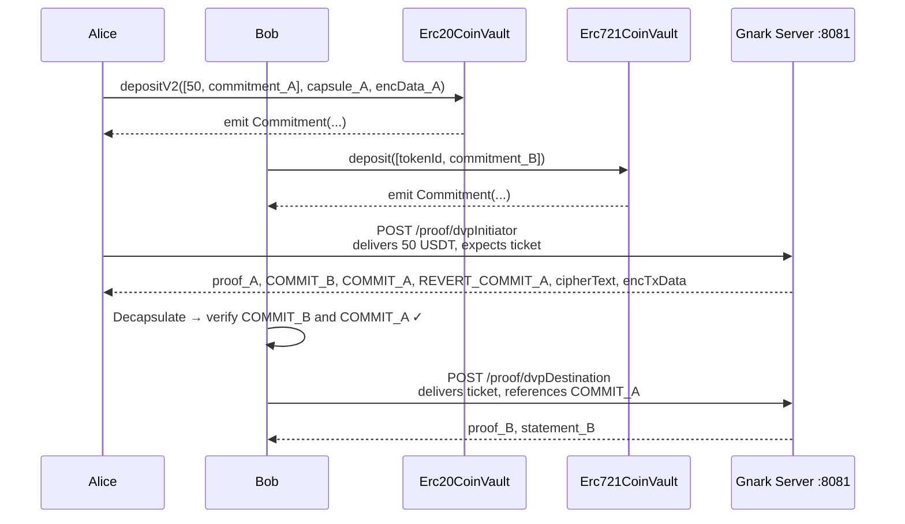
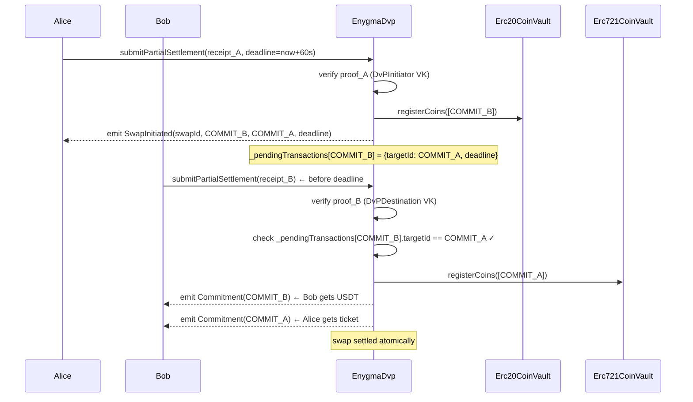
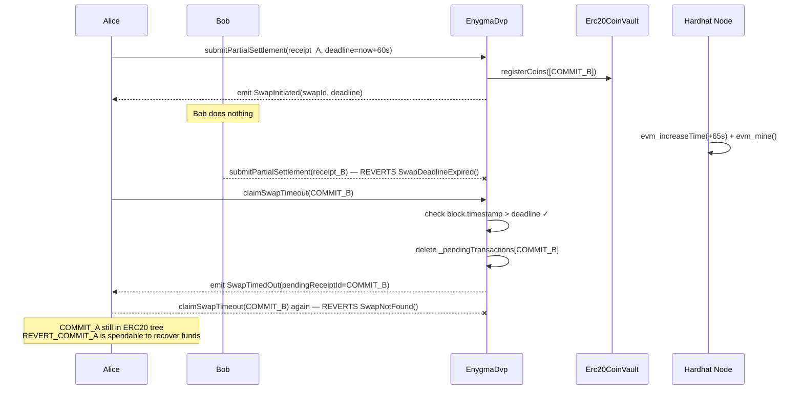
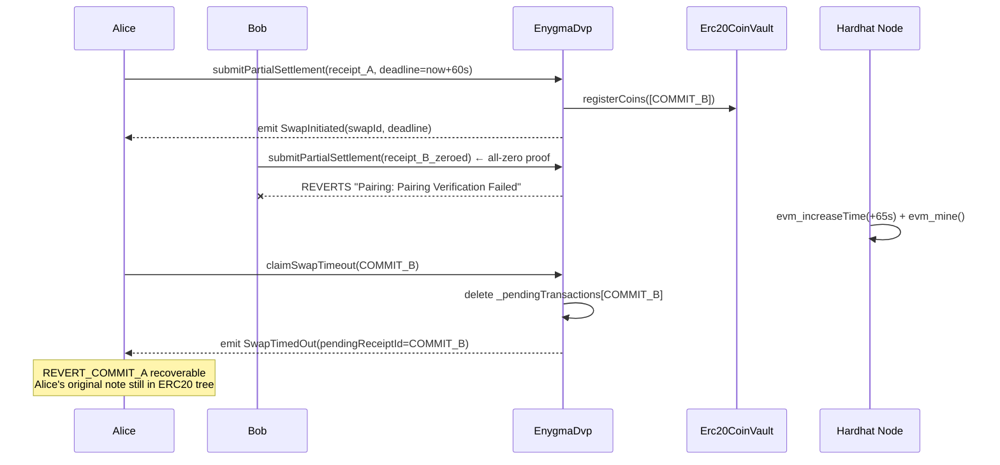

# 04 — DvP with Deadline (Three Scenarios)

**Test:** `TestV2DvP_WithDeadline`
**File:** `test/04_v2_dvp_deadline_test.go`

Alice swaps 50 USDT (ERC20) for Bob's ERC721 ticket. A deadline is attached to the swap.
Three sub-scenarios test the full lifecycle of the deadline-protected DvP.

The setup (deposits + proof generation) is identical across all three scenarios.
They diverge only after Alice submits her first leg on-chain.

---

## Shared Setup (all three scenarios)

---

## Scenario A — FullSwap (happy path)

---

## Scenario B — DeadlineExpired (Bob never responds)

---

## Scenario C — InvalidProof (Bob submits bad proof)

---

## Statement Layout (DvP Initiator, 7 elements)

| Index | Field | Value |
|-------|-------|-------|
| 0 | `stMessage` | `COMMIT_A` (cross-reference target) |
| 1 | `treeNumber` | ERC20 tree number |
| 2 | `merkleRoot` | ERC20 Merkle root |
| 3 | `nullifier` | Alice's USDT nullifier |
| 4 | `COMMIT_B` | Bob's USDT output (receiptUniqueId) |
| 5 | `COMMIT_A` | Alice's NFT output |
| 6 | `REVERT_COMMIT_A` | Alice's USDT fallback if timeout |

## Statement Layout (DvP Destination, 5 elements)

| Index | Field | Value |
|-------|-------|-------|
| 0 | `stMessage` | `COMMIT_B` (must match pending swap) |
| 1 | `treeNumber` | NFT tree number |
| 2 | `merkleRoot` | NFT Merkle root |
| 3 | `nullifier` | Bob's ticket nullifier |
| 4 | `COMMIT_A` | Alice's NFT output (must match stored targetId) |

## Key Contracts

| Contract | Function | Purpose |
|----------|----------|---------|
| `EnygmaDvp` | `submitPartialSettlement(receipt, deadline)` | Submit first or second leg |
| `EnygmaDvp` | `claimSwapTimeout(commitB)` | Revert after deadline passes |
| `Erc20CoinVault` | `registerCoins` | Insert COMMIT_B into ERC20 tree |
| `Erc721CoinVault` | `registerCoins` | Insert COMMIT_A into NFT tree on settle |
