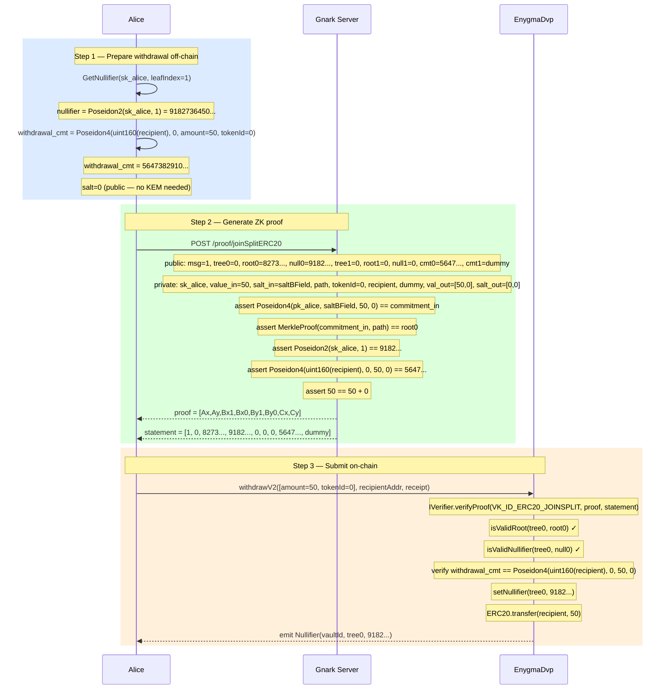

# Flow 04 — ERC20 Withdraw (withdrawV2)

## Overview

Withdrawal lets Alice redeem a private note back into real ERC20 tokens sent to an on-chain
recipient address. It is the reverse of deposit: real tokens leave the vault and the input
note is nullified.

Unlike a transfer (Flow 03), the output commitment is **public** — it encodes the recipient
address with a fixed `salt=0`, so no KEM encryption is needed for the output.

The circuit enforces the same JoinSplit constraints as a transfer, with the additional
convention that the first output commitment encodes the withdrawal:

```
withdrawal_commitment = Poseidon4(uint160(recipient), 0, amount, tokenId)
```

---

## Circuit

**File:** `gnark_circuits/templates/ERC20.go`

Same `joinSplitERC20` circuit as Flow 03. The withdrawal convention is enforced by the
prover (fixed `salt=0` for output 0), not by a separate circuit.

### Public inputs (statement)

| Index | Name                 | Value                                               |
| ----- | -------------------- | --------------------------------------------------- |
| 0     | `StMessage`          | Arbitrary (e.g. `1`)                                |
| 1     | `StTreeNumber[0]`    | Tree number for Alice's input note                  |
| 2     | `StMerkleRoots[0]`   | Merkle root proving Alice's note is in the tree     |
| 3     | `StNullifiers[0]`    | `Poseidon2(sk_alice, leafIndex)`                    |
| 4     | `StTreeNumber[1]`    | `0` (dummy)                                         |
| 5     | `StMerkleRoots[1]`   | `0` (dummy)                                         |
| 6     | `StNullifiers[1]`    | `0` (dummy)                                         |
| 7     | `StCommitmentOut[0]` | `Poseidon4(uint160(recipient), 0, amount, tokenId)` |
| 8     | `StCommitmentOut[1]` | Dummy zero-value commitment                         |

### Private witnesses

| Name                   | Value                                                   |
| ---------------------- | ------------------------------------------------------- |
| `WtPrivateKeysIn[0]`   | `sk_alice` (spend key of the withdrawer)                |
| `WtValuesIn[0]`        | Amount in Alice's note                                  |
| `WtSaltsIn[0]`         | `saltBField` from when Alice received the note          |
| `WtPathElements[0][j]` | Merkle sibling hashes for Alice's leaf                  |
| `WtPathIndices[0]`     | Leaf index of Alice's note                              |
| `WtTokenId`            | ERC20 token identifier                                  |
| `WtSpendPublicKeysOut` | `[uint160(recipient), dummySpendPk]`                    |
| `WtValuesOut`          | `[amount, 0]`                                           |
| `WtSaltsOut`           | `[0, 0]` — fixed zero salt for public withdrawal output |

---

## Participants

| Participant  | Role                                                                            |
| ------------ | ------------------------------------------------------------------------------- |
| Alice        | Note holder — spends her note, triggers the withdrawal to the recipient address |
| Gnark Server | Generates the Groth16 JoinSplit proof for the withdrawal                        |
| EnygmaDvp    | Verifies the proof, nullifies Alice's note, transfers ERC20 tokens to recipient |

---

## Diagram



---

## Step-by-Step Function Calls

### Step 1 — Prepare withdrawal off-chain

**`Erc20WithdrawProof()` — `src/core/prover_erc.go:377`**

**1.1 — Compute nullifier for Alice's input note**

```
GetNullifier(sk_alice, leafIndex)                src/core/utils.go
  poseidon.Hash([sk_alice, leafIndex])
  → nullifier = 9182736450...
```

**1.2 — Compute withdrawal output commitment**

```
Erc20CommitmentV2(uint160(recipient), 0, amount, tokenId)   src/core/utils.go:563
  poseidon.Hash([recipient_as_uint160, 0, 50, 0])
  → withdrawal_cmt = 5647382910...
```

No `Encapsulate` / `EncryptPayload` — the output is unconditionally public.
The `salt=0` convention is enforced in the prover, not in the circuit.

**1.3 — Compute dummy second output commitment**

```
Erc20CommitmentV2(dummySpendPk, 0, 0, tokenId)
  → dummy_cmt = ...   (zero-value, never usable)
```

---

### Step 2 — Generate ZK proof

**`PostProof(\"/proof/joinSplitERC20\", payload)` — `src/core/prover_gnark.go:48`**

Same JoinSplit endpoint as Flow 03. The only difference is `WtSaltsOut=[0,0]` and
`WtValuesOut=[amount, 0]` with the recipient address as `WtSpendPublicKeysOut[0]`.

```
POST http://localhost:8081/proof/joinSplitERC20

{
  "StMessage":            "1",
  "StTreeNumber":         ["0", "0"],
  "StMerkleRoots":        ["8273...", "0"],
  "StNullifiers":         ["9182...", "0"],
  "StCommitmentOut":      ["5647...", "dummy_cmt"],
  "WtPrivateKeysIn":      ["sk_alice", "0"],
  "WtValuesIn":           ["50", "0"],
  "WtSaltsIn":            ["saltBField", "0"],
  "WtPathElements":       [[...8 siblings...], [...zeros...]],
  "WtPathIndices":        ["leafIndex", "0"],
  "WtTokenId":            "0",
  "WtSpendPublicKeysOut": ["uint160(recipient)", "dummySpendPk"],
  "WtValuesOut":          ["50", "0"],
  "WtSaltsOut":           ["0", "0"]
}
```

---

### Step 3 — Submit on-chain

**`Erc20CoinVault.withdrawV2()` — called via EnygmaDvp**

**3.1 — Build receipt**

```go
stmt    := result.ContractStatement()   // de-interleaved for on-chain
receipt := ProofReceipt{Proof, stmt, NumberOfInputs=2, NumberOfOutputs=2}
```

**3.2 — Call `withdrawV2`**

```
vault.withdrawV2(
  [amount=50, tokenId=0],
  recipientAddr,
  receipt
)
```

**3.3 — Verify proof and roots**

```
IVerifier.verifyProof(VK_ID_ERC20_JOINSPLIT=0, proof, statement)
isValidRoot(tree0, root0)        — Merkle root is on-chain
isValidNullifier(tree0, null0)   — note not already spent
```

**3.4 — Nullify input note**

```
setNullifier(tree0, 9182...)
emit Nullifier(vaultId, tree0, 9182...)
```

**3.5 — Release real tokens**

```
ERC20.transfer(recipientAddr, 50)
```

No `EncryptedNote` is emitted — the output commitment is public and the recipient
receives actual ERC20 tokens, not another private note.

---

## What withdrawal does NOT do

- **No `EncryptedNote` event** — the output is public; no scanning needed.
- **No KEM** — `salt=0` for the withdrawal output; no `Encapsulate` / `Decapsulate`.
- **No change note** — the dummy second output has zero value and is unspendable.
  If Alice wants partial withdrawal she must transfer first, then withdraw.

---

## Key references

| Symbol                   | File                                                       | Line |
| ------------------------ | ---------------------------------------------------------- | ---- |
| `Erc20WithdrawProof`     | `src/core/prover_erc.go`                                   | 377  |
| `Erc20CommitmentV2`      | `src/core/utils.go`                                        | 563  |
| `GetNullifier`           | `src/core/utils.go`                                        | —    |
| `PostProof`              | `src/core/prover_gnark.go`                                 | 48   |
| `Erc20Circuit.Define`    | `gnark_circuits/templates/ERC20.go`                        | 45   |
| `NewHandler` (joinSplit) | `gnark_circuits/server/circuits/joinSplitERC20/handler.go` | 25   |
| `withdrawV2`             | `contracts/core/contracts/vaults/Erc20CoinVault.sol`       | —    |
| `ContractStatement`      | `src/core/prover_auction.go`                               | —    |
