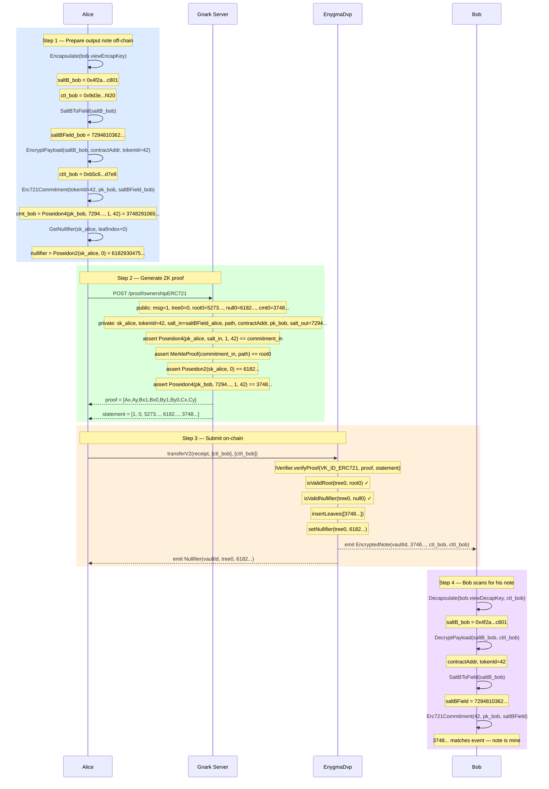

# Flow 05 — ERC721 Transfer (ownershipERC721)

## Overview

The ERC721 ownership transfer lets Alice privately hand over an NFT note to Bob without
revealing the tokenId, identities, or the link between sender and recipient on-chain.
Alice spends her input note and produces one output note for Bob.

**No real NFT moves** — the token remains locked inside the vault. Only the on-chain
Merkle tree changes: Alice's leaf is nullified, Bob's new commitment is inserted.

The circuit enforces:
1. Alice owns the input note (she knows `sk_spend`).
2. The input nullifier is correctly derived.
3. The input commitment is a member of the Merkle tree.
4. The output commitment is well-formed with the same `tokenId`.

---

## Key facts

| Property        | Value                                                         |
| --------------- | ------------------------------------------------------------- |
| Circuit         | `ownershipERC721` (1-in / 1-out)                             |
| ZK proof        | Groth16 on BN254                                              |
| Commitment      | `Poseidon4(pk_spend, salt, 1, tokenId)` — amount fixed at `1` |
| Verifier        | Generic `IVerifier` registry                                  |
| Tree operation  | `insertLeaves` (1 new) + `setNullifier` (1 old)              |
| Events emitted  | `EncryptedNote` × 1, `Nullifier` × 1                         |
| Token movement  | None — vault already holds the NFT                            |

---

## Circuit

**File:** `gnark_circuits/templates/ERC721.go`

### Public inputs (statement)

| Index | Name               | Value                                         |
| ----- | ------------------ | --------------------------------------------- |
| 0     | `StMessage`        | Arbitrary public value (e.g. `1` for transfer) |
| 1     | `StTreeNumbers[0]` | Tree number for Alice's input note            |
| 2     | `StMerkleRoots[0]` | Merkle root proving Alice's note membership   |
| 3     | `StNullifiers[0]`  | `Poseidon2(sk_alice, leafIndex)`              |
| 4     | `StCommitmentOut[0]` | Bob's output commitment                     |

### Private witnesses

| Name                    | Value                                                          |
| ----------------------- | -------------------------------------------------------------- |
| `WtPrivateKeysIn[0]`    | `sk_alice` — proves ownership of the input note               |
| `WtValues[0]`           | `tokenId` — ERC721 token identifier                           |
| `WtSaltsIn[0]`          | `saltBField` from when Alice received the note                 |
| `WtPathElements[0][j]`  | Merkle sibling hashes for Alice's leaf                         |
| `WtPathIndices[0]`      | Leaf index of Alice's note                                     |
| `WtErc721ContractAddress` | ERC721 contract address — binds the note to a specific NFT   |
| `WtPublicKeysOut[0]`    | `pk_bob` — spend public key of the recipient                  |
| `WtSaltsOut[0]`         | `saltBField` derived from `Encapsulate(bob.viewEncapKey)`     |

### Constraints (in-circuit)

```
pk_alice          = PublicKey(WtPrivateKeysIn[0])
StNullifiers[0]   = Poseidon2(WtPrivateKeysIn[0], WtPathIndices[0])
commitment_in     = Poseidon4(pk_alice, WtSaltsIn[0], 1, WtValues[0])
MerkleRoot(commitment_in, WtPathElements[0], WtPathIndices[0]) == StMerkleRoots[0]
StCommitmentOut[0] = Poseidon4(WtPublicKeysOut[0], WtSaltsOut[0], 1, WtValues[0])
```

---

## Participants

| Participant  | Role                                                                            |
| ------------ | ------------------------------------------------------------------------------- |
| Alice        | Sender — spends her NFT note and creates Bob's output note                     |
| Bob          | Recipient — scans `EncryptedNote` to discover the note addressed to him        |
| Gnark Server | Generates the Groth16 ownership proof                                           |
| EnygmaDvp    | Verifies the proof, nullifies Alice's note, inserts Bob's commitment            |

---

## Diagram



---

## Step-by-Step Function Calls

### Step 1 — Prepare output note off-chain

**`Erc721OwnershipProof()` — `src/core/prover_erc.go:512`**

**1.1 — Encapsulate for Bob**

```
Encapsulate(bob.viewEncapKey)                  src/core/utils.go:216
  → saltB_bob = 0x4f2a...c801
  → ctI_bob   = 0x9d3e...f420
```

**1.2 — Reduce to field element**

```
SaltBToField(saltB_bob)                        src/core/utils.go:239
  → saltBField_bob = 7294810362...
```

**1.3 — Encrypt payload for Bob**

```
EncryptPayload(saltB_bob, contractAddr, tokenId=42)   src/core/utils.go:317
  chacha20poly1305.New(saltB_bob)
  plaintext = 32-byte contractAddr || 32-byte tokenId=42
  → ctII_bob = 0xb5c6...d7e8
```

Note: unlike ERC20, the encrypted payload carries `(contractAddress, tokenId)` — not
`(tokenId, amount)`. The amount is always implicitly `1` for NFTs.

**1.4 — Compute Bob's output commitment**

```
Erc721Commitment(tokenId=42, pk_bob, saltBField_bob)  src/core/utils.go:577
  Erc20CommitmentV2(pk_bob, saltBField_bob, 1, 42)
  poseidon.Hash([pk_bob, 7294..., 1, 42])
  → cmt_bob = 3748291065...
```

**1.5 — Compute nullifier for Alice's input**

```
GetNullifier(sk_alice, leafIndex=0)            src/core/utils.go
  poseidon.Hash([sk_alice, 0])
  → nullifier = 6182930475...
```

---

### Step 2 — Generate ZK proof

**`PostProof(\"/proof/ownershipERC721\", payload)` — `src/core/prover_gnark.go:48`**

**2.1 — POST request**

```
POST http://localhost:8081/proof/ownershipERC721

{
  "StMessage":               "1",
  "StTreeNumbers":           ["0"],
  "StMerkleRoots":           ["5273..."],
  "StNullifiers":            ["6182..."],
  "StCommitmentOut":         ["3748..."],
  "WtPrivateKeysIn":         ["sk_alice"],
  "WtValues":                ["42"],
  "WtSaltsIn":               ["saltBField_alice"],
  "WtPathElements":          [[...8 siblings...]],
  "WtPathIndices":           ["0"],
  "WtErc721ContractAddress": "contractAddr",
  "WtPublicKeysOut":         ["pk_bob"],
  "WtSaltsOut":              ["7294..."]
}
```

**2.2 — Gnark server: compile and prove**

```
frontend.Compile(BN254, r1cs.NewBuilder, &Erc721Circuit{1,8})    handler.go
frontend.NewWitness(&witness, BN254.ScalarField())
groth16.Prove(ccs, pk, witnessFull)
groth16.Verify(proof, vk, witnessPublic)
```

**2.3 — Serialize proof and statement**

```
proofRemix = [Ax, Ay, Bx1, Bx0, By1, By0, Cx, Cy]

statement = [
  1,        // StMessage          [0]
  0,        // StTreeNumbers[0]   [1]
  5273...,  // StMerkleRoots[0]   [2]
  6182...,  // StNullifiers[0]    [3]
  3748...,  // StCommitmentOut[0] [4]
]
```

---

### Step 3 — Submit on-chain

**`Erc721CoinVault.transferV2()` — called via EnygmaDvp**

**3.1 — Build receipt**

```go
stmt    := result.ContractStatement()
receipt := ProofReceipt{Proof, stmt, NumberOfInputs=1, NumberOfOutputs=1}
```

**3.2 — Call `transferV2`**

```
vault.transferV2(receipt, [ctI_bob], [ctII_bob])
```

**3.3 — Verify proof**

```
IVerifier.verifyProof(VK_ID_ERC721_OWNERSHIP, proof, statement)
isValidRoot(tree0, root0)
isValidNullifier(tree0, null0)
```

**3.4 — Insert output and nullify input**

```
insertLeaves([3748...])          → leafIndex_bob = 1
setNullifier(tree0, 6182...)
emit EncryptedNote(vaultId, 3748..., ctI_bob, ctII_bob)
emit Nullifier(vaultId, tree0, 6182...)
```

---

### Step 4 — Bob scans for his note

```
ScanForErc721Notes(bob.viewDecapKey, bob.spendPk, events)   src/core/scan.go
  Decapsulate(bob.viewDecapKey, ctI_bob)
    → saltB_bob = 0x4f2a...c801
  DecryptPayload(saltB_bob, ctII_bob)
    → contractAddr, tokenId=42
  SaltBToField(saltB_bob)
    → saltBField = 7294810362...
  Erc721Commitment(42, pk_bob, saltBField)
    → 3748... — matches event commitment → note is mine
```

Bob stores:

| Value        | Source                       | Used for                    |
| ------------ | ---------------------------- | --------------------------- |
| `commitment` | Event `EncryptedNote`        | Merkle proof lookup         |
| `saltBField` | Decapsulate → SaltBToField   | `WtSaltsIn` in next proof   |
| `leafIndex`  | From `insertLeaves` / events | Merkle path generation      |
| `tokenId`    | Decrypted from ctII          | `WtValues` in next proof    |

---

## What this transfer does NOT do

- **No token movement** — vault ERC721 balance is unchanged.
- **No amount check** — the circuit hardcodes `amount=1`; there is no balance constraint.
- **No change note** — 1-in / 1-out: the entire NFT ownership moves to Bob.

---

## Key references

| Symbol                      | File                                                        | Line |
| --------------------------- | ----------------------------------------------------------- | ---- |
| `Erc721OwnershipProof`      | `src/core/prover_erc.go`                                    | 512  |
| `Erc721Commitment`          | `src/core/utils.go`                                         | 577  |
| `GetNullifier`              | `src/core/utils.go`                                         | —    |
| `Encapsulate`               | `src/core/utils.go`                                         | 216  |
| `SaltBToField`              | `src/core/utils.go`                                         | 239  |
| `EncryptPayload`            | `src/core/utils.go`                                         | 317  |
| `PostProof`                 | `src/core/prover_gnark.go`                                  | 48   |
| `Erc721Circuit.Define`      | `gnark_circuits/templates/ERC721.go`                        | —    |
| `NewHandler` (ownership721) | `gnark_circuits/server/circuits/ownershipERC721/handler.go` | —    |
| `transferV2`                | `contracts/core/contracts/vaults/Erc721CoinVault.sol`       | —    |
| `ContractStatement`         | `src/core/prover_auction.go`                                | —    |
