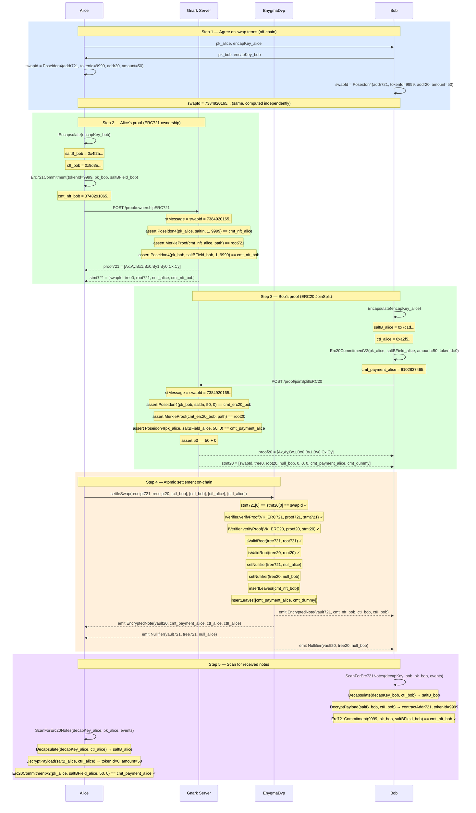

# Flow 06 — Atomic DVP Swap (ERC721 ↔ ERC20)

## Overview

The atomic DVP swap lets Alice sell an NFT to Bob in exchange for ERC20 tokens — without
any trusted intermediary and without either party having to trust the other to act first.

Both parties generate their proofs **independently and in any order**. The contract only
settles when it receives both proofs carrying the same `swapId`, enforcing atomicity:
either the full exchange happens, or nothing does.

The `swapId` is the only public linking value between the two proofs:

```
// temporary solution
swapId = Poseidon4(contractAddr721, tokenId, contractAddr20, paymentAmount)
```

Both parties compute this from the agreed swap terms. It is embedded as `stMessage` in
both proofs and verified on-chain.

---

## Non-interactivity

After a one-time public-key exchange, neither party waits for the other:

| Party | Needs from the other party                  | Can proceed without knowing       |
| ----- | ------------------------------------------- | --------------------------------- |
| Alice | `pk_bob` (spend), `encapKey_bob` (view)     | Bob's ERC20 proof or payment note |
| Bob   | `pk_alice` (spend), `encapKey_alice` (view) | Alice's ERC721 proof or NFT note  |

---

## Atomicity

```
swapId = Poseidon4(contractAddr721, tokenId, contractAddr20, paymentAmount)
```

Both proofs encode `swapId` as `StMessage`. The DVP contract verifies both proofs share
the same `swapId` before settling. A partial submission is rejected.

---

## Participants

| Participant  | Role                                                                   |
| ------------ | ---------------------------------------------------------------------- |
| Alice        | NFT seller — spends her ERC721 note, receives ERC20 payment from Bob   |
| Bob          | NFT buyer — spends his ERC20 note, receives the ERC721 note from Alice |
| Gnark Server | Generates both Groth16 proofs (ERC721 ownership + ERC20 JoinSplit)     |
| EnygmaDvp    | Verifies both proofs atomically and settles the swap                   |

---

## Diagram



---

## Key references

| Symbol                 | File                                     | Line |
| ---------------------- | ---------------------------------------- | ---- |
| `Erc721OwnershipProof` | `src/core/prover_erc.go`                 | 512  |
| `Erc20JoinSplitProof`  | `src/core/prover_erc.go`                 | —    |
| `Erc721Commitment`     | `src/core/utils.go`                      | 577  |
| `Erc20CommitmentV2`    | `src/core/utils.go`                      | 563  |
| `GetNullifier`         | `src/core/utils.go`                      | —    |
| `Encapsulate`          | `src/core/utils.go`                      | 216  |
| `ScanForErc721Notes`   | `src/core/scan.go`                       | —    |
| `ScanForErc20Notes`    | `src/core/scan.go`                       | —    |
| `Erc721Circuit.Define` | `gnark_circuits/templates/ERC721.go`     | —    |
| `Erc20Circuit.Define`  | `gnark_circuits/templates/ERC20.go`      | —    |
| `settleSwap`           | `contracts/core/contracts/EnygmaDvp.sol` | —    |
| Integration test       | `test/06_v2_swap_erc721_erc20_test.go`   | —    |
