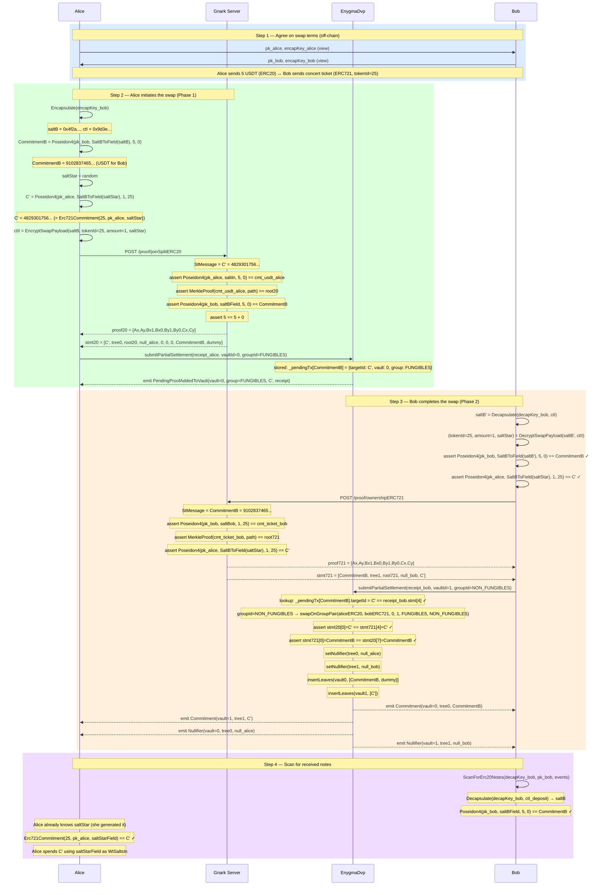

# Flow 06 — ZkDvP Atomic Swap (ERC20 ↔ ERC721)

## Overview

The ZkDvP swap lets Alice exchange ERC20 tokens (e.g., 5 USDT) for Bob's ERC721 NFT
(e.g., a concert ticket with `tokenId=25`) — without any trusted intermediary and without
either party having to trust the other to act first.

The protocol is **asymmetric and two-phase**:

- **Phase 1 (Alice initiates)**: Alice generates an ERC20 JoinSplit proof spending her USDT note
  and submits it on-chain as a pending swap, pre-committing to both outputs.
- **Phase 2 (Bob completes)**: Bob scans the on-chain event, verifies the pre-committed outputs,
  generates an ERC721 OwnershipProof, and triggers atomic settlement.

---

## Commitment formulas

```
Alice's USDT note:  Poseidon4(pk_alice, saltA, amount, tokenId=0)       // ERC20 JoinSplit
Bob's ticket note:  Poseidon4(pk_bob,   saltB, 1, tokenId=25)           // ERC721 Ownership
C' (Alice receives): Poseidon4(pk_alice, saltStar, 1, tokenId=25)       // ≡ Erc721Commitment
```

Note: `Erc721Commitment(tokenId, pk, salt) = Poseidon4(pk, salt, 1, tokenId)` — same formula
as `Erc20CommitmentV2(pk, salt, 1, tokenId)`. Alice uses this equivalence to pre-compute C'
inside her ERC20 JoinSplit proof.

---

## Atomicity — Cross-commitment linking

```
stMessage(Alice) = C'             // Alice's expected ERC721 ticket commitment
firstOutput(Alice) = CommitmentB  // Alice's USDT payment for Bob

stMessage(Bob)   = CommitmentB    // links Bob's ERC721 proof back to Alice's pending proof
firstOutput(Bob) = C'             // Bob delivers exactly the ticket commitment Alice pre-computed
```

The on-chain `_settleOnGroupPair` verifies (ERC20 has 2 inputs, ERC721 has 1 input):

```
receipt_alice.statement[0] == receipt_bob.statement[4]   // stMsg(Alice)=C'          == firstOut(Bob)=C'          ✓
receipt_bob.statement[0]   == receipt_alice.statement[7]  // stMsg(Bob)=CommitmentB   == firstOut(Alice)=CommitmentB ✓
```

---

## Settlement path

When Bob (NON_FUNGIBLES) submits second via `submitPartialSettlement`, the contract:

1. Looks up the stored pending proof: `_pendingTx[CommitmentB] = {vaultId: 0, groupId: FUNGIBLES}`
2. Detects current group = NON_FUNGIBLES → delivery submitted second
3. Calls `swapOnGroupPair(aliceERC20, bobERC721, vault=0, vault=1, FUNGIBLES, NON_FUNGIBLES)`

The swap pair `(FUNGIBLES, NON_FUNGIBLES)` is registered at deployment via `registerSwapGroupPair`.

---

## Participants

| Participant  | Role                                                                                            |
| ------------ | ----------------------------------------------------------------------------------------------- |
| Alice        | Initiator — spends her ERC20 USDT note, pre-commits to receiving the ERC721 ticket             |
| Bob          | Completer — verifies Alice's pre-commitments, spends his ERC721 note, triggers settlement      |
| Gnark Server | Generates Alice's ERC20 JoinSplit proof and Bob's ERC721 OwnershipProof                        |
| EnygmaDvp    | Stores Alice's proof as PENDING, settles atomically when Bob's matching proof arrives           |

---

## Diagram



---

## Key references

| Symbol                         | File                                     | Line |
| ------------------------------ | ---------------------------------------- | ---- |
| `ZkDvpInitiateSwap`            | `src/core/prover_erc.go`                 | 231  |
| `Erc721OwnershipProofFromSalt` | `src/core/prover_erc.go`                 | 610  |
| `ScanForZkDvpSwap`             | `src/core/scan.go`                       | 237  |
| `EncryptSwapPayload`           | `src/core/utils.go`                      | 264  |
| `DecryptSwapPayload`           | `src/core/utils.go`                      | —    |
| `Erc721Commitment`             | `src/core/utils.go`                      | 577  |
| `Erc20CommitmentV2`            | `src/core/utils.go`                      | 563  |
| `Encapsulate`                  | `src/core/utils.go`                      | 216  |
| `SaltBToField`                 | `src/core/utils.go`                      | 239  |
| `submitPartialSettlement`      | `contracts/core/contracts/EnygmaDvp.sol` | 598  |
| `_settleOnGroupPair`           | `contracts/core/contracts/EnygmaDvp.sol` | 798  |
| `swapOnGroupPair`              | `contracts/core/contracts/EnygmaDvp.sol` | 727  |
| `Erc20Circuit.Define`          | `gnark_circuits/templates/ERC20.go`      | —    |
| `Erc721Circuit.Define`         | `gnark_circuits/templates/ERC721.go`     | —    |
| Unit test                      | `test/06_v2_swap_erc721_erc20_test.go`   | —    |
| Full ZkDvp test                | `test/12_v2_zkdvp_swap_test.go`          | —    |
