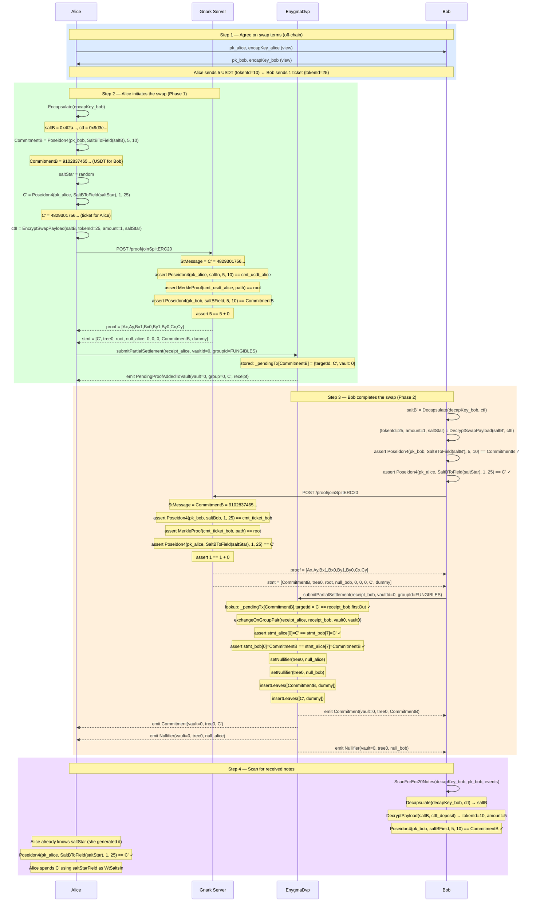

# Flow 06 — ZkDvP Atomic Swap (ERC20 ↔ ERC20)

## Overview

The ZkDvP swap lets Alice exchange one type of token (e.g., 5 USDT with `tokenId=10`) for Bob's
different token type (e.g., 1 concert ticket with `tokenId=25`), all within the same vault — without
any trusted intermediary and without either party having to trust the other to act first.

Both assets use the standard ERC20 JoinSplit commitment formula with different `tokenId` values:

```
commitment = Poseidon4(pk_spend, saltBField, amount, tokenId)
```

The protocol is **asymmetric and two-phase**:

- **Phase 1 (Alice initiates)**: Alice generates a ZK proof spending her USDT note and submits it
  on-chain as a pending swap, pre-committing to both outputs.
- **Phase 2 (Bob completes)**: Bob scans the on-chain event, verifies the pre-committed outputs,
  generates his own ZK proof, and triggers atomic settlement.

---

## Atomicity — Cross-commitment linking

Atomicity is enforced by **cross-commitment linking**, not a shared `swapId`:

```
stMessage(Alice) = C'            (Alice's expected concert ticket commitment)
firstOutput(Alice) = CommitmentB  (Alice's USDT payment for Bob)
stMessage(Bob)   = CommitmentB   (links Bob's proof back to Alice's pending proof)
firstOutput(Bob) = C'            (Bob delivers exactly the ticket commitment Alice pre-committed to)
```

The on-chain `_settleOnGroupPair` verifies:

```
receipt_alice.statement[0] == receipt_bob.statement[7]   // stMsg(Alice) == firstOut(Bob)
receipt_bob.statement[0]   == receipt_alice.statement[7] // stMsg(Bob)   == firstOut(Alice)
```

A party cannot alter the outputs after the other party's proof is submitted — any mismatch reverts.

---

## Non-interactivity

After a one-time public-key exchange, Alice initiates without waiting for Bob:

| Party | Needs from the other party                  | Can proceed without knowing       |
| ----- | ------------------------------------------- | --------------------------------- |
| Alice | `pk_bob` (spend), `encapKey_bob` (view)     | Bob's proof or ticket note        |
| Bob   | `pk_alice` (spend), `encapKey_alice` (view) | Alice's proof or USDT note        |

Bob responds asynchronously after seeing the `PendingProofAddedToVault` event on-chain.

---

## Participants

| Participant  | Role                                                                                          |
| ------------ | --------------------------------------------------------------------------------------------- |
| Alice        | Initiator — spends her USDT note, pre-commits to receiving the concert ticket                 |
| Bob          | Completer — verifies Alice's pre-commitments, spends his ticket note, triggers settlement     |
| Gnark Server | Generates both Groth16 JoinSplit proofs (ERC20 circuit, different tokenIds)                  |
| EnygmaDvp    | Stores Alice's proof as PENDING, settles atomically when Bob's matching proof arrives         |

---

## Diagram



---

## Key references

| Symbol                    | File                                                         | Line |
| ------------------------- | ------------------------------------------------------------ | ---- |
| `ZkDvpInitiateSwap`       | `src/core/prover_erc.go`                                     | 231  |
| `Erc20JoinSplitProofFromSalts` | `src/core/prover_erc.go`                                | 680  |
| `ScanForZkDvpSwap`        | `src/core/scan.go`                                           | 237  |
| `EncryptSwapPayload`      | `src/core/utils.go`                                          | 264  |
| `DecryptSwapPayload`      | `src/core/utils.go`                                          | —    |
| `Erc20CommitmentV2`       | `src/core/utils.go`                                          | 563  |
| `GetNullifier`            | `src/core/utils.go`                                          | —    |
| `Encapsulate`             | `src/core/utils.go`                                          | 216  |
| `SaltBToField`            | `src/core/utils.go`                                          | 239  |
| `submitPartialSettlement` | `contracts/core/contracts/EnygmaDvp.sol`                     | 598  |
| `_settleOnGroupPair`      | `contracts/core/contracts/EnygmaDvp.sol`                     | 798  |
| `exchangeOnGroupPair`     | `contracts/core/contracts/EnygmaDvp.sol`                     | 773  |
| `Erc20Circuit.Define`     | `gnark_circuits/templates/ERC20.go`                          | —    |
| Unit test                 | `test/06_v2_swap_erc721_erc20_test.go`                       | —    |
| Full ZkDvp test           | `test/12_v2_zkdvp_swap_test.go`                              | —    |
