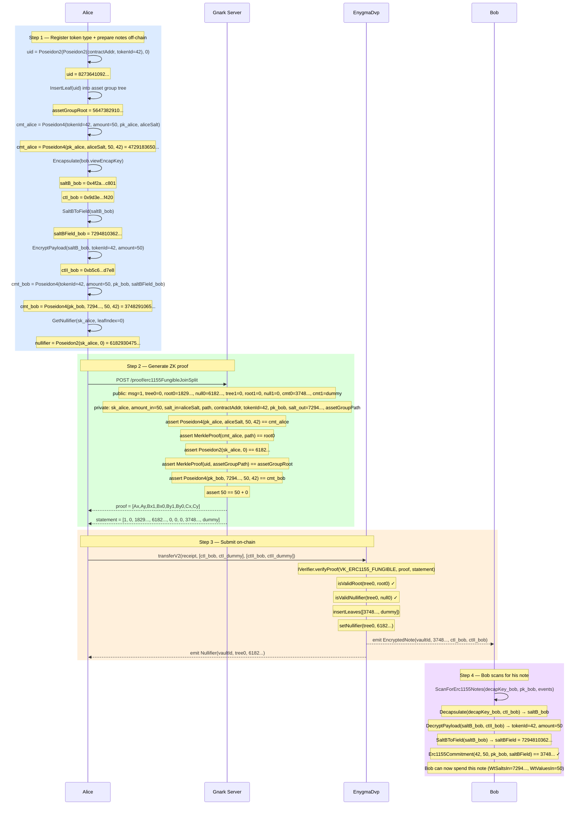

# Flow 07 — ERC1155 Fungible Transfer (erc1155FungibleJoinSplit)

## Overview

The ERC1155 fungible transfer lets Alice privately send tokens to Bob using the same
JoinSplit pattern as ERC20 (Flow 03), with two key differences:

1. **Asset group tree** — a second Merkle tree whose leaves are registered token type IDs.
   The circuit verifies the transferred token type is registered, preventing proofs over
   fake or unregistered token types.

2. **Commitment formula** — `contractAddress` is **not** embedded in the commitment.
   Instead it is validated through the asset group tree membership proof.

The same flow composes into a custody chain: Alice → Bob → Carol, each generating an
independent JoinSplit proof spending the previous output note.

---

## Key difference from ERC20 (Flow 03)

|                    | ERC20 JoinSplit (Flow 03)                | ERC1155 Fungible (Flow 07)                                                         |
| ------------------ | ---------------------------------------- | ---------------------------------------------------------------------------------- |
| Commitment formula | `Poseidon4(pk, salt, amount, tokenId=0)` | `Poseidon4(pk, salt, amount, tokenId)`                                             |
| Contract binding   | Not enforced in circuit                  | `uid = Poseidon2(Poseidon2(contractAddr, tokenId), 0)` checked in asset group tree |
| Asset group tree   | None                                     | Required — proves token type is registered                                         |
| Endpoint           | `/proof/joinSplitERC20`                  | `/proof/erc1155FungibleJoinSplit`                                                  |
| Statement length   | 9 elements                               | 9 elements (same layout)                                                           |

---

## Commitment and UID formulas

```
uid             = Poseidon2(Poseidon2(contractAddr, tokenId), 0)
commitment      = Poseidon4(pk_spend, saltBField, amount, tokenId)
nullifier       = Poseidon2(sk_spend, leafIndex)
```

---

## Circuit

**File:** `gnark_circuits/templates/ERC1155.go`

### Public inputs (statement)

| Index | Name                 | Value                                   |
| ----- | -------------------- | --------------------------------------- |
| 0     | `StMessage`          | Arbitrary (e.g. `1`)                    |
| 1     | `StTreeNumber[0]`    | Tree number for Alice's input note      |
| 2     | `StMerkleRoots[0]`   | Merkle root for Alice's note membership |
| 3     | `StNullifiers[0]`    | `Poseidon2(sk_alice, leafIndex)`        |
| 4     | `StTreeNumber[1]`    | `0` (dummy)                             |
| 5     | `StMerkleRoots[1]`   | `0` (dummy)                             |
| 6     | `StNullifiers[1]`    | `0` (dummy)                             |
| 7     | `StCommitmentOut[0]` | Bob's output commitment                 |
| 8     | `StCommitmentOut[1]` | Dummy zero-value commitment             |

### Private witnesses

| Name                       | Value                                                       |
| -------------------------- | ----------------------------------------------------------- |
| `WtPrivateKeysIn[0]`       | `sk_alice` — proves ownership of the input note             |
| `WtValuesIn[0]`            | Amount in Alice's note                                      |
| `WtSaltsIn[0]`             | `saltBField` from when Alice received the note              |
| `WtPathElements[0][j]`     | Merkle sibling hashes for Alice's leaf (token tree)         |
| `WtPathIndices[0]`         | Leaf index of Alice's note                                  |
| `WtErc1155ContractAddress` | ERC1155 contract address — used to check UID in asset group |
| `WtErc1155TokenId`         | Token type ID                                               |
| `WtPublicKeysOut[0]`       | `pk_bob` — spend public key of the recipient                |
| `WtSaltsOut[0]`            | `saltBField` derived from `Encapsulate(bob.viewEncapKey)`   |
| `WtValuesOut[0]`           | Amount for Bob                                              |
| Asset group path           | Merkle path proving `uid` is in the asset group tree        |

---

## Participants

| Participant  | Role                                                                    |
| ------------ | ----------------------------------------------------------------------- |
| Alice        | Sender — spends her ERC1155 note and creates Bob's output note          |
| Bob          | Recipient — scans `EncryptedNote` to discover the note addressed to him |
| Gnark Server | Generates the Groth16 ERC1155 JoinSplit proof                           |
| EnygmaDvp    | Verifies the proof, nullifies Alice's note, inserts Bob's commitment    |

---

## Diagram



---

## Key references

| Symbol                          | File                                                        | Line |
| ------------------------------- | ----------------------------------------------------------- | ---- |
| `Erc1155FungibleJoinSplitProof` | `src/core/prover_erc.go`                                    | 802  |
| `Erc1155Commitment`             | `src/core/utils.go`                                         | 596  |
| `Erc1155UniqueId`               | `src/core/utils.go`                                         | 582  |
| `GetNullifier`                  | `src/core/utils.go`                                         | —    |
| `Encapsulate`                   | `src/core/utils.go`                                         | 216  |
| `SaltBToField`                  | `src/core/utils.go`                                         | 239  |
| `EncryptPayload`                | `src/core/utils.go`                                         | 317  |
| `ScanForErc1155Notes`           | `src/core/scan.go`                                          | —    |
| `Erc1155Circuit.Define`         | `gnark_circuits/templates/ERC1155.go`                       | —    |
| `NewHandler` (erc1155Fungible)  | `gnark_circuits/server/circuits/erc1155Fungible/handler.go` | —    |
| `transferV2`                    | `contracts/core/contracts/vaults/Erc1155CoinVault.sol`      | —    |
| Integration test                | `test/07_v2_erc1155_fungible_test.go`                       | —    |
