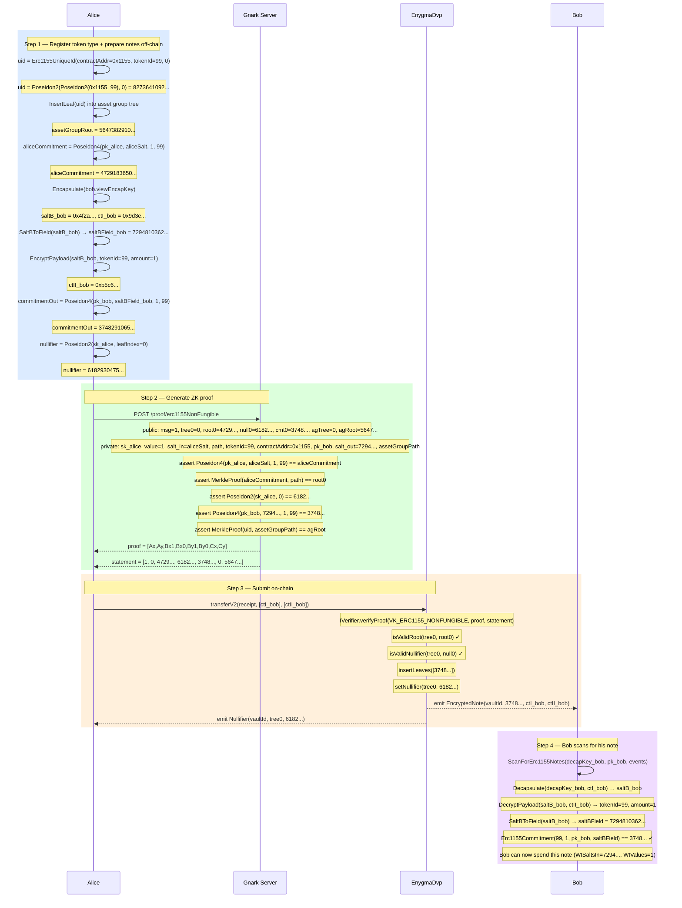

# Flow 08 — ERC1155 Non-Fungible Transfer (erc1155NonFungible)

## Overview

The ERC1155 non-fungible transfer lets Alice privately hand over a non-fungible ERC1155 token
note to Bob (or a chain Alice → Bob → Carol) without revealing the tokenId, identities, or the
link between sender and recipient on-chain.

It is identical in structure to the ERC721 transfer (Flow 05) — 1-in / 1-out ownership proof —
with two additions that are shared with the ERC1155 fungible flow (Flow 07):

1. **Asset group tree** — a second Merkle tree whose leaves are registered token type UIDs.
   The circuit checks that `uid = Erc1155UniqueId(contractAddr, tokenId, 0)` is a member,
   preventing proofs over fake or unregistered token types.

2. **`contractAddress` witness** — the contract address is passed as a private input and used
   to compute the UID, but is **not** part of the commitment hash.

---

## Key facts

| Property          | Value                                                           |
| ----------------- | --------------------------------------------------------------- |
| Circuit           | `erc1155NonFungible` (1-in / 1-out)                            |
| ZK proof          | Groth16 on BN254                                               |
| Commitment        | `Poseidon4(pk_spend, salt, 1, tokenId)` — amount fixed at `1`  |
| UID               | `Poseidon2(Poseidon2(contractAddr, tokenId), 0)`               |
| Verifier          | Generic `IVerifier` registry                                   |
| Tree operation    | `insertLeaves` (1 new) + `setNullifier` (1 old)                |
| Events emitted    | `EncryptedNote` × 1, `Nullifier` × 1                           |
| Token movement    | None — vault already holds the ERC1155 token                   |

---

## Key difference from ERC1155 Fungible (Flow 07)

|                    | ERC1155 Fungible (Flow 07)              | ERC1155 Non-Fungible (Flow 08)         |
| ------------------ | --------------------------------------- | -------------------------------------- |
| Circuit            | `erc1155Fungible` (2-in / 2-out)        | `erc1155NonFungible` (1-in / 1-out)   |
| Amount             | Variable                                | Always `1`                             |
| Balance check      | `sum(in) == sum(out)` enforced          | No balance constraint (amount = 1)    |
| Change note        | Yes — second output is change/dummy     | No — full ownership transfers          |
| Statement length   | 9 elements                              | 7 elements                             |

---

## Commitment and UID formulas

```
uid        = Poseidon2(Poseidon2(contractAddr, tokenId), 0)    // asset group leaf
commitment = Poseidon4(pk_spend, saltBField, 1, tokenId)       // note commitment
nullifier  = Poseidon2(sk_spend, leafIndex)
```

---

## Circuit

**File:** `gnark_circuits/templates/ERC1155.go` (non-fungible variant)

### Public inputs (statement)

| Index | Name                      | Value                                           |
| ----- | ------------------------- | ----------------------------------------------- |
| 0     | `StMessage`               | Arbitrary public value (e.g. `1` for transfer)  |
| 1     | `StTreeNumbers[0]`        | Tree number for Alice's input note              |
| 2     | `StMerkleRoots[0]`        | Merkle root proving Alice's note membership     |
| 3     | `StNullifiers[0]`         | `Poseidon2(sk_alice, leafIndex)`                |
| 4     | `StCommitmentOut[0]`      | Bob's output commitment                         |
| 5     | `StAssetGroupTreeNumber[0]` | Tree number of the asset group tree            |
| 6     | `StAssetGroupMerkleRoot[0]` | Merkle root of the asset group tree            |

### Private witnesses

| Name                         | Value                                                          |
| ---------------------------- | -------------------------------------------------------------- |
| `WtPrivateKeysIn[0]`         | `sk_alice` — proves ownership of the input note               |
| `WtValues[0]`                | `1` — fixed amount for non-fungible tokens                    |
| `WtSaltsIn[0]`               | `saltBField` from when Alice received the note                 |
| `WtPathElements[0][j]`       | Merkle sibling hashes for Alice's leaf (token tree)            |
| `WtPathIndices[0]`           | Leaf index of Alice's note                                     |
| `WtErc1155TokenId[0]`        | Token type ID                                                  |
| `WtErc1155ContractAddress`   | ERC1155 contract address — used to compute the UID             |
| `WtPublicKeysOut[0]`         | `pk_bob` — spend public key of the recipient                  |
| `WtSaltsOut[0]`              | `saltBField` derived from `Encapsulate(bob.viewEncapKey)`     |
| `WtAssetGroupPathElements[0]` | Merkle sibling hashes for `uid` in the asset group tree      |
| `WtAssetGroupPathIndices[0]` | Leaf index of `uid` in the asset group tree                   |

### Constraints (in-circuit)

```
pk_alice              = PublicKey(WtPrivateKeysIn[0])
StNullifiers[0]       = Poseidon2(WtPrivateKeysIn[0], WtPathIndices[0])
commitment_in         = Poseidon4(pk_alice, WtSaltsIn[0], 1, WtErc1155TokenId[0])
MerkleRoot(commitment_in, WtPathElements[0], WtPathIndices[0]) == StMerkleRoots[0]
StCommitmentOut[0]    = Poseidon4(WtPublicKeysOut[0], WtSaltsOut[0], 1, WtErc1155TokenId[0])
uid                   = Poseidon2(Poseidon2(WtErc1155ContractAddress, WtErc1155TokenId[0]), 0)
MerkleRoot(uid, WtAssetGroupPathElements[0], WtAssetGroupPathIndices[0]) == StAssetGroupMerkleRoot[0]
```

---

## Participants

| Participant  | Role                                                                              |
| ------------ | --------------------------------------------------------------------------------- |
| Alice        | Sender — spends her NFT note and creates Bob's output note                       |
| Bob          | Recipient — scans `EncryptedNote` to discover the note addressed to him          |
| Gnark Server | Generates the Groth16 ERC1155 non-fungible ownership proof                       |
| EnygmaDvp    | Verifies the proof, nullifies Alice's note, inserts Bob's commitment              |

---

## Diagram



---

## Key references

| Symbol                                | File                                                                  | Line |
| ------------------------------------- | --------------------------------------------------------------------- | ---- |
| `Erc1155NonFungibleOwnershipProof`    | `src/core/prover_erc.go`                                              | 898  |
| `Erc1155Commitment`                   | `src/core/utils.go`                                                   | 596  |
| `Erc1155UniqueId`                     | `src/core/utils.go`                                                   | 582  |
| `GetNullifier`                        | `src/core/utils.go`                                                   | —    |
| `Encapsulate`                         | `src/core/utils.go`                                                   | 216  |
| `SaltBToField`                        | `src/core/utils.go`                                                   | 239  |
| `EncryptPayload`                      | `src/core/utils.go`                                                   | 317  |
| `ScanForErc1155Notes`                 | `src/core/scan.go`                                                    | —    |
| `Erc1155Circuit.Define` (non-fungible) | `gnark_circuits/templates/ERC1155.go`                                | —    |
| `NewHandler` (erc1155NonFungible)     | `gnark_circuits/server/circuits/erc1155NonFungible/handler.go`        | —    |
| `transferV2`                          | `contracts/core/contracts/vaults/Erc1155CoinVault.sol`                | —    |
| Integration test                      | `test/08_v2_erc1155_nonfungible_test.go`                              | —    |
