# Flow 09 — Atomic DVP Swap: ERC1155 Non-Fungible ↔ ERC20

## Overview

Alice holds an ERC1155 NFT (e.g. tokenId=3116, value=1) and wants to sell it to Bob in exchange
for ERC20 tokens (e.g. 100 tokens). The swap is **atomic and non-custodial**: either both legs
settle simultaneously or neither does.

This flow differs from the ERC721 ↔ ERC20 swap ([Flow 06](./06_swap_erc721_erc20.md)) in three
ways:

1. The delivery asset lives in `Erc1155CoinVault` (vaultId=2) instead of `Erc721CoinVault` (vaultId=1).
2. The ERC1155 proof carries a 7-element statement that includes an **asset group Merkle proof**
   (`agTreeNum`, `agRoot`) at indices [5] and [6].
3. Before calling swap, the specific ERC1155 token must be registered in `NonFungibleAssetGroup`
   via `EnygmaDvp.addTokenToGroup(2, [0, tokenId], 1)` so that `isMemberFromProofReceipt` passes.

Commitment formulae:

```
ERC1155 note: Poseidon4(pk_spend, saltBField, value=1, tokenId)
ERC20 note:   Poseidon4(pk_spend, saltBField, amount, tokenId=0)
```

---

## Atomicity — Cross-commitment linking

The on-chain `_settleOnGroupPair` enforces atomicity by verifying cross-commitment consistency:

```
bobPaymentReceipt.statement[0]    == aliceDeliveryReceipt.statement[4]
aliceDeliveryReceipt.statement[0] == bobPaymentReceipt.statement[7]
```

Mapping to this swap:

```
stMessage(Bob)   = bobNFTCmt      ← pre-computed by Bob, equals Alice's ERC1155 output at stmt[4]
stMessage(Alice) = aliceERC20Cmt  ← pre-computed by Alice, equals Bob's ERC20 first output at stmt[7]
```

Neither party can alter their outputs after the cross-commitment is fixed — any mismatch reverts.

---

## Statement layouts

**ERC20 payment receipt** (2-in / 2-out, non-interleaved, 9 elements):

```
[msg, tree0, tree1, root0, root1, null0, null1, cmt0, cmt1]
 [0]   [1]    [2]   [3]   [4]    [5]    [6]    [7]   [8]
         ↑ first output (Alice's ERC20) at index 7
```

**ERC1155 delivery receipt** (1-in / 1-out, 7 elements):

```
[msg, treeNum, merkleRoot, nullifier, cmt, agTreeNum, agRoot]
 [0]   [1]      [2]         [3]       [4]   [5]        [6]
                                       ↑ NFT output at index 4
```

`agRoot` (index 6) is the last element read by `isMemberFromProofReceipt` to verify
asset group membership in `NonFungibleAssetGroup`.

---

## Asset group membership

Unlike ERC721 (entire vault pre-registered in NON_FUNGIBLES), ERC1155 tokens must be individually
registered because the same vault holds both fungible and non-fungible tokens.

```
EnygmaDvp.addTokenToGroup(
    vaultId        = 2,           // Erc1155CoinVault
    uniqueIdParams = [0, tokenId], // amountOrOne=0, tokenId
    groupId        = 1            // NON_FUNGIBLES
)
```

This inserts `uid = Erc1155UniqueId(contractAddress, tokenId, 0)` into the
NonFungibleAssetGroup's on-chain Merkle tree. The resulting on-chain root then matches the
off-chain `assetGroupProof.Root` built by `core.NewMerkleTree(depth).InsertLeaf(uid)`.

---

## Participants

| Participant  | Role                                                                                    |
| ------------ | --------------------------------------------------------------------------------------- |
| Alice        | Depositor — holds ERC1155 NFT, initiates swap, expects ERC20 payment                   |
| Bob          | Buyer — holds ERC20 tokens (deposited via depositV2), expects ERC1155 NFT              |
| Gnark Server | Generates ERC1155 non-fungible ownership proof (Alice) and ERC20 JoinSplit proof (Bob) |
| EnygmaDvp    | Registers token, verifies cross-commitments, checks group membership, settles atomically|

---

## Diagram

```mermaid
sequenceDiagram
    participant Alice
    participant Gnark as Gnark Server
    participant DVP as EnygmaDvp
    participant Bob

    rect rgb(220, 235, 255)
        Note over Alice,Bob: Step 1 — Alice deposits ERC1155 NFT

        Alice->>DVP: ERC1155.mint + setApprovalForAll
        Alice->>DVP: Erc1155CoinVault.deposit([value=1, tokenId, aliceNFTCmt])
        Note over Alice: aliceNFTCmt = Poseidon4(pk_alice, aliceSalt, 1, tokenId)
        DVP-->>Alice: emit Commitment(vaultId=2, aliceNFTCmt)

        Alice->>Alice: loadVaultMerkleTree() → aliceNFTProof
        Alice->>Alice: uid = Erc1155UniqueId(contractAddr, tokenId, 0)
        Alice->>Alice: assetGroupTree.InsertLeaf(uid) → assetGroupProof.Root

        Alice->>DVP: addTokenToGroup(vaultId=2, [0, tokenId], groupId=NON_FUNGIBLES)
        Note over DVP: uid inserted into NonFungibleAssetGroup Merkle tree
        Note over DVP: on-chain agRoot now matches assetGroupProof.Root
    end

    rect rgb(220, 255, 220)
        Note over Alice,Bob: Step 2 — Alice deposits ERC20 with Bob's commitment

        Alice->>Alice: Encapsulate(bobViewKey) → bobDepositSaltB, capsule
        Alice->>Alice: bobInputCmt = Poseidon4(pk_bob, saltBField, 100, 0)
        Alice->>DVP: ERC20.approve + Erc20CoinVault.depositV2([100, bobInputCmt], capsule, ctII)
        DVP-->>Bob: emit Commitment(vaultId=0, bobInputCmt)

        Alice->>Alice: loadVaultMerkleTree() → bobErc20MerkleProof
    end

    rect rgb(255, 240, 200)
        Note over Alice,Bob: Step 3 — Pre-compute cross-commitments (off-chain key exchange)

        Alice->>Alice: Encapsulate(bobViewKey) → saltBForNFT, ctINFT
        Alice->>Alice: bobNFTCmt = Poseidon4(pk_bob, saltBForNFT, 1, tokenId)
        Note over Alice: bobNFTCmt = 176081...  ← Bob's future NFT note

        Alice->>Alice: Encapsulate(aliceViewKey) → saltBForPayment, ctIPayment
        Alice->>Alice: aliceERC20Cmt = Poseidon4(pk_alice, saltBForPayment, 100, 0)
        Note over Alice: aliceERC20Cmt = 30414...  ← Alice's future ERC20 payment
    end

    rect rgb(240, 220, 255)
        Note over Alice,Gnark: Step 4 — Alice generates ERC1155 ownership proof

        Alice->>Gnark: POST /proof/erc1155NonFungible
        Note over Gnark: StMessage        = aliceERC20Cmt
        Note over Gnark: WtSaltsOut       = saltBForNFT  (pre-determined → produces bobNFTCmt)
        Note over Gnark: StMerkleRoots    = aliceNFTProof.Root
        Note over Gnark: StAssetGroupRoot = assetGroupProof.Root

        Gnark-->>Alice: proof = [8 field elements]
        Gnark-->>Alice: stmt  = [aliceERC20Cmt, treeNum, merkleRoot, nullifier,
        Note over Alice:         bobNFTCmt, agTreeNum, agRoot]   (7 elements)

        Alice->>Alice: assert stmt[4] == bobNFTCmt ✓
    end

    rect rgb(220, 255, 240)
        Note over Bob,Gnark: Step 5 — Bob generates ERC20 JoinSplit proof

        Bob->>Gnark: POST /proof/joinSplitERC20
        Note over Gnark: StMessage     = bobNFTCmt
        Note over Gnark: WtSaltsOut[0] = saltBForPayment (pre-determined → produces aliceERC20Cmt)
        Note over Gnark: StMerkleRoots = bobErc20MerkleProof.Root

        Gnark-->>Bob: proof = [8 field elements]
        Gnark-->>Bob: stmt  = [bobNFTCmt, tree0, tree1, root0, root1,
        Note over Bob:         null0, null1, aliceERC20Cmt, dummy]   (9 elements)

        Bob->>Bob: assert stmt[7] == aliceERC20Cmt ✓
        Bob->>Bob: assert aliceResult.stmt[0] == bobResult.stmt[7] ✓
        Bob->>Bob: assert bobResult.stmt[0]   == aliceResult.stmt[4] ✓
    end

    rect rgb(255, 220, 220)
        Note over Alice,DVP: Step 6 — Atomic settlement

        Alice->>DVP: swap(bobPaymentReceipt, aliceDeliveryReceipt,\n  paymentVaultId=0, deliveryVaultId=2)
        Note over DVP: _settleOnGroupPair:
        Note over DVP: bobPaymentReceipt.stmt[0] == aliceDeliveryReceipt.stmt[4] ✓
        Note over DVP: aliceDeliveryReceipt.stmt[0] == bobPaymentReceipt.stmt[7] ✓
        Note over DVP: isValidRoot(0, agRoot) == true ✓  (NonFungibleAssetGroup)
        Note over DVP: Erc20CoinVault: checkReceiptConditions + insertCommitments + nullify
        Note over DVP: Erc1155CoinVault: checkReceiptConditions + insertCommitments + nullify

        DVP-->>Bob: emit Commitment(vaultId=2, bobNFTCmt)
        DVP-->>Alice: emit Commitment(vaultId=0, aliceERC20Cmt)
        DVP-->>Alice: emit Nullifier (alice's NFT note spent)
        DVP-->>Bob: emit Nullifier (bob's ERC20 note spent)
        DVP-->>Alice: emit Settled(bobNFTCmt, aliceERC20Cmt)
    end

    rect rgb(235, 235, 235)
        Note over Alice,Bob: Step 7 — Scan for received notes

        Bob->>Bob: ScanForErc1155Notes(bobDecapsKey, pk_bob, events)
        Note over Bob: Decapsulate(bobDecapsKey, ctINFT) → saltBForNFT
        Note over Bob: DecryptPayload(saltBForNFT, ctIINFT) → tokenId, value=1
        Note over Bob: Poseidon4(pk_bob, saltBForNFT, 1, tokenId) == bobNFTCmt ✓

        Alice->>Alice: ScanForErc20Notes(aliceDecapsKey, pk_alice, events)
        Note over Alice: Decapsulate(aliceDecapsKey, ctIPayment) → saltBForPayment
        Note over Alice: DecryptPayload(saltBForPayment, ctIIPayment) → tokenId=0, amount=100
        Note over Alice: Poseidon4(pk_alice, saltBForPayment, 100, 0) == aliceERC20Cmt ✓
    end
```



---

## Key differences from ERC721 ↔ ERC20 swap (Flow 06)

| Aspect                   | ERC721 ↔ ERC20                        | ERC1155 NFT ↔ ERC20                          |
| ------------------------ | ------------------------------------- | -------------------------------------------- |
| Delivery vault           | vaultId=1 (Erc721CoinVault)           | vaultId=2 (Erc1155CoinVault)                 |
| Delivery proof function  | `Erc721OwnershipProofFromSalt`        | `Erc1155NonFungibleOwnershipProofFromSalt`   |
| Delivery statement size  | 5 elements                            | 7 elements (+ agTreeNum, agRoot)             |
| Receipt construction     | `buildReceipt()` / `ContractStatement()` | Use `result.Statement` directly           |
| Group pre-registration   | Entire ERC721 vault in NON_FUNGIBLES  | Per-token via `addTokenToGroup` before swap  |
| Asset group proof        | Not needed                            | Required (off-chain tree + on-chain insert)  |
| Token approval           | `ERC721.approve(vault, tokenId)`      | `ERC1155.setApprovalForAll(vault, true)`     |

---

## Key references

| Symbol                                        | File                                                           | Line |
| --------------------------------------------- | -------------------------------------------------------------- | ---- |
| `Erc1155NonFungibleOwnershipProofFromSalt`    | `src/core/prover_erc.go`                                       | 1000 |
| `Erc20JoinSplitProofFromSalts`                | `src/core/prover_erc.go`                                       | 688  |
| `Erc1155Commitment`                           | `src/core/utils.go`                                            | 596  |
| `Erc1155UniqueId`                             | `src/core/utils.go`                                            | 582  |
| `ScanForErc1155Notes`                         | `src/core/scan.go`                                             | 320  |
| `addTokenToGroup`                             | `contracts/core/contracts/EnygmaDvp.sol`                       | 400  |
| `isMemberFromProofReceipt`                    | `contracts/core/contracts/vaults/AssetGroup.sol`               | 117  |
| `_settleOnGroupPair`                          | `contracts/core/contracts/EnygmaDvp.sol`                       | 798  |
| `swap`                                        | `contracts/core/contracts/EnygmaDvp.sol`                       | 707  |
| `checkReceiptConditions` (ERC1155)            | `contracts/core/contracts/vaults/Erc1155CoinVault.sol`         | 312  |
| Integration test                              | `test/10_v2_swap_erc1155nonfungible_erc20_onchain_test.go`     | —    |
| ERC1155 non-fungible transfer (reference)     | `test/07_v2_erc1155_nonfungible_onchain_test.go`               | —    |
| ERC721 ↔ ERC20 swap (reference)              | `test/08_v2_swap_erc721_erc20_onchain_test.go`                 | —    |
