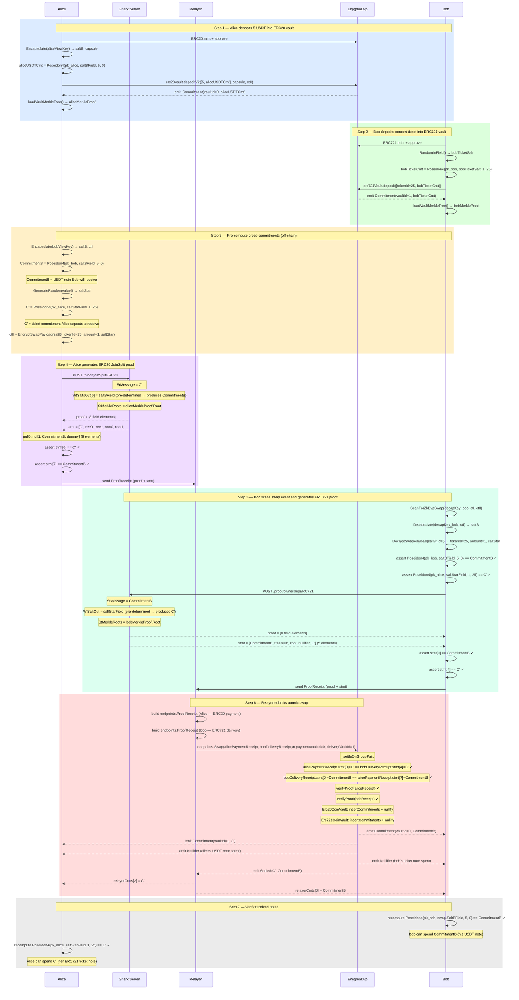

# Flow 10 — ZkDvP Two-Phase Swap with Relayer (ERC20 ↔ ERC721)

## Overview

Alice swaps 5 USDT (ERC20, tokenId=0) for Bob's concert ticket (ERC721, tokenId=25).
Both parties generate their ZK proofs independently and off-chain. A **relayer** collects
both `ProofReceipt`s and submits them in a single atomic call to `EnygmaDvp.swap()`.

Compared to [Flow 06](./06_swap_erc721_erc20.md) which uses two independent
`submitPartialSettlement` calls (on-chain coordination), this flow uses one atomic
`swap()` call — the relayer coordinates off-chain so only one transaction lands on-chain.

Commitment formulae:

```
ERC20 note:  Poseidon4(pk_spend, saltBField, amount, tokenId=0)
ERC721 note: Poseidon4(pk_spend, saltBField, amount=1, tokenId)
```

---

## Atomicity

`_settleOnGroupPair` verifies cross-commitment consistency before settling:

```
alicePaymentReceipt.stmt[0] == bobDeliveryReceipt.stmt[4]   // C' == C'
bobDeliveryReceipt.stmt[0]  == alicePaymentReceipt.stmt[7]  // CommitmentB == CommitmentB
```

Mapping to this swap:

```
stMessage(Alice) = C'            ← Alice's expected ERC721 ticket, equals Bob's output at stmt[4]
firstOutput(Alice) = CommitmentB ← Alice's USDT payment for Bob, equals Bob's stMessage at stmt[0]
stMessage(Bob)   = CommitmentB   ← links Bob's proof to Alice's payment
firstOutput(Bob) = C'            ← Bob delivers exactly the ticket Alice pre-computed
```

Any mismatch between the two receipts reverts the entire transaction.

---

## Statement layouts

**ERC20 payment receipt** (2-in / 2-out, non-interleaved, 9 elements):

```
[msg, tree0, tree1, root0, root1, null0, null1, cmt0, cmt1]
 [0]   [1]    [2]   [3]   [4]    [5]    [6]    [7]   [8]
                                                 ↑ CommitmentB (Bob's USDT) at index 7
```

**ERC721 delivery receipt** (1-in / 1-out, 5 elements):

```
[msg, treeNum, merkleRoot, nullifier, cmt]
 [0]   [1]      [2]         [3]       [4]
                                       ↑ C' (Alice's ticket) at index 4
```

---

## Relayer

The relayer submits the transaction on behalf of both parties using its own Ethereum key.

It **cannot**: forge or alter proofs (on-chain Groth16 verifier rejects), steal funds
(outputs are bound to recipients' public keys), or see private inputs.

It **can**: choose when to submit (liveness trust only) and pays gas.

---

## Participants

| Participant  | Role                                                                                    |
| ------------ | --------------------------------------------------------------------------------------- |
| Alice        | Initiator — spends her USDT note, pre-commits to receiving the concert ticket           |
| Bob          | Completer — decrypts swap payload, spends his ticket note                               |
| Gnark Server | Generates Alice's ERC20 JoinSplit proof and Bob's ERC721 Ownership proof                |
| Relayer      | Collects both ProofReceipts, submits `EnygmaDvp.swap()` with its own Ethereum key      |
| EnygmaDvp    | Verifies both proofs, checks cross-commitment consistency, settles atomically in one tx |

---

## Diagram



---

## Key references

| Symbol                         | File                                                              | Line |
| ------------------------------ | ----------------------------------------------------------------- | ---- |
| `Erc20JoinSplitProofFromSalts` | `src/core/prover_erc.go`                                         | 680  |
| `Erc721OwnershipProofFromSalt` | `src/core/prover_erc.go`                                         | —    |
| `ScanForZkDvpSwap`             | `src/core/scan.go`                                               | 237  |
| `EncryptSwapPayload`           | `src/core/utils.go`                                              | 264  |
| `Erc20CommitmentV2`            | `src/core/utils.go`                                              | 563  |
| `Erc721Commitment`             | `src/core/utils.go`                                              | —    |
| `Encapsulate` / `SaltBToField` | `src/core/utils.go`                                              | 216  |
| `endpoints.Swap`               | `src/core/endpoints/relayer.go`                                  | 183  |
| `endpoints.ProofReceipt`       | `src/core/endpoints/relayer.go`                                  | 61   |
| `swap`                         | `contracts/core/contracts/EnygmaDvp.sol`                         | 707  |
| `_settleOnGroupPair`           | `contracts/core/contracts/EnygmaDvp.sol`                         | 798  |
| Integration test               | `test/05_v2_zkdvp_two_phase_swap_relayer_test.go`                | —    |
| ZkDvP without relayer          | `docs/flows/06_swap_erc721_erc20.md`                             | —    |
