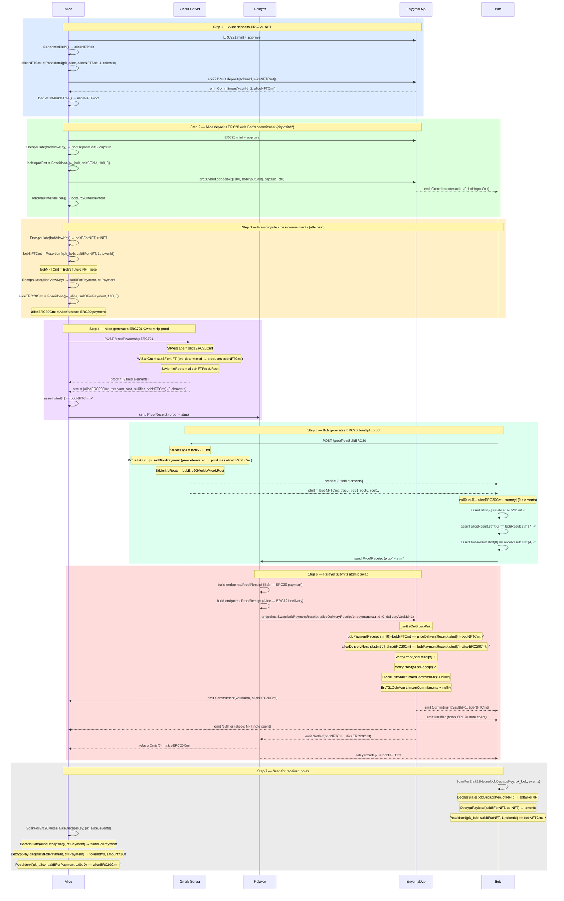

# Flow 11 — Atomic DVP Swap with Relayer: ERC721 ↔ ERC20

## Overview

Alice has an ERC721 NFT (e.g. tokenId=2347) and Bob has ERC20 tokens (e.g. 100).
They want to swap atomically — either both sides settle or neither does.

Compared to [Flow 09](./09_swap_erc1155nonfungible_erc20.md), the delivery asset is in
`Erc721CoinVault` (vaultId=1) and no asset group pre-registration is required.

Compared to [Flow 10](./10_zkdvp_two_phase_swap_relayer.md), the direction is reversed:
Bob pays ERC20, Alice delivers ERC721. Alice deposits the ERC20 tokens on Bob's behalf
via `depositV2` so Bob has a spendable note without needing `privateMint`.

Commitment formulae:

```
ERC721 note: Poseidon4(pk_spend, saltBField, amount=1, tokenId)
ERC20 note:  Poseidon4(pk_spend, saltBField, amount, tokenId=0)
```

---

## Atomicity

`_settleOnGroupPair` verifies cross-commitment consistency before settling:

```
bobPaymentReceipt.stmt[0]    == aliceDeliveryReceipt.stmt[4]   // bobNFTCmt == bobNFTCmt
aliceDeliveryReceipt.stmt[0] == bobPaymentReceipt.stmt[7]      // aliceERC20Cmt == aliceERC20Cmt
```

Mapping to this swap:

```
stMessage(Bob)   = bobNFTCmt      ← pre-computed by Bob, equals Alice's ERC721 output at stmt[4]
stMessage(Alice) = aliceERC20Cmt  ← pre-computed by Alice, equals Bob's ERC20 first output at stmt[7]
```

Any mismatch between the two receipts reverts the entire transaction.

---

## Statement layouts

**ERC20 payment receipt** (2-in / 2-out, non-interleaved, 9 elements):

```
[msg, tree0, tree1, root0, root1, null0, null1, cmt0, cmt1]
 [0]   [1]    [2]   [3]   [4]    [5]    [6]    [7]   [8]
                                                 ↑ aliceERC20Cmt at index 7
```

**ERC721 delivery receipt** (1-in / 1-out, 5 elements):

```
[msg, treeNum, merkleRoot, nullifier, cmt]
 [0]   [1]      [2]         [3]       [4]
                                       ↑ bobNFTCmt at index 4
```

---

## Relayer

The relayer submits the transaction on behalf of both parties using its own Ethereum key.

It **cannot**: forge or alter proofs (on-chain Groth16 verifier rejects), steal funds
(outputs are bound to recipients' public keys), or see private inputs.

It **can**: choose when to submit (liveness trust only) and pays gas.

---

## Participants

| Participant  | Role                                                                                    |
| ------------ | --------------------------------------------------------------------------------------- |
| Alice        | Sells ERC721 NFT, wants ERC20 payment — also funds Bob's initial ERC20 note via depositV2 |
| Bob          | Buys NFT with ERC20 tokens                                                              |
| Gnark Server | Generates Alice's ERC721 Ownership proof and Bob's ERC20 JoinSplit proof                |
| Relayer      | Collects both ProofReceipts, submits `EnygmaDvp.swap()` with its own Ethereum key      |
| EnygmaDvp    | Verifies both proofs, checks cross-commitment consistency, settles atomically in one tx |

---

## Diagram



---

## Key references

| Symbol                         | File                                                              | Line |
| ------------------------------ | ----------------------------------------------------------------- | ---- |
| `Erc721OwnershipProofFromSalt` | `src/core/prover_erc.go`                                         | —    |
| `Erc20JoinSplitProofFromSalts` | `src/core/prover_erc.go`                                         | 680  |
| `Erc721Commitment`             | `src/core/utils.go`                                              | —    |
| `Erc20CommitmentV2`            | `src/core/utils.go`                                              | 563  |
| `ScanForErc721Notes`           | `src/core/scan.go`                                               | —    |
| `ScanForErc20Notes`            | `src/core/scan.go`                                               | 62   |
| `Encapsulate` / `SaltBToField` | `src/core/utils.go`                                              | 216  |
| `endpoints.Swap`               | `src/core/endpoints/relayer.go`                                  | 183  |
| `endpoints.ProofReceipt`       | `src/core/endpoints/relayer.go`                                  | 61   |
| `swap`                         | `contracts/core/contracts/EnygmaDvp.sol`                         | 707  |
| `_settleOnGroupPair`           | `contracts/core/contracts/EnygmaDvp.sol`                         | 798  |
| Integration test               | `test/08_v2_swap_erc721_erc20_relayer_test.go`                   | —    |
| Without relayer (reference)    | `test/08_v2_swap_erc721_erc20_onchain_test.go`                   | —    |
