# Flow 12 — Atomic DVP Swap with Relayer: ERC1155 Non-Fungible ↔ ERC20

## Overview

Alice has an ERC1155 NFT (e.g. tokenId=3116, value=1) and Bob has ERC20 tokens (e.g. 100).
They want to swap atomically — either both sides settle or neither does.

Compared to [Flow 09](./09_swap_erc1155nonfungible_erc20.md), the delivery asset is in
`Erc1155CoinVault` (vaultId=2) and asset group pre-registration is required before swapping.

Compared to [Flow 11](./11_swap_erc721_erc20_relayer.md), the delivery proof produces a
**7-element statement** (not 5) because ERC1155 appends `agTreeNum` and `agRoot` for
asset group membership verification. The relayer must pass `aliceResult.Statement` directly
(NOT `ContractStatement()`, which trims to 5 elements).

Commitment formulae:

```
ERC1155 note: Poseidon4(pk_spend, saltBField, value=1, tokenId)
ERC20 note:   Poseidon4(pk_spend, saltBField, amount, tokenId=0)
```

---

## Atomicity

`_settleOnGroupPair` verifies cross-commitment consistency before settling:

```
bobPaymentReceipt.stmt[0]    == aliceDeliveryReceipt.stmt[4]   // bobNFTCmt == bobNFTCmt
aliceDeliveryReceipt.stmt[0] == bobPaymentReceipt.stmt[7]      // aliceERC20Cmt == aliceERC20Cmt
```

Mapping to this swap:

```
stMessage(Bob)   = bobNFTCmt      ← pre-computed by Bob, equals Alice's ERC1155 output at stmt[4]
stMessage(Alice) = aliceERC20Cmt  ← pre-computed by Alice, equals Bob's ERC20 first output at stmt[7]
```

Any mismatch between the two receipts reverts the entire transaction.

---

## Statement layouts

**ERC20 payment receipt** (2-in / 2-out, non-interleaved, 9 elements):

```
[msg, tree0, tree1, root0, root1, null0, null1, cmt0, cmt1]
 [0]   [1]    [2]   [3]   [4]    [5]    [6]    [7]   [8]
                                                 ↑ aliceERC20Cmt at index 7
```

**ERC1155 delivery receipt** (1-in / 1-out, 7 elements):

```
[msg, treeNum, merkleRoot, nullifier, cmt, agTreeNum, agRoot]
 [0]   [1]      [2]         [3]       [4]   [5]        [6]
                                       ↑ bobNFTCmt at index 4
```

`agRoot` (index 6) is read by `isMemberFromProofReceipt` to verify asset group membership.
The relayer must pass `aliceResult.Statement` (7 elements) — do NOT use `ContractStatement()`
which trims to 5 elements and drops `agTreeNum` and `agRoot`.

---

## Asset group membership

ERC1155 tokens must be registered per-token before swapping:

```
EnygmaDvp.addTokenToGroup(
    vaultId        = 2,            // Erc1155CoinVault
    uniqueIdParams = [0, tokenId], // amountOrOne=0, tokenId
    groupId        = 1             // NON_FUNGIBLES
)
```

This inserts `uid = Erc1155UniqueId(contractAddress, tokenId, 0)` into the
`NonFungibleAssetGroup` on-chain Merkle tree, so its root matches the off-chain
`assetGroupProof.Root` built by `core.NewMerkleTree(depth).InsertLeaf(uid)`.

---

## Relayer

The relayer submits the transaction on behalf of both parties using its own Ethereum key.

It **cannot**: forge or alter proofs (on-chain Groth16 verifier rejects), steal funds
(outputs are bound to recipients' public keys), or see private inputs.

It **can**: choose when to submit (liveness trust only) and pays gas.

---

## Participants

| Participant  | Role                                                                                      |
| ------------ | ----------------------------------------------------------------------------------------- |
| Alice        | Sells ERC1155 NFT, wants ERC20 payment — also funds Bob's initial ERC20 note via depositV2 |
| Bob          | Buys NFT with ERC20 tokens                                                                |
| Gnark Server | Generates Alice's ERC1155 ownership proof and Bob's ERC20 JoinSplit proof                 |
| Relayer      | Collects both ProofReceipts, submits `EnygmaDvp.swap()` with its own Ethereum key        |
| EnygmaDvp    | Verifies both proofs, checks group membership and cross-commitments, settles atomically   |

---

## Diagram

```mermaid
sequenceDiagram
    participant Alice
    participant Gnark as Gnark Server
    participant Relayer
    participant DVP as EnygmaDvp
    participant Bob

    rect rgb(220, 235, 255)
        Note over Alice,DVP: Step 1 — Alice deposits ERC1155 NFT and registers token

        Alice->>DVP: ERC1155.mint + setApprovalForAll
        Alice->>Alice: RandomInField() → aliceNFTSalt
        Alice->>Alice: aliceNFTCmt = Poseidon4(pk_alice, aliceNFTSalt, 1, tokenId)
        Alice->>DVP: erc1155Vault.deposit([value=1, tokenId, aliceNFTCmt])
        DVP-->>Alice: emit Commitment(vaultId=2, aliceNFTCmt)
        Alice->>Alice: loadVaultMerkleTree() → aliceNFTProof

        Alice->>Alice: uid = Erc1155UniqueId(contractAddr, tokenId, 0)
        Alice->>Alice: assetGroupTree.InsertLeaf(uid) → assetGroupProof

        Alice->>DVP: addTokenToGroup(vaultId=2, [0, tokenId], groupId=NON_FUNGIBLES)
        Note over DVP: uid inserted into NonFungibleAssetGroup Merkle tree
        Note over DVP: on-chain agRoot now matches assetGroupProof.Root
    end

    rect rgb(220, 255, 220)
        Note over Alice,DVP: Step 2 — Alice deposits ERC20 with Bob's commitment (depositV2)

        Alice->>DVP: ERC20.mint + approve
        Alice->>Alice: Encapsulate(bobViewKey) → bobDepositSaltB, capsule
        Alice->>Alice: bobInputCmt = Poseidon4(pk_bob, saltBField, 100, 0)
        Alice->>DVP: erc20Vault.depositV2([100, bobInputCmt], capsule, ctII)
        DVP-->>Bob: emit Commitment(vaultId=0, bobInputCmt)
        Alice->>Alice: loadVaultMerkleTree() → bobErc20MerkleProof
    end

    rect rgb(255, 240, 200)
        Note over Alice,Bob: Step 3 — Pre-compute cross-commitments (off-chain)

        Alice->>Alice: Encapsulate(bobViewKey) → saltBForNFT, ctINFT
        Alice->>Alice: bobNFTCmt = Poseidon4(pk_bob, saltBForNFT, 1, tokenId)
        Note over Alice: bobNFTCmt = Bob's future ERC1155 NFT note

        Alice->>Alice: Encapsulate(aliceViewKey) → saltBForPayment, ctIPayment
        Alice->>Alice: aliceERC20Cmt = Poseidon4(pk_alice, saltBForPayment, 100, 0)
        Note over Alice: aliceERC20Cmt = Alice's future ERC20 payment
    end

    rect rgb(240, 220, 255)
        Note over Alice,Gnark: Step 4 — Alice generates ERC1155 ownership proof

        Alice->>Gnark: POST /proof/erc1155NonFungible
        Note over Gnark: StMessage        = aliceERC20Cmt
        Note over Gnark: WtSaltsOut       = saltBForNFT  (pre-determined → produces bobNFTCmt)
        Note over Gnark: StMerkleRoots    = aliceNFTProof.Root
        Note over Gnark: StAssetGroupRoot = assetGroupProof.Root

        Gnark-->>Alice: proof = [8 field elements]
        Gnark-->>Alice: stmt  = [aliceERC20Cmt, treeNum, merkleRoot, nullifier,
        Note over Alice:         bobNFTCmt, agTreeNum, agRoot]   (7 elements)

        Alice->>Alice: assert stmt[4] == bobNFTCmt ✓
        Alice->>Relayer: send ProofReceipt (proof + stmt, 7 elements as-is)
    end

    rect rgb(220, 255, 240)
        Note over Bob,Gnark: Step 5 — Bob generates ERC20 JoinSplit proof

        Bob->>Gnark: POST /proof/joinSplitERC20
        Note over Gnark: StMessage     = bobNFTCmt
        Note over Gnark: WtSaltsOut[0] = saltBForPayment  (pre-determined → produces aliceERC20Cmt)
        Note over Gnark: StMerkleRoots = bobErc20MerkleProof.Root

        Gnark-->>Bob: proof = [8 field elements]
        Gnark-->>Bob: stmt  = [bobNFTCmt, tree0, tree1, root0, root1,
        Note over Bob:         null0, null1, aliceERC20Cmt, dummy]   (9 elements)

        Bob->>Bob: assert stmt[7] == aliceERC20Cmt ✓
        Bob->>Bob: assert aliceResult.stmt[0] == bobResult.stmt[7] ✓
        Bob->>Bob: assert bobResult.stmt[0]   == aliceResult.stmt[4] ✓
        Bob->>Relayer: send ProofReceipt (proof + stmt)
    end

    rect rgb(255, 220, 220)
        Note over Relayer,DVP: Step 6 — Relayer submits atomic swap

        Relayer->>Relayer: build endpoints.ProofReceipt (Bob — ERC20 payment, ContractStatement())
        Relayer->>Relayer: build endpoints.ProofReceipt (Alice — ERC1155 delivery, Statement as-is)

        Relayer->>DVP: endpoints.Swap(bobPaymentReceipt, aliceDeliveryReceipt,\n  paymentVaultId=0, deliveryVaultId=2)

        Note over DVP: _settleOnGroupPair:
        Note over DVP: bobPaymentReceipt.stmt[0]=bobNFTCmt == aliceDeliveryReceipt.stmt[4]=bobNFTCmt ✓
        Note over DVP: aliceDeliveryReceipt.stmt[0]=aliceERC20Cmt == bobPaymentReceipt.stmt[7]=aliceERC20Cmt ✓
        Note over DVP: isValidRoot(0, agRoot) == true ✓  (NonFungibleAssetGroup)
        Note over DVP: verifyProof(bobReceipt)   ✓
        Note over DVP: verifyProof(aliceReceipt) ✓
        Note over DVP: Erc20CoinVault:   insertCommitments + nullify
        Note over DVP: Erc1155CoinVault: insertCommitments + nullify

        DVP-->>Alice: emit Commitment(vaultId=0, aliceERC20Cmt)
        DVP-->>Bob: emit Commitment(vaultId=2, bobNFTCmt)
        DVP-->>Bob: emit Nullifier (bob's ERC20 note spent)
        DVP-->>Alice: emit Nullifier (alice's ERC1155 NFT note spent)
        DVP-->>Relayer: emit Settled(bobNFTCmt, aliceERC20Cmt)
        Relayer-->>Alice: relayerCmts[0] = aliceERC20Cmt
        Relayer-->>Bob: relayerCmts[2] = bobNFTCmt
    end

    rect rgb(235, 235, 235)
        Note over Alice,Bob: Step 7 — Scan for received notes

        Bob->>Bob: ScanForErc1155Notes(bobDecapsKey, pk_bob, events)
        Note over Bob: Decapsulate(bobDecapsKey, ctINFT) → saltBForNFT
        Note over Bob: DecryptPayload(saltBForNFT, ctIINFT) → tokenId, value=1
        Note over Bob: Poseidon4(pk_bob, saltBForNFT, 1, tokenId) == bobNFTCmt ✓

        Alice->>Alice: ScanForErc20Notes(aliceDecapsKey, pk_alice, events)
        Note over Alice: Decapsulate(aliceDecapsKey, ctIPayment) → saltBForPayment
        Note over Alice: DecryptPayload(saltBForPayment, ctIIPayment) → tokenId=0, amount=100
        Note over Alice: Poseidon4(pk_alice, saltBForPayment, 100, 0) == aliceERC20Cmt ✓
    end
```



---

## Key references

| Symbol                                      | File                                                              | Line |
| ------------------------------------------- | ----------------------------------------------------------------- | ---- |
| `Erc1155NonFungibleOwnershipProofFromSalt`  | `src/core/prover_erc.go`                                         | 1000 |
| `Erc20JoinSplitProofFromSalts`              | `src/core/prover_erc.go`                                         | 688  |
| `Erc1155Commitment`                         | `src/core/utils.go`                                              | 596  |
| `Erc1155UniqueId`                           | `src/core/utils.go`                                              | 582  |
| `ScanForErc1155Notes`                       | `src/core/scan.go`                                               | 320  |
| `ScanForErc20Notes`                         | `src/core/scan.go`                                               | 62   |
| `Encapsulate` / `SaltBToField`              | `src/core/utils.go`                                              | 216  |
| `endpoints.Swap`                            | `src/core/endpoints/relayer.go`                                  | 183  |
| `endpoints.ProofReceipt`                    | `src/core/endpoints/relayer.go`                                  | 61   |
| `addTokenToGroup`                           | `contracts/core/contracts/EnygmaDvp.sol`                         | 400  |
| `isMemberFromProofReceipt`                  | `contracts/core/contracts/vaults/AssetGroup.sol`                 | 117  |
| `swap`                                      | `contracts/core/contracts/EnygmaDvp.sol`                         | 707  |
| `_settleOnGroupPair`                        | `contracts/core/contracts/EnygmaDvp.sol`                         | 798  |
| Integration test                            | `test/10_v2_swap_erc1155nonfungible_erc20_relayer_test.go`       | —    |
| Without relayer (reference)                 | `test/10_v2_swap_erc1155nonfungible_erc20_onchain_test.go`       | —    |
