# Flow 13 — Atomic DVP Swap with On-Chain Relayer (SwapRelayer.sol)

## Overview

Alice swaps 5 USDT (ERC20, tokenId=0) for Bob's concert ticket (ERC721, tokenId=25)
using the **on-chain relayer** (`SwapRelayer.sol`).

Compared to [Flow 10](./10_zkdvp_two_phase_swap_relayer.md) (off-chain relayer):

1. Each party submits their `ProofReceipt` directly to `SwapRelayer` — no off-chain service needed.
2. Nullifiers are locked **on first submission** via `EnygmaDvp.lockReceiptNullifiers()` — preventing double-spend during the gap.
3. `ctI`/`ctII` are emitted as `SwapReceiptSubmitted` on-chain — Bob discovers the swap by scanning the chain, not via off-chain messaging.
4. The second submitter **triggers settlement atomically** — `SwapRelayer` calls `EnygmaDvp.swap()` internally.
5. If the counterparty never appears, the initiator can **cancel after expiry** and unlock their note.

Commitment formulae:

```
ERC20 note:  Poseidon4(pk_spend, saltBField, amount, tokenId=0)
ERC721 note: Poseidon4(pk_spend, saltBField, amount=1, tokenId)
```

---

## Atomicity

Cross-commitment consistency enforced by `_settleOnGroupPair` inside `EnygmaDvp.swap()`:

```
alicePaymentReceipt.stmt[0] == bobDeliveryReceipt.stmt[4]   // C' == C'
bobDeliveryReceipt.stmt[0]  == alicePaymentReceipt.stmt[7]  // CommitmentB == CommitmentB
```

Neither party can alter their output after generating their proof — any mismatch reverts.

---

## Double-spend prevention

```
submitReceipt (Alice) → EnygmaDvp.lockReceiptNullifiers()
                            → vault.lockCoin(treeNum, nullifier)
                            → lockedNullifiers[treeNum][nullifier] = true

Alice tries to spend elsewhere → vault rejects: nullifier is locked ✓

submitReceipt (Bob)   → dvp.swap() called → nullifiers consumed permanently ✓
```

---

## Statement layouts

**ERC20 payment receipt** (2-in / 2-out, non-interleaved, 9 elements):

```
[msg, tree0, tree1, root0, root1, null0, null1, cmt0, cmt1]
 [0]   [1]    [2]   [3]   [4]    [5]    [6]    [7]   [8]
                                                 ↑ CommitmentB at index 7
```

**ERC721 delivery receipt** (1-in / 1-out, 5 elements):

```
[msg, treeNum, merkleRoot, nullifier, cmt]
 [0]   [1]      [2]         [3]       [4]
                                       ↑ C' at index 4
```

---

## swapId

Both parties derive the same identifier independently before any on-chain submission:

```
swapId = keccak256(abi.encode(CommitmentB, C'))
```

---

## Participants

| Participant  | Role                                                                               |
| ------------ | ---------------------------------------------------------------------------------- |
| Alice        | Initiator — submits ERC20 payment receipt, locks her USDT nullifier               |
| Bob          | Completer — discovers swap on-chain, submits ERC721 delivery receipt, triggers settlement |
| Gnark Server | Generates Alice's ERC20 JoinSplit proof and Bob's ERC721 ownership proof           |
| SwapRelayer  | On-chain coordinator — locks nullifiers, triggers `dvp.swap()` when both sides in |
| EnygmaDvp    | Verifies both proofs, checks cross-commitments, settles atomically                 |

---

## Diagram

```mermaid
sequenceDiagram
    participant Alice
    participant Gnark as Gnark Server
    participant SR as SwapRelayer
    participant DVP as EnygmaDvp
    participant Bob

    rect rgb(220, 235, 255)
        Note over Alice,DVP: Step 1 — Alice deposits 5 USDT into ERC20 vault

        Alice->>DVP: ERC20.mint + approve
        Alice->>Alice: Encapsulate(aliceViewKey) → saltB, capsule
        Alice->>Alice: aliceUSDTCmt = Poseidon4(pk_alice, saltBField, 5, 0)
        Alice->>DVP: erc20Vault.depositV2([5, aliceUSDTCmt], capsule, ctII)
        DVP-->>Alice: emit Commitment(vaultId=0, aliceUSDTCmt)
        Alice->>Alice: loadVaultMerkleTree() → aliceMerkleProof
    end

    rect rgb(220, 255, 220)
        Note over Bob,DVP: Step 2 — Bob deposits concert ticket into ERC721 vault

        Bob->>DVP: ERC721.mint + approve
        Bob->>Bob: RandomInField() → bobTicketSalt
        Bob->>Bob: bobTicketCmt = Poseidon4(pk_bob, bobTicketSalt, 1, 25)
        Bob->>DVP: erc721Vault.deposit([tokenId=25, bobTicketCmt])
        DVP-->>Bob: emit Commitment(vaultId=1, bobTicketCmt)
        Bob->>Bob: loadVaultMerkleTree() → bobMerkleProof
    end

    rect rgb(255, 240, 200)
        Note over Alice,Bob: Step 3 — Alice pre-computes cross-commitments (off-chain)

        Alice->>Alice: Encapsulate(bobViewKey) → saltB, ctI
        Alice->>Alice: CommitmentB = Poseidon4(pk_bob, saltBField, 5, 0)
        Note over Alice: CommitmentB = USDT note Bob will receive

        Alice->>Alice: GenerateRandomValue() → saltStar
        Alice->>Alice: C' = Poseidon4(pk_alice, saltStarField, 1, 25)
        Note over Alice: C' = ticket commitment Alice expects to receive

        Alice->>Alice: ctII = EncryptSwapPayload(saltB, tokenId=25, amount=1, saltStar)
        Alice->>Alice: swapId = keccak256(CommitmentB, C')
    end

    rect rgb(240, 220, 255)
        Note over Alice,Gnark: Step 4 — Alice generates ERC20 JoinSplit proof

        Alice->>Gnark: POST /proof/joinSplitERC20
        Note over Gnark: StMessage     = C'
        Note over Gnark: WtSaltsOut[0] = saltBField  (pre-determined → produces CommitmentB)
        Note over Gnark: StMerkleRoots = aliceMerkleProof.Root

        Gnark-->>Alice: proof = [8 field elements]
        Gnark-->>Alice: stmt  = [C', tree0, tree1, root0, root1,
        Note over Alice:         null0, null1, CommitmentB, dummy]   (9 elements)

        Alice->>Alice: assert stmt[0] == C' ✓
        Alice->>Alice: assert stmt[7] == CommitmentB ✓
    end

    rect rgb(255, 235, 210)
        Note over Alice,DVP: Step 5 — Alice submits to SwapRelayer (nullifier locked)

        Alice->>SR: submitReceipt(swapId, aliceReceipt, isPayment=true, vaultId=0, expiry, ctI, ctII)

        SR->>DVP: lockReceiptNullifiers(aliceReceipt, vaultId=0)
        DVP->>DVP: vault.lockCoin(treeNum, nullifier)
        Note over DVP: lockedNullifiers[treeNum][nullifier] = true
        Note over DVP: Alice cannot double-spend her USDT note ✓

        SR-->>Bob: emit SwapReceiptSubmitted(swapId, ctI, ctII)
    end

    rect rgb(220, 255, 240)
        Note over Bob,Gnark: Step 6 — Bob discovers swap on-chain and generates ERC721 proof

        Bob->>Bob: scan chain for SwapReceiptSubmitted(swapId)
        Bob->>Bob: Decapsulate(decapKey_bob, ctI) → saltB'
        Bob->>Bob: DecryptSwapPayload(saltB', ctII) → tokenId=25, amount=1, saltStar
        Bob->>Bob: assert Poseidon4(pk_bob, saltBField, 5, 0) == CommitmentB ✓
        Bob->>Bob: assert Poseidon4(pk_alice, saltStarField, 1, 25) == C' ✓
        Bob->>Bob: swapId = keccak256(CommitmentB, C') ← matches Alice's ✓

        Bob->>Gnark: POST /proof/ownershipERC721
        Note over Gnark: StMessage  = CommitmentB
        Note over Gnark: WtSaltOut  = saltStarField  (pre-determined → produces C')
        Note over Gnark: StMerkleRoots = bobMerkleProof.Root

        Gnark-->>Bob: proof = [8 field elements]
        Gnark-->>Bob: stmt  = [CommitmentB, treeNum, root, nullifier, C']   (5 elements)

        Bob->>Bob: assert stmt[0] == CommitmentB ✓
        Bob->>Bob: assert stmt[4] == C' ✓
    end

    rect rgb(255, 220, 220)
        Note over Bob,DVP: Step 7 — Bob submits → SwapRelayer triggers atomic settlement

        Bob->>SR: submitReceipt(swapId, bobReceipt, isPayment=false, vaultId=1, expiry, ctI, ctII)

        SR->>DVP: lockReceiptNullifiers(bobReceipt, vaultId=1)
        DVP->>DVP: vault.lockCoin(treeNum, nullifier)
        Note over DVP: Bob's ticket nullifier locked ✓

        Note over SR: both sides present → call dvp.swap()
        SR->>DVP: swap(aliceReceipt, bobReceipt, paymentVaultId=0, deliveryVaultId=1)

        Note over DVP: _settleOnGroupPair:
        Note over DVP: aliceReceipt.stmt[0]=C' == bobReceipt.stmt[4]=C' ✓
        Note over DVP: bobReceipt.stmt[0]=CommitmentB == aliceReceipt.stmt[7]=CommitmentB ✓
        Note over DVP: verifyProof(aliceReceipt) ✓
        Note over DVP: verifyProof(bobReceipt) ✓
        Note over DVP: Erc20CoinVault:  insertCommitments + nullify
        Note over DVP: Erc721CoinVault: insertCommitments + nullify

        DVP-->>Bob: emit Commitment(vaultId=0, CommitmentB)
        DVP-->>Alice: emit Commitment(vaultId=1, C')
        DVP-->>Alice: emit Nullifier (alice's USDT note spent)
        DVP-->>Bob: emit Nullifier (bob's ticket note spent)
        SR-->>SR: delete swaps[swapId]
        SR-->>Alice: emit SwapSettled(swapId)
    end

    rect rgb(235, 235, 235)
        Note over Alice,Bob: Step 8 — Alice and Bob scan for their notes

        Bob->>Bob: recompute Poseidon4(pk_bob, saltBField, 5, 0) == CommitmentB ✓
        Note over Bob: Bob can spend CommitmentB (his 5 USDT note) ✓

        Alice->>Alice: recompute Poseidon4(pk_alice, saltStarField, 1, 25) == C' ✓
        Note over Alice: Alice can spend C' (her ERC721 ticket note) ✓
    end

    rect rgb(255, 245, 245)
        Note over Alice,SR: Cancellation path — Bob never submits

        Note over SR: block.timestamp >= expiry
        Alice->>SR: cancelSwap(swapId)
        SR->>DVP: unlockReceiptNullifiers(aliceReceipt, vaultId=0)
        DVP->>DVP: vault.unlockCoin(treeNum, nullifier)
        Note over DVP: lockedNullifiers[treeNum][nullifier] = false
        SR-->>SR: delete swaps[swapId]
        SR-->>Alice: emit SwapCancelled(swapId)
        Note over Alice: Alice's USDT note is free again ✓
    end
```



---

## Key differences from off-chain relayer (Flow 10)

| Aspect                    | Off-chain relayer (Flow 10)               | On-chain relayer (Flow 13)                        |
| ------------------------- | ----------------------------------------- | ------------------------------------------------- |
| Coordination              | Off-chain HTTP/messaging                  | On-chain via `SwapReceiptSubmitted` event         |
| ctI/ctII delivery to Bob  | Alice sends off-chain                     | Emitted on-chain — Bob scans chain                |
| Nullifier locking         | None until `swap()` is called             | Locked on first `submitReceipt()`                 |
| Who calls `dvp.swap()`    | Off-chain relayer service                 | `SwapRelayer` contract (triggered by Bob)         |
| Gas                       | Relayer pays all                          | Alice pays `submitReceipt`, Bob pays `submitReceipt` + settlement |
| Liveness trust            | Must trust relayer to submit              | Trustless — Bob calls directly                    |
| Cancellation              | Not defined                               | `cancelSwap()` after expiry                       |
| Transactions on-chain     | 1 (relayer submits both receipts at once) | 2 (Alice submits, Bob submits + settles)          |

---

## Key references

| Symbol                          | File                                                      | Line |
| ------------------------------- | --------------------------------------------------------- | ---- |
| `SwapRelayer.submitReceipt`     | `contracts/core/contracts/SwapRelayer.sol`                | 72   |
| `SwapRelayer.cancelSwap`        | `contracts/core/contracts/SwapRelayer.sol`                | 115  |
| `EnygmaDvp.lockReceiptNullifiers`   | `contracts/core/contracts/EnygmaDvp.sol`              | 623  |
| `EnygmaDvp.unlockReceiptNullifiers` | `contracts/core/contracts/EnygmaDvp.sol`              | 642  |
| `EnygmaDvp.registerRelayer`     | `contracts/core/contracts/EnygmaDvp.sol`                  | 190  |
| `swap`                          | `contracts/core/contracts/EnygmaDvp.sol`                  | 707  |
| `_settleOnGroupPair`            | `contracts/core/contracts/EnygmaDvp.sol`                  | 798  |
| `lockCoin` / `unlockCoin`       | `contracts/core/contracts/vaults/AbstractCoinVault.sol`   | 202  |
| Off-chain relayer (reference)   | `docs/flows/10_zkdvp_two_phase_swap_relayer.md`           | —    |
