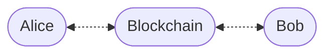

# Enygma DvP Private Swap Protocol

## System Entities

We assume a setting with three entities:

* Alice (the initiator)
* Blockchain (the verification and DvP coordination layer)
* Bob (the counterparty)

### Adversarial Model

The adversary $$\mathcal{A}$$ aims to:

* break transactional privacy
* link inputs and outputs
* identify participants
* disrupt atomic settlement

We assume the blockchain correctly enforces the DvP smart contract logic and that the cryptographic primitives are secure.

---

## Key Generation

Each user generates:

* a **view keypair** using ML-KEM
* a **spend keypair** using a hash-based construction

$$
(pk^{\text{view}}, sk^{\text{view}}) \longleftarrow \mathrm{ML\text{-}KEM.KeyGen}()
$$

$$
(pk^{\text{spend}}, sk^{\text{spend}}) \longleftarrow \mathrm{Hash.KeyGen}()
$$

A concrete spend-key instantiation is:

$$
sk^{\text{spend}} \longleftarrow {0,1}^{\lambda}
$$

$$
pk^{\text{spend}} = \mathrm{H}(sk^{\text{spend}})
$$

---

## Registration

Each user publishes:

$$
(id, pk^{\text{view}}, pk^{\text{spend}})
$$

---

## Commitment Structure

Each note commitment has the following form:

$$
\mathrm{Commitment} = \mathrm{H}(pk^{\text{spend}}, salt, amount, token_{id})
$$

We assume Alice and Bob already hold commitments:

$$
\mathrm{Commitment}*{A}
= \mathrm{H}(pk*{A}^{\text{spend}}, salt_{A}^{\text{in}}, amount_{1}, token_{id_{1}})
$$

$$
\mathrm{Commitment}*{B}
= \mathrm{H}(pk*{B}^{\text{spend}}, salt_{B}^{\text{in}}, amount_{2}, token_{id_{2}})
$$

Alice holds $$\mathrm{Commitment}*{A}$$ and Bob holds $$\mathrm{Commitment}*{B}$$.

---

## DvP Overview

Alice and Bob agree on trade parameters:

* Alice sends $$amount_{1}$$ of $$token_{id_{1}}$$
* Bob sends $$amount_{2}$$ of $$token_{id_{2}}$$

The protocol enforces **atomic Delivery-versus-Payment (DvP)**:

* either both transfers occur
* or Alice recovers her funds through a revert commitment

---

## Transaction Structure (Alice → Blockchain)

| $\pi_{A}$ | CTXT | $\mathrm{OUTPUT_COMMIT}_{B}$ | $\mathrm{OUTPUT_COMMIT}_{A}$ | ENC_TX_DATA | $\mathrm{REVERT_COMMIT}_{A}$ | $nf_{A}$ | deadline |
| :-------: | :--: | :--------------------------: | :--------------------------: | :---------: | :--------------------------: | :------: | :------: |

---

## Transaction Creation (Alice)

### Step 1 — ML-KEM Encapsulation

Alice encapsulates to Bob’s view public key:

$$
(ss_{B}, \mathrm{CTXT}) \longleftarrow \mathrm{ML\text{-}KEM.Encaps}(pk_{B}^{\text{view}})
$$

---

### Step 2 — Key Derivation

Alice derives an encryption key:

$$
k = \mathrm{HKDF}(ss_{B}, \text{"encryption key"})
$$

Alice derives Bob’s output salt:

$$
salt_{B}^{\text{out}} = \mathrm{HKDF}(ss_{B}, \text{"Bob salt"})
$$

Alice derives her own output salt:

$$
salt_{A}^{\text{out}} = \mathrm{HKDF}(ss_{B}, \text{"Alice salt"})
$$

---

### Step 3 — Output Commitments

Bob’s output commitment is:

$$
\mathrm{OUTPUT_COMMIT}*{B}
= \mathrm{H}(pk*{B}^{\text{spend}}, salt_{B}^{\text{out}}, amount_{1}, token_{id_{1}})
$$

Alice’s output commitment is:

$$
\mathrm{OUTPUT_COMMIT}*{A}
= \mathrm{H}(pk*{A}^{\text{spend}}, salt_{A}^{\text{out}}, amount_{2}, token_{id_{2}})
$$

---

### Step 4 — Encrypt Transaction Data

Alice sets:

$$
m = token_{id_{1}} \parallel amount_{1}
$$

and encrypts it as:

$$
\mathrm{[[TX_{DATA}]]_{k}} = \mathrm{AES\text{-}GCM.Enc}(k, m)
$$

---

### Step 5 — Revert Commitment

Alice generates a fresh revert salt:

$$
salt^{revert}_{A} \longleftarrow {0,1}^{\lambda}
$$

Alice creates a revert commitment containing the same asset she is attempting to spend:

$$
\mathrm{REVERT_COMMIT}*{A}
= \mathrm{H}(pk*{A}^{\text{spend}}, salt^{revert}_{A}, amount_{1}, token_{id_{1}})
$$

---

### Step 6 — Nullifier

Let $$leafIndex_{A}$$ be the Merkle-tree leaf index of Alice’s input commitment.

Alice computes:

$$
nf_{A} = \mathrm{H}(sk_{A}^{\text{spend}} \parallel leafIndex_{A})
$$

---

### Step 7 — Zero-Knowledge Proof

Alice generates $$\pi_{A}$$ proving:

* she knows $$sk_{A}^{\text{spend}}$$ for the input commitment
* the input commitment is included in the Merkle tree
* $$nf_{A}$$ is correctly derived from $$sk_{A}^{\text{spend}}$$ and $$leafIndex_{A}$$
* $$\mathrm{OUTPUT_COMMIT}*{B}$$ contains $$amount*{1}$$ and $$token_{id_{1}}$$
* $$\mathrm{REVERT_COMMIT}*{A}$$ contains $$amount*{1}$$ and $$token_{id_{1}}$$
* $$\mathrm{OUTPUT_COMMIT}*{A}$$ contains $$amount*{2}$$ and $$token_{id_{2}}$$
* $$nf_{A}$$, $$\mathrm{OUTPUT_COMMIT}*{A}$$, and $$\mathrm{REVERT_COMMIT}*{A}$$ are associated with Alice’s spend public key where required

---

### Step 8 — Submission

Alice submits:

* \pi_{A},
* CTXT},
* $$\mathrm{COMMIT}_{B}$$
* ENC_TX_DATA
* $$\mathrm{COMMIT}_{A}$$
* $$\mathrm{REVERT_COMMIT}*{A}$$
* $$nf*{A}$$
* deadline
  

---

## Transaction Processing (Blockchain)

The blockchain checks:

* the deadline is well formed
* the current time is before or equal to the deadline
* $$nf_{A}$$ is not already locked
* $$nf_{A}$$ is not already spent
* $$\mathrm{Verify}(\pi_{A}) = TRUE$$

If all checks pass, the blockchain computes:

$$
\mathrm{swap_{id}} = \mathrm{H}( \mathrm{OUTPUT_COMMIT}*{A}, \mathrm{REVERT_COMMIT}*{A}, nf_{A}, \mathrm{OUTPUT_COMMIT}_{B}, deadline)
$$

The blockchain then:

* marks $$nf_{A}$$ as locked
* registers $$swap_{id}$$ as active
* stores the deadline associated with $$swap_{id}$$

---

## Transaction Retrieval (Bob)

Bob receives:
* ML-KEM CTXT
* $$\mathrm{OUTPUT_COMMIT}*{B}$$
* ENC_TX_DATA
* $$\mathrm{OUTPUT_COMMIT}*{A}$$
* $$swap_{id}$$

---

### Step 1 — ML-KEM Decapsulation

Bob decapsulates:

$$
ss_{B} \leftarrow \mathrm{ML\text{-}KEM.Decaps}(sk_{B}^{\text{view}}, \mathrm{CTXT})
$$

---

### Step 2 — Key Derivation

Bob derives the encryption key:

$$
k = \mathrm{HKDF}(ss_{B}, \text{"encryption key"})
$$

Bob derives his output salt:

$$
salt_{B}^{\text{out}} = \mathrm{HKDF}(ss_{B}, \text{"Bob salt"})
$$

Bob derives Alice’s output salt:

$$
salt_{A}^{\text{out}} = \mathrm{HKDF}(ss_{B}, \text{"Alice salt"})
$$

---

### Step 3 — Decryption

Bob decrypts:

$$
(token_{id_{1}}, amount_{1}) = \mathrm{AES\text{-}GCM.Dec}(k, \mathrm{[[TX_{DATA}]]_{k}})
$$

If decryption fails, Bob aborts.

---

### Step 4 — Commitment Recompute

Bob recomputes his expected output commitment:

$$
\mathrm{OBTAINED_COMMIT}_{B} = \mathrm{H}(pk_{B}^{\text{spend}}, salt_{B}^{\text{out}}, amount_{1}, token_{id_{1}})
$$

Bob also recomputes Alice’s expected output commitment:

$$
\mathrm{OBTAINED_COMMIT}_{A} = \mathrm{H}(pk_{A}^{\text{spend}}, salt_{A}^{\text{out}}, amount_{2}, token_{id_{2}})
$$

Bob accepts iff:

$$
\mathrm{OBTAINED_COMMIT}_{B} = \mathrm{OUTPUT_COMMIT}_{B}
$$

and

$$
\mathrm{OBTAINED_COMMIT}_{A} = \mathrm{OUTPUT_COMMIT}_{A}
$$

Otherwise, Bob aborts.

---

## Bob Completion

### Step 1 — Nullifier

Let $$leafIndex_{B}$$ be the Merkle-tree leaf index of Bob’s input commitment.

Bob computes:

$$
nf_{B} = \mathrm{H}(sk_{B}^{\text{spend}} \parallel leafIndex_{B})
$$

---

### Step 2 — Zero-Knowledge Proof

Bob generates $$\pi_{B}$$ proving:

* he knows $$sk_{B}^{\text{spend}}$$ for his input commitment
* his input commitment is included in the Merkle tree
* $$nf_{B}$$ is correctly derived from $$sk_{B}^{\text{spend}}$$ and $$leafIndex_{B}$$
* $$\mathrm{OUTPUT_COMMIT}*{A}$$ contains the same $$amount*{2}$$ and $$token_{id_{2}}$$ as Bob’s input commitment

---

### Step 3 — Submission

Bob submits:
* $$\pi_{B}$$
* $$\mathrm{OUTPUT_COMMIT}*{A}$$
* $$nf*{B}$$
* $$swap_{id}$$

---

## Finalization (Blockchain)

The blockchain checks:

* the current time is before the deadline
* $$swap_{id}$$ is active
* $$nf_{B}$$ is not already spent
* $$\mathrm{Verify}(\pi_{B}) = TRUE$$

### Success Case

If:

$$
(current\ time < deadline)
\wedge
(\mathrm{Verify}(\pi_{B}) = TRUE)
\wedge
(nf_{B}\ \text{fresh})
\wedge
(swap_{id}\ \text{active})
$$

then the blockchain:

* marks $$nf_{A}$$ as spent
* marks $$nf_{B}$$ as spent
* inserts $$\mathrm{OUTPUT_COMMIT}_{A}$$ into the Merkle tree
* inserts $$\mathrm{OUTPUT_COMMIT}_{B}$$ into the Merkle tree
* marks $$swap_{id}$$ as completed

---

### Timeout / Failure Case

If Bob does not complete before the deadline, Alice can trigger the revert path.

The blockchain checks:

* $$swap_{id}$$ is active
* the current time is after the deadline
* $$nf_{A}$$ is locked
* $$nf_{A}$$ is not already spent

If valid, the blockchain:

* marks $$nf_{A}$$ as spent
* inserts $$\mathrm{REVERT_COMMIT}_{A}$$ into the Merkle tree
* marks $$swap_{id}$$ as failed

Alice’s funds are returned to:

$$
\mathrm{REVERT_COMMIT}_{A}
$$

---

## Security Goals

* **Atomicity**: either both sides settle or Alice recovers her original asset
* **Privacy**: commitments hide owners, amounts, token identifiers, and linkage
* **Fairness**: Bob cannot receive Alice’s asset unless he spends his own input
* **Replay resistance**: nullifiers prevent double-spending
* **Timeout safety**: locked funds can be recovered after the deadline
* **Bounded griefing**: Bob can delay settlement only until the deadline

---

## Zero-Knowledge Proof Remarks

### Alice Proof: $$\pi_{A}$$

Alice’s proof must enforce:

* spend authorization for Alice’s input commitment
* Merkle inclusion of Alice’s input commitment
* nullifier correctness for $$nf_{A}$$
* freshness is checked publicly by the contract
* $$\mathrm{OUTPUT_COMMIT}_{B}$$ is well formed
* $$\mathrm{OUTPUT_COMMIT}*{B}$$ carries $$amount*{1}$$ and $$token_{id_{1}}$$
* $$\mathrm{REVERT_COMMIT}_{A}$$ is well formed
* $$\mathrm{REVERT_COMMIT}*{A}$$ carries $$amount*{1}$$ and $$token_{id_{1}}$$
* $$\mathrm{OUTPUT_COMMIT}_{A}$$ is well formed
* $$\mathrm{OUTPUT_COMMIT}*{A}$$ carries $$amount*{2}$$ and $$token_{id_{2}}$$

---

### Bob Proof: $$\pi_{B}$$

Bob’s proof must enforce:

* spend authorization for Bob’s input commitment
* Merkle inclusion of Bob’s input commitment
* nullifier correctness for $$nf_{B}$$
* freshness is checked publicly by the contract
* $$\mathrm{OUTPUT_COMMIT}_{A}$$ is well formed
* $$\mathrm{OUTPUT_COMMIT}*{A}$$ carries the same $$amount*{2}$$ and $$token_{id_{2}}$$ as Bob’s input commitment

---

## Notes

* View keys are **ML-KEM keys**, not Diffie-Hellman keys.
* The DvP smart contract never learns the private salts.
* Bob verifies Alice’s encrypted payload by AEAD authentication and commitment recomputation.
* Alice’s input nullifier is first marked as locked, then later marked as spent.
* Bob’s input nullifier is marked as spent only in the successful settlement path.
* The revert path consumes Alice’s locked input and inserts $$\mathrm{REVERT_COMMIT}_{A}$$.
* Encryption correctness is not directly proven inside the zero-knowledge proof.
* Recipient-side validation is performed by decapsulation, decryption, and commitment recomputation.

