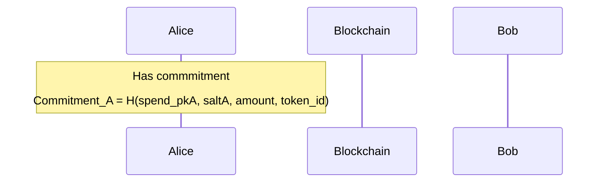
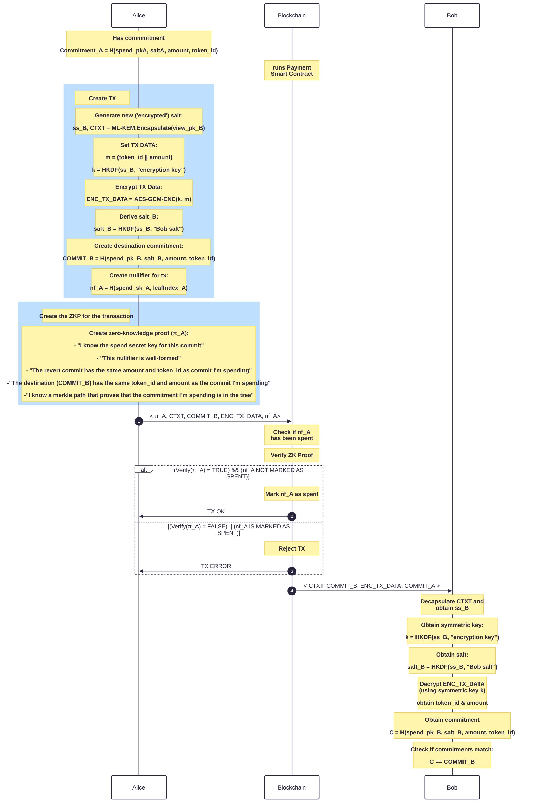

## Problem Statement

A commitment is of the form Commit = H(spend_pk, salt, amount, token_id).

How can Alice send funds to a commitment only Bob can open in a non-interactive manner?

## Step by Step

### 1. Alice has already deposit a note in a Merkle Tree

Alice already has a deposit in EnygmaDvp system which in format of a note inserted, with the following paramenters.

Note_Alice:= H(spend_pkA, saltA, amount, token_id)

### 2. Alice prepare transaction

## Protocol Flow

### Additional Remark(s)

Alice was able to send funds to Bob.  Only Bob can spend the received commitment  The protocol does not require any interaction from Bob.
