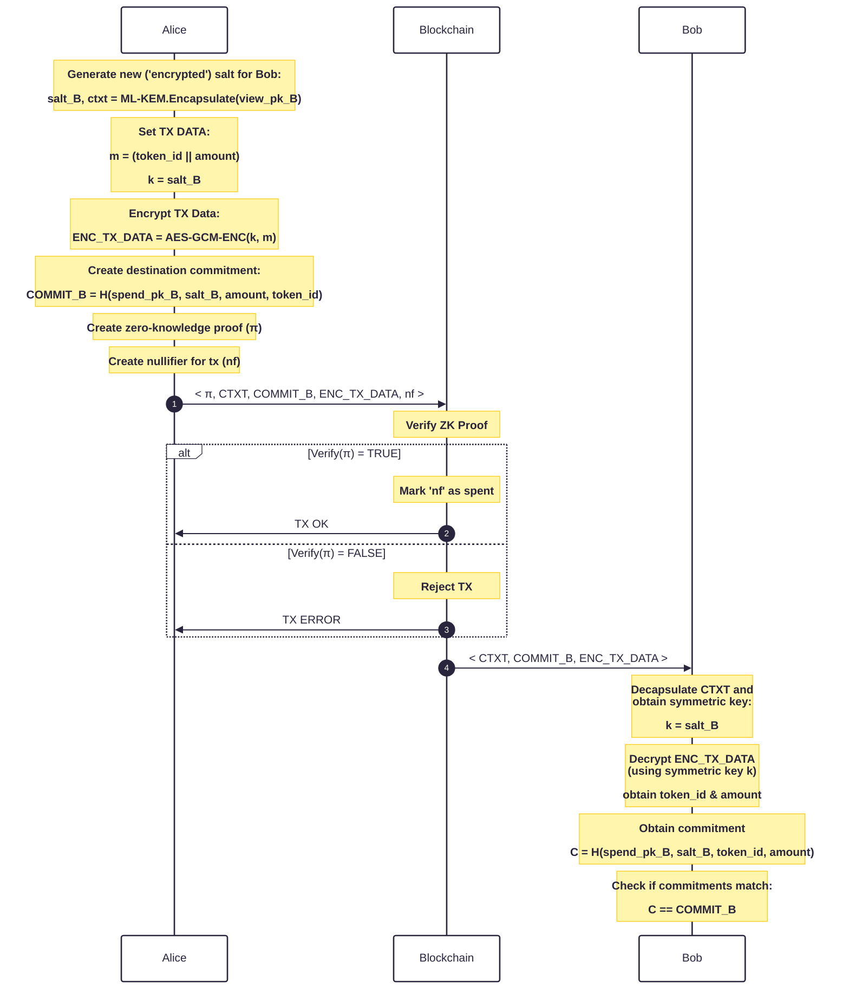

## Problem Statement
A commitment is of the form Commit = H(spend_pk, salt, token_id, amount).

How can Alice send funds to a commitment only Bob can open in a non-interactive manner? 

## Protocol Flow

### Additional Remark(s)
Alice was able to send funds to Bob.  Only Bob can spend the received commitment  The protocol does not require any interaction from Bob.
