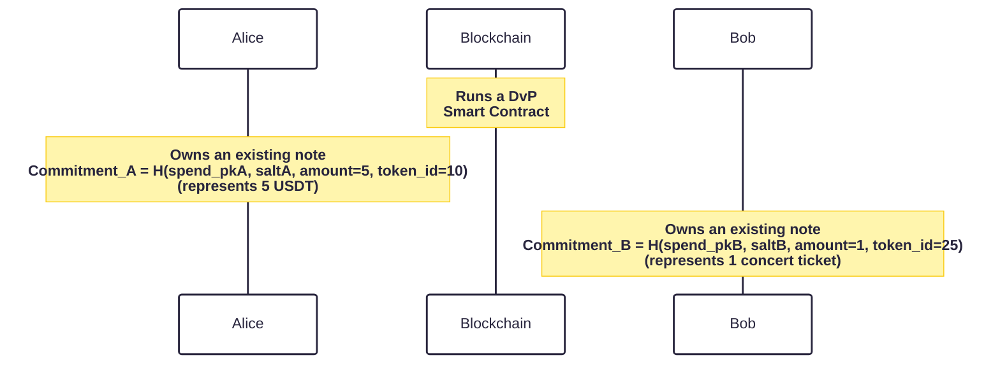
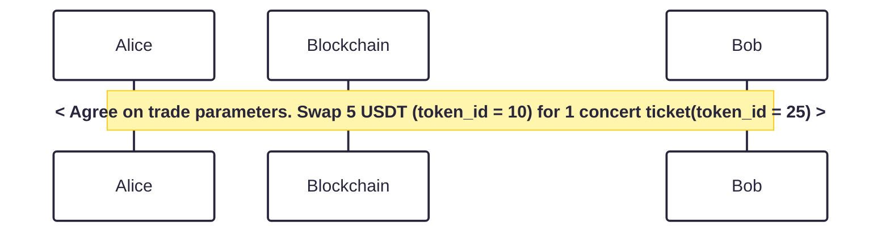
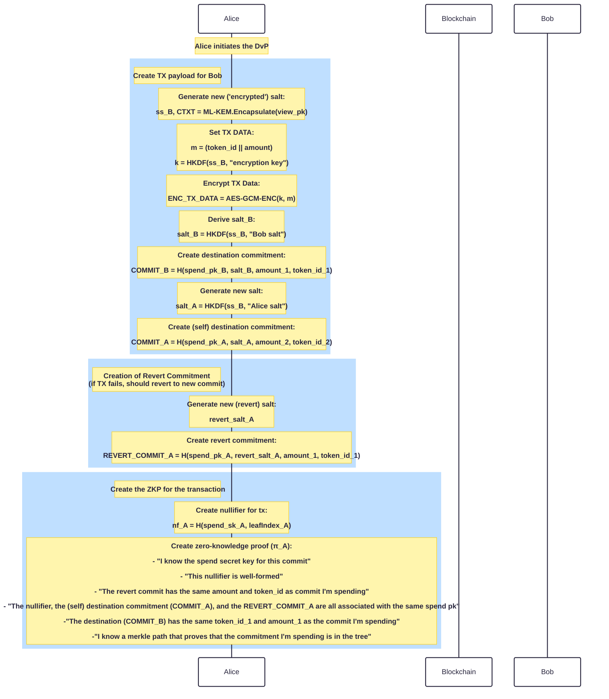
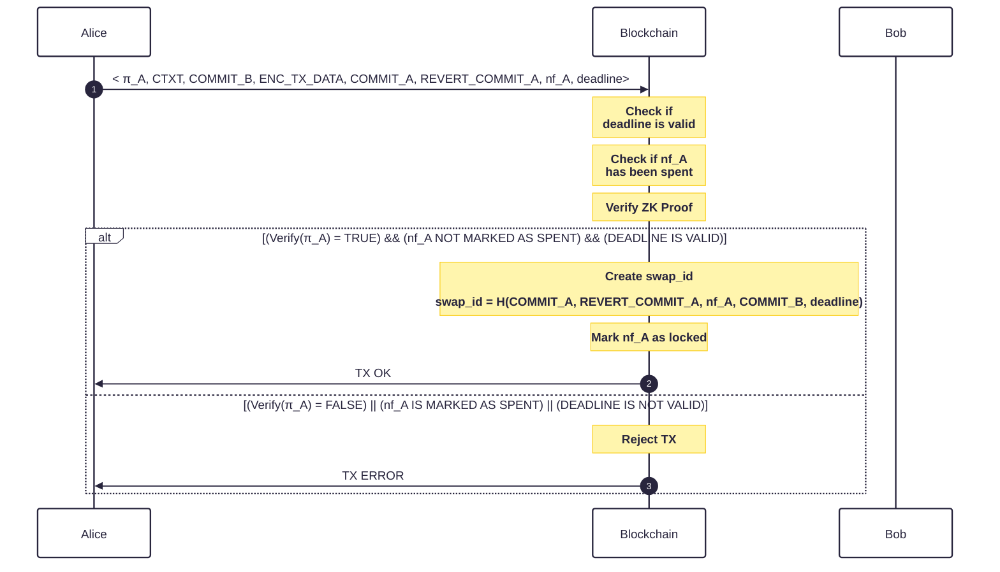
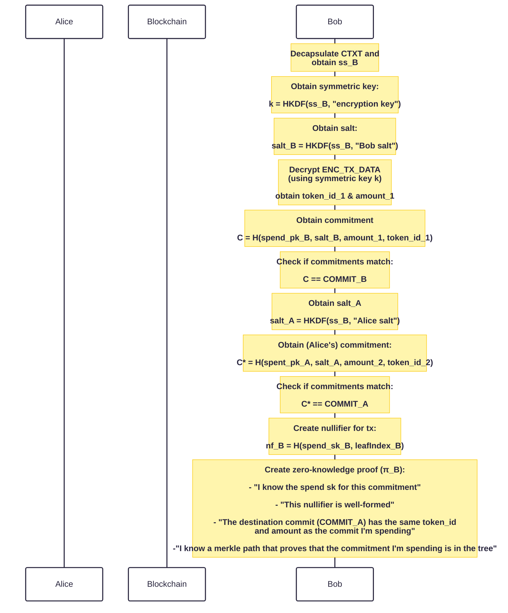
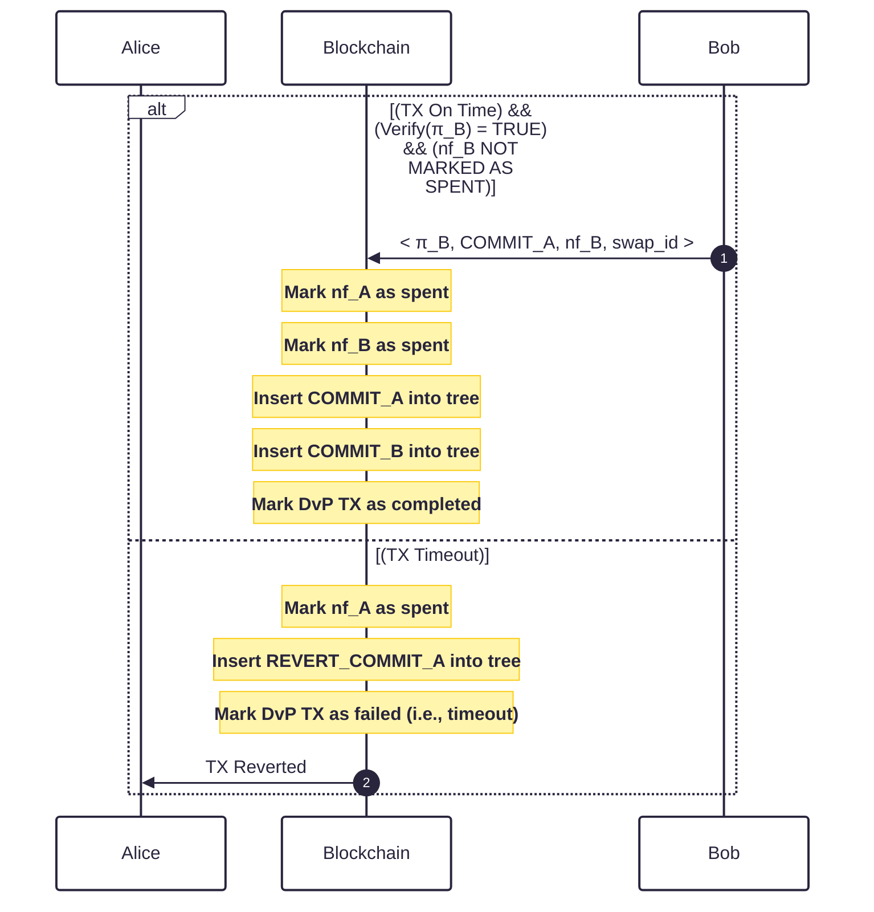

# Protocol Description

## Notation

In Enygma DvP, the commitments have the following form:

$$C = Hash(pk^{spend} | salt | token_{ID} | amount)$$

To spend the commitment, the user proves in zero-knowledge that they know the secret spend key associated with this commitment, and publish a nullifier that spends the corresponding commitment.

## 1 - System Setup

TBD

## 2 - Key Generation

Each privacy node generates two keypairs: one to spend funds, and one to 'view' transactions. Concretely:

- Privacy node A generates an [ML-KEM](https://nvlpubs.nist.gov/nistpubs/FIPS/NIST.FIPS.203.pdf) (view) keypair and obtains $$(sk_{A}^{view}, pk_{A}^{view})$$

- Privacy node A generates a simple hash-based (spend) keypair and obtains $$(sk_{A}^{spend}, pk_{A}^{spend})$$.
  - $$sk_{A}^{spend} \longleftarrow \\\{{0, 1\\\}}^{256}$$
  - $$pk_{A}^{spend} = Hash(sk_{A}^{spend})$$

The goal here is to have segregation of functionalities with each keypair.

- To spend, the user proves in zero-knowledge that they know a secret key $$sk^{spend}$$ corresponding to one public key $$pk^{spend}$$ in an anonymity set of size $$k$$. We note that the hashing used in this step is ZK-friendly (i.e., Poseidon).
- The view key pair is used to decrypt the values that are inserted into the received commitments.

## Private Issuance

To spend the funds, the recipient must be able to open the commitment. Concretely, the user must know the spend key pair, the salt, the token ID, and the amount. Therefore, we require a mechanism that allows the issuer to share the salt with the recipient. An initial approach could have the recipient communicate with the issuer in advance and send the already-formed commitment. The issuer, then simply performs a mint directly to that commitment. This is possible, but not elegant and makes the payment extremely interactive. A user should simply be able to privately send funds to the other user right away.

Issuer:

- generates a random salt:
  - $$salt \longleftarrow \lbrace0, 1\rbrace^{\lambda}$$

## Protocol Flow

### Assumptions

In the flow exposed below, we assume two users (Alice and Bob), each with a private version of their assets already.

### a . Off-chain Agreement

Before initiating any on-chain transaction, Alice and Bob agree on the terms of the trade through an off-chain channel.They establish which assets are being exchanged — including the token identifiers and amounts on each side — without any  
blockchain interaction.

### b. Initiating the DvP

Alice initiates the swap by constructing the transaction by following these steps

1. _Key encapsulation_ — Alice runs ML-KEM encapsulation on Bob's view public key, obtaining a shared secret `ss_B` and ciphertext `CTXT`.
2. _Salt derivation_ — Alice derives `salt_B` and `salt_A` deterministically from `ss_B` via HKDF, so that Bob can later reconstruct them after decapsulation.
3. _k generation_ - The shared secret `ss_B` is used as the key materiall; "encryption key" is a domain label that scopes this derivation to symmetric encryption.
4. _Payload encrpytion ENC TX DATA_ - Alices encrypted the payload with the derived key `k`. AES-GCM provides authenticated encryption, so any tampering with the ciphertext is detectable.
5. _Commitment_ — Alice creates `COMMIT_B` (the commitment Bob will receive) and `COMMIT_A` (the commitment Alice will receive from Bob),using the derived salts and the agreed token_ids and amounts.
6. _Payload encryption_ — Alice encrypts (`token_id`, `amount`) under a symmetric key derived from ss_B, producing ENC_TX_DATA. This allows Bob to verify the commitment without Alice revealing the plaintext publicly.
7. _Revert commitment_ — Alice creates `REVERT_COMMIT_A`, a self-addressed commitment over the same asset she is spending. If Bob does not respond before the deadline, the chain inserts this commitment instead, returning Alice's funds.
8. _Zero-knowledge proof_ — Alice generates the `nf_A` =`H(spend_pk_A, leafIndexA)`. She also generates a proof `π_A` attesting that she knows the spend key for the commitment she is nullifying, the nullifier is well-formed, the revert and destination commitments are consistent with the spent asset, and the commitment exists in the Merkle tree.

### c. Transaction verification

Upon receiving Alice's submission, the smart contract performs three independent checks before accepting the transaction:

1. Deadline validity — the contract confirms that the supplied deadline has not yet passed, ensuring the swap can still be completed within the agreed time window.
2. Nullifier status — the contract checks that `nf_A` has not already been spent or locked by a prior transaction, preventing double-spends.
3. Zero-knowledge proof — the contract verifies `π_A` on-chain is proof is valid or not.

If all theree conditions are valid simultaneously. The smart contract do the following

- Creates a `swap_id` = `H(COMMIT_A, REVER_COMMIT_A, nf_A, COMMIT_B, deadline)`
- Marks `nf_A` as locked and spent
- Emits the following data <`CTXT`, `COMMIT_B`, `ENC_TX_DATA`, `COMMIT_A`, `swap_id`>

### d. Bob receiving the transaction

Once the swap is recorded on-chain, Bob is notified of the pending transaction and receives (`CTXT`, `COMMIT_B`, `ENC_TX_DATA`, `COMMIT_A`,`swap_id`).

Bob begins by recovering the shared secret Alice used when constructing the payload:

1. _Decapsulation_ — Bob runs ML-KEM decapsulation on `CTXT` using his view secret key, recovering `ss_B`.
2. _Key and salt derivation_ — Bob derives the symmetric encryption key k` = HKDF(ss_B, "encryption key")` and his salt `salt_B = HKDF(ss_B, "Bob salt")`.
3. _Payload decryption_ — Bob decrypts `ENC_TX_DATA` using `k`, obtaining `token_id_1` and `amount_1` in plaintext.

Bob then performs two commitment checks to verify the swap is legitimate and intended for him:

- He recomputes `C = H(spend_pk_B, salt_B, amount_1, token_id_1)` and checks that `C == COMMIT_B`.
- He derives `salt_A = HKDF(ss_B, "Alice salt")`, recomputes `C* = H(spend_pk_A, salt_A, amount_2, token_id_2)`, and checks that `C* == COMMIT_A`.

If both checks pass, Bob construct his response:

1. _Nullifier_ :Bob computes `nf_B = H(spend_sk_B, leafIndex_B)`, the nullifier for the commitment he is spending.
2. _Zero-knowledge proof_: Bob generates `π_B` attesting that he knows the spend secret key for his commitment, the nullifier is well-formed, the destination commitment `COMMIT_A` encodes the same `token_id` and amount as the commitment he is spending, and the commitment exists in the Merkle tree.

### e. Smart Contract checks Bob TX

Bob submits (`π_B`, `COMMIT_A`, `nf_B`, `swap_id`) to the smart contract. The contract must validate Bob's submission before finalizing the swap.

Three conditions must hold simultaneously:

1. _Deadline not exceeded_: the contract checks that Bob's submission arrives before the deadline embedded in `swap_id`.
2. _Nullifier status_ : the contract verifies that `nf_B` has not already been spent, preventing Bob from double-spending his commitment.
3. _Zero-knowledge proof_:the contract verifies`π_B` on-chain, confirming that Bob knows the spend key for his commitment, the nullifier is correctly formed, the destination commitment `COMMIT_A` is consistent with the asset Bob is delivering, and Bob's commitment exists in the Merkle tree.

If all conditions are met, the contract finalizes the swap atomically:

- `nf_A` is marked as spent
- `COMMIT_A` (Bob's asset, now owned by Alice) and `COMMIT_B` (Alice's asset, now owned by Bob) are inserted into the Merkle tree
- the swap is marked as completed.

If the deadline has passed before Bob submits, the contract executes the revert path instead:

- nf_A is marked as spent
- `REVERT_COMMIT_A` is inserted into the Merkle tree, returning Alice's original asset to her under a fresh commitment
- the swap is marked as failed (`timeout`), and Alice is notified.

## Full Protocol

#### Additional Remarks

Alice was able to send funds to Bob. Only Bob can spend the received commitment. The protocol does not require any interaction from Bob.

## Auditing

Our design supports different types of auditing. Concretely,
