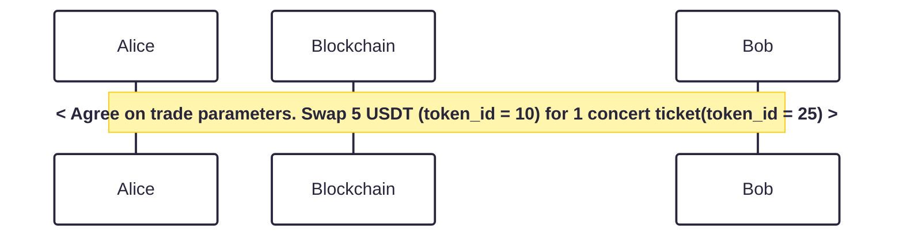
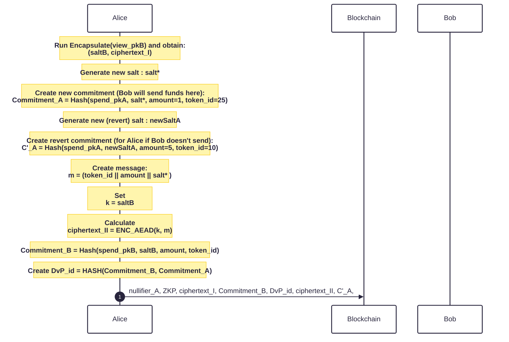
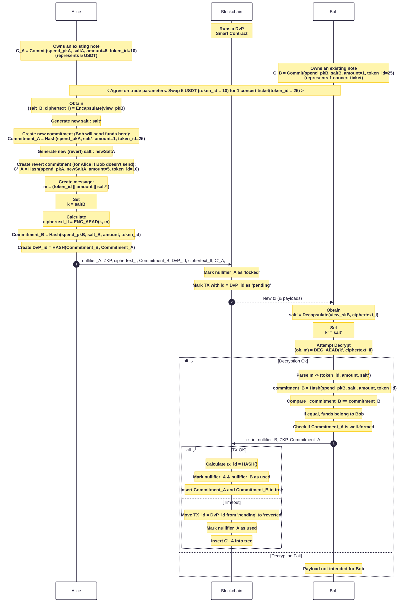

# Protocol Description

## Notation

In Enygma DvP, the commitments have the following form:

$$C = Hash(pk^{spend} | salt | token_{ID} | amount)$$

To spend the commitment, the user proves in zero-knowledge that they know the secret spend key associated with this commitment, and publish a nullifier that spends the corresponding commitment. 

## 1 - System Setup
TBD

## 2 - Key Generation
Each privacy node generates two keypairs: one to spend funds, and one to 'view' transactions. Concretely: 

* Privacy node A generates an [ML-KEM](https://nvlpubs.nist.gov/nistpubs/FIPS/NIST.FIPS.203.pdf) (view) keypair and obtains $$(sk_{A}^{view}, pk_{A}^{view})$$

* Privacy node A generates a simple hash-based (spend) keypair and obtains $$(sk_{A}^{spend}, pk_{A}^{spend})$$.
  *  $$sk_{A}^{spend} \longleftarrow \\\{{0, 1\\\}}^{256}$$
  *  $$pk_{A}^{spend} = Hash(sk_{A}^{spend})$$
 
The goal here is to have segregation of functionalities with each keypair. 

* To spend, the user proves in zero-knowledge that they know a secret key $$sk^{spend}$$ corresponding to one public key $$pk^{spend}$$ in an anonymity set of size $$k$$. We note that the hashing used in this step is ZK-friendly (i.e., Poseidon).
* The view key pair is used to decrypt the values that are inserted into the received commitments. 

## Private Issuance

To spend the funds, the recipient must be able to open the commitment. Concretely, the user must know the spend key pair, the salt, the token ID, and the amount. Therefore, we require a mechanism that allows the issuer to share the salt with the recipient. An initial approach could have the recipient communicate with the issuer in advance and send the already-formed commitment. The issuer, then simply performs a mint directly to that commitment. This is possible, but not elegant and makes the payment extremely interactive. A user should simply be able to privately send funds to the other user right away. 

Issuer:

* generates a random salt:
   * $$salt \longleftarrow \lbrace0, 1\rbrace^{\lambda}$$

## Protocol Flow

### Assumptions
In the flow exposed below, we assume two users (Alice and Bob), each with a private version of their assets already. 

### Off-chain Agreement
First, Alice and Bob agree on the terms for the trade. For example, on an online marketplace. 

### Initiating the DvP

### Full flow

## New Protocol

```mermaid
---
config:
  theme: redux
  look: handDrawn
---
sequenceDiagram
    autonumber

    participant Alice
    participant Chain as Blockchain
    participant Bob

    note over Alice: Has commitment<br><br>Commitment_A = H(spend_pkA, saltA, amount_1, token_id_1)

    note over Bob: Has commitment<br><br>Commitment_B = H(spend_pkB, saltB, amount_2, token_id_2)

    note over Chain: runs DvP Smart Contract

    note over Alice, Bob: DvP can now start

    note over Alice: Alice initiates the DvP
    
    rect rgb(191, 223, 255)

        note left of Alice: Create TX payload for Bob

        note over Alice: Generate new ('encrypted') salt:<br><br>ss_B, CTXT = ML-KEM.Encapsulate(view_pk_B)

        note over Alice: Set TX DATA: <br><br>m = (token_id || amount)<br><br>k = HKDF(ss_B, "encryption key")

        note over Alice: Encrypt TX Data: <br><br> ENC_TX_DATA = AES-GCM-ENC(k, m)
        
        note over Alice: Derive salt_B: <br><br> salt_B = HKDF(ss_B, "Bob salt")

        note over Alice: Create destination commitment:<br><br>COMMIT_B = H(spend_pk_B, salt_B, amount_1, token_id_1)
        
        note over Alice: Generate new salt:<br><br>salt_A = HKDF(ss_B, "Alice salt")

        %% Bob also needs to be able to generate the value of salt_A in order to prove that token_ids and amounts match across commitments

        note over Alice: Create (self) destination commitment:<br><br>COMMIT_A = H(spend_pk_A, salt_A, amount_2, token_id_2)

    end     


    rect rgb(191, 223, 255)

        note left of Alice: Creation of Revert Commitment<br>(if TX fails, should revert to new commit)

        note over Alice: Generate new (revert) salt:<br><br>revert_salt_A
        note over Alice: Create revert commitment:<br><br>REVERT_COMMIT_A = H(spend_pk_A, revert_salt_A, amount_1, token_id_1)

    end



    rect rgb(191, 223, 255)

        note left of Alice: Create the ZKP for the transaction

        note over Alice: Create nullifier for tx: <br><br>nf_A = H(spend_sk_A, leafIndex_A)
        
        note over Alice: Create zero-knowledge proof (π_A):<br><br> - "I know the spend secret key for this commit"<br><br> - "This nullifier is well-formed"<br><br>- "The revert commit has the same amount and token_id as commit I'm spending"<br><br>- "The nullifier, the (self) destination commitment (COMMIT_A), and the REVERT_COMMIT_A are all associated with the same spend pk"<br><br>-"The destination (COMMIT_B) has the same token_id_1 and amount_1 as the commit I'm spending"<br><br>-"I know a merkle path that proves that the commitment I'm spending is in the tree"

    end


    Alice->>Chain: < π_A, CTXT, COMMIT_B, ENC_TX_DATA, COMMIT_A, REVERT_COMMIT_A, nf_A, deadline>

    
    note over Chain: Check if<br>deadline is valid

    note over Chain: Check if nf_A<br>has been spent
    note over Chain: Verify ZK Proof


    alt (Verify(π_A) = TRUE) && (nf_A NOT MARKED AS SPENT) && (DEADLINE IS VALID)

        note over Chain: Create swap_id<br><br>swap_id = H(COMMIT_A, REVERT_COMMIT_A, nf_A, COMMIT_B, deadline)
        note over Chain: Mark nf_A as locked
        Chain ->> Alice: TX OK


    else (Verify(π_A) = FALSE) || (nf_A IS MARKED AS SPENT) || (DEADLINE IS NOT VALID)
      note over Chain: Reject TX
      Chain ->> Alice: TX ERROR

    end


    Chain ->> Bob: < CTXT, COMMIT_B, ENC_TX_DATA, COMMIT_A, swap_id >

    note over Bob: Decapsulate CTXT and<br>obtain ss_B


    note over Bob: Obtain symmetric key:<br><br> k = HKDF(ss_B, "encryption key")

    note over Bob: Obtain salt:<br><br> salt_B = HKDF(ss_B, "Bob salt")


    note over Bob: Decrypt ENC_TX_DATA<br>(using symmetric key k)<br><br>obtain token_id_1 & amount_1

    note over Bob: Obtain commitment<br><br>C = H(spend_pk_B, salt_B, amount_1, token_id_1)
    note over Bob: Check if commitments match: <br><br>C == COMMIT_B

    note over Bob: Obtain salt_A<br><br>salt_A = HKDF(ss_B, "Alice salt")

    note over Bob: Obtain (Alice's) commitment:<br><br>C* = H(spend_pk_A, salt_A, amount_2, token_id_2)

    note over Bob: Check if commitments match:<br><br>C* == COMMIT_A

    note over Bob: Create nullifier for tx: <br><br>nf_B = H(spend_sk_B, leafIndex_B)

    note over Bob: Create zero-knowledge proof (π_B):<br><br> - "I know the spend sk for this commitment"<br><br> - "This nullifier is well-formed"<br><br>- "The destination commit (COMMIT_A) has the same token_id<br>and amount as the commit I'm spending"<br><br>-"I know a merkle path that proves that the commitment I'm spending is in the tree"




    alt (TX On Time) && (Verify(π_B) = TRUE) && (nf_B NOT MARKED AS SPENT)

      Bob->>Chain: < π_B, COMMIT_A, nf_B, swap_id >

      note over Chain: Mark nf_A as spent
      note over Chain: Mark nf_B as spent
      note over Chain: Insert COMMIT_A into tree
      note over Chain: Insert COMMIT_B into tree
      
      note over Chain: Mark DvP TX as completed


    else (TX Timeout)
      note over Chain: Mark nf_A as spent
      note over Chain: Insert REVERT_COMMIT_A into tree
      note over Chain: Mark DvP TX as failed (i.e., timeout)

      Chain ->> Alice: TX Reverted
    end






%%     note over Alice, Bob: Alice was able to send funds to Bob.<br><br>Only Bob can spend the received commitment<br><br>The protocol does not require any interaction from Bob.

```

#### Additional Remarks
Alice was able to send funds to Bob. Only Bob can spend the received commitment. The protocol does not require any interaction from Bob.

## Auditing

Our design supports different types of auditing. Concretely, 
