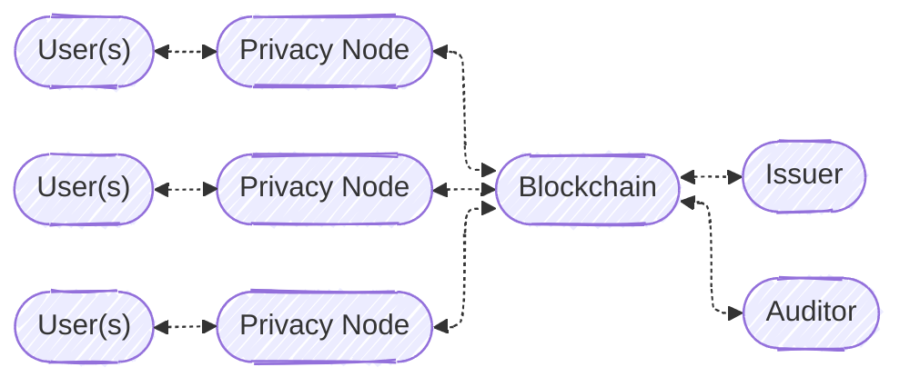
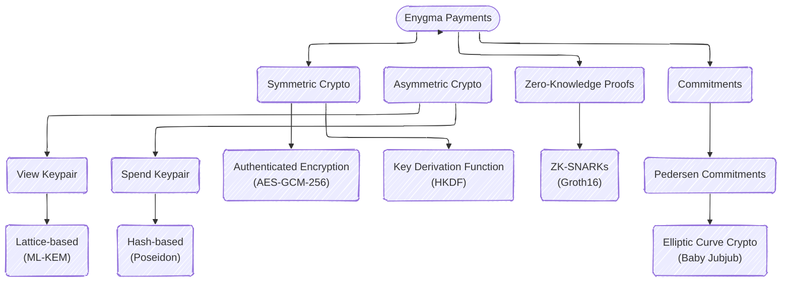

# Enygma Payments

## System Architecture
Our system is simple: **users** (e.g., a bank customers) are directly connected to **privacy nodes** (i.e., a high-performance single-node EVM blockchain). Each of the privacy nodes, is connected to a **private network hub**, which effectively acts as a bulletin board for all privacy nodes to leverage as a universal (encrypted) messaging layer and verification layer. **Issuer(s)** are the managers/admins of specific assets on the private network hub. Optionally, there is an **auditor** that oversees (some of) the transactions that take place in the network. A more formal protocol description is documented [here](./protocol_description.md).

**Implementation note.** In this reference implementation, privacy nodes do not submit their own transactions to the blockchain directly — `enygma_payments/relayer` is a single, mandatory intermediary that holds the on-chain signing key and submits every bank's transaction on its behalf. This is a deployment choice, not a protocol requirement (see the "Implementation Note: the Relayer" subsection of [the protocol description](./protocol_description.md#6---private-transfers) for what that intermediary can and cannot do).

## Cryptographic Primitives

**Fix M-12:** the **Symmetric Crypto** branch above (AES-GCM-256 payload encryption, HKDF-based key rotation) is design, not implemented — there is no AES-GCM or HKDF code anywhere in this repository. Every other branch (Asymmetric Crypto, ZK-SNARKs, Commitments) matches the shipped code. See the notice at the top of [protocol_description.md](./protocol_description.md) for the full picture, including the auditing subsystem it enables, which is also design-only.

Note: We intend to update the ZK module to use a quantum-secure ZK scheme, which will make the entire system quantum-secure (as opposed to quantum-private). We also intend to leverage the ability of having [Single-Server Private Outsourcing of zk-SNARKs
](https://eprint.iacr.org/2025/2113) to allow clients to submit ZK proofs to the Private Network Hub component of the system without incurring in unnecessary hardware costs. 

## Implementation Details
* **Client**: [Golang](https://go.dev/)
* **ZK Circuit(s)**: [Gnark](https://docs.gnark.consensys.net/)
* **Verifier**: [Solidity](https://www.soliditylang.org/)

## Performance
To show that our protocol runs on commodity hardware and does not come with extreme hardware requirements, we measured the performance of our design using a Mac mini M1 from 2020 with 16GB of memory. We obtained the following numbers: 

* **Constraints:** 82086
* **(Groth16) Prover time:** 334.28 ms
* **(Groth16) Verifier cost:** 389578 gas

## Peer-Reviewed Publications
- [Rayls: A Novel Design for CBDCs](https://sp2024.ieee-security.org/downloads/SP24-posters/sp24posters-final12.pdf), published at [45th IEEE Symposium on Security and Privacy 2024 (Poster Track)](https://sp2024.ieee-security.org/)
- [Rayls: A Novel Design for CBDCs](https://eprint.iacr.org/2025/1639), published at [The 6th Workshop on Coordination of Decentralized Finance (CoDecFin) 2025](https://fc25.ifca.ai/codecfin/)
- [Rayls II: Fast, Private, and Compliant CBDCs](https://eprint.iacr.org/2025/1638), published at [Financial Cryptography in Rome (FCiR) 2025](https://www.decifris.it/fcir25/)

