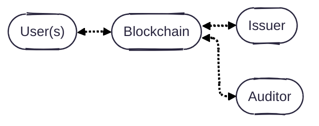
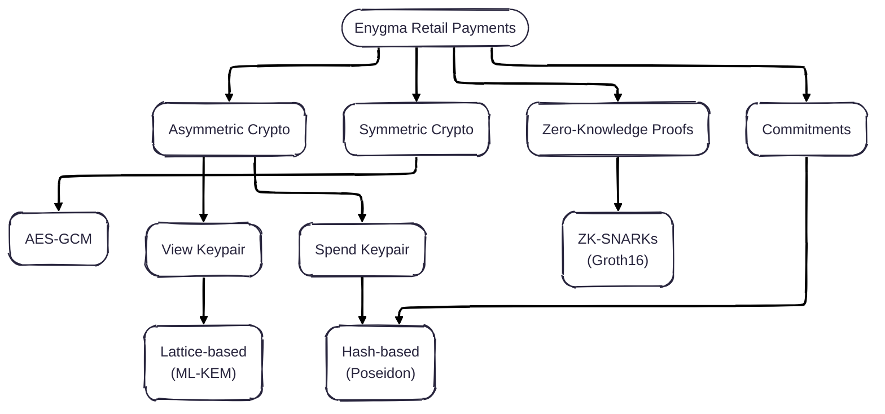

# Enygma Retail Payments

> **WARNING: Demo purposes only.**
> `enygmapayment.config.json` contains well-known [Hardhat default private keys](https://hardhat.org/hardhat-network/docs/reference#accounts) that are publicly visible on the internet. Do **not** use these keys on any real network or to hold real funds. Replace them with your own keys before any non-local deployment.

## Motivation

An anonymous payment system that is completely quantum-private and provides auditability. To make it quantum-secure end-to-end, one must simply update the ZK module to use a zero-knowledge proof scheme that is quantum-secure.

## Protocol Properties

## System Architecture

Our system is simple: **users** (e.g., a bank customers) are directly connected to **privacy nodes** (i.e., a high-performance single-node EVM blockchain). Each of the privacy nodes, is connected to a **private network hub**, which effectively acts as a bulletin board for all privacy nodes to leverage as a universal (encrypted) messaging layer and verification layer. **Issuer(s)** are the managers/admins of specific assets on the private network hub. Optionally, there is an **auditor** that oversees (some of) the transactions that take place in the network. A more formal protocol description is documented [here](./protocol_description.md).



## Protocol Overview

TBD

## Cryptographic Primitives



Note: We intend to update the ZK module to use a quantum-secure ZK scheme once the schemes become more practical/usable. This change will make the entire system quantum-secure (as opposed to quantum-private). We also intend to leverage the ability of having [Single-Server Private Outsourcing of zk-SNARKs
](https://eprint.iacr.org/2025/2113) to allow clients to submit ZK proofs to the Private Network Hub component of the system without incurring in unnecessary hardware costs.

## Repository Layout

```
enygma_retail_payments/
├── gnark_circuits/     # Gnark ZK server (Go module: gnark_server, port 8082)
│   ├── scripts/keys/   # Proving/verifying keys (PaymentPK/VK, PrivateMintPK/VK)
│   └── cmd/export_vk/  # Exports VK to circom JSON format for on-chain init
├── src/                # Core Go library (module: enygma_retail_payments/src)
├── test/               # Integration tests (module: enygma_retail_payments/test)
├── scripts/            # Deployment and initialization scripts
│   ├── deploy.go       # Deploys all contracts; writes build/receipts.json
│   └── init.go         # Initializes EnygmaDvp on-chain with VKs and vault
├── contracts/          # Solidity contracts
│   └── abis/           # Compiled contract ABIs (flat JSON files)
└── build/              # Deployment receipts + exported VK JSONs (gitignored)
```

> **Note on `PrivateMintPK.key` / `PrivateMintVK.key`:** These keys are copied from
> `enygma_dvp` and must not be regenerated. The `PrivateMintVerifier` contract bytecode
> has the dvp VK baked in at compile time — regenerating the keys here would cause
> proof verification to revert on-chain.

## Prerequisites

- Go 1.24+
- Node.js + npm (for Hardhat)
- A running instance of **[enygma_dvp](../enygma_dvp)** providing the Hardhat node on port 8545

> **Dependency on `enygma_dvp`:** `src/` and `test/` import `github.com/raylsnetwork/enygma_dvp/src`
> via a local `replace` directive. Both repos must be cloned **side-by-side** in the same
> parent directory:
> ```
> parent/
> ├── enygma_dvp/
> └── enygma_retail_payments/
> ```
> Once `enygma_dvp/src` is published as a versioned Go module the `replace` directives
> in `src/go.mod` and `test/go.mod` can be removed.

## How to Run

### 1. Start the Hardhat node (from `enygma_dvp/`)

```bash
cd ../enygma_dvp
npx hardhat node
```

### 2. Start the gnark ZK server (port 8082)

```bash
cd gnark_circuits
go run main.go
```

The server loads proving/verifying keys from `./scripts/keys/` on startup. Pre-generated
keys are committed to the repo, so no key generation step is needed for a standard run.
See [Regenerating Keys](#regenerating-provingverifying-keys) only if you change circuit parameters.

### 3. Deploy contracts

```bash
cd scripts
go run deploy.go
```

Reads `enygmapayment.config.json` for RPC endpoint and accounts. Writes
deployment addresses to `build/receipts.json`.

### 4. Export the Payment VK

```bash
cd gnark_circuits
go run ./cmd/export_vk/ ../build
```

Writes `build/Payment.json` in circom format, consumed by the init script.

### 5. Initialize contracts on-chain

```bash
cd scripts
go run init.go
```

Registers the Payment verification key and Erc20CoinVault with the `EnygmaDvp` contract.

### 6. Run integration tests

```bash
cd test
go test ./... -v -timeout 600s
```

Requires the gnark server (step 2) and a freshly deployed chain (steps 1–5).

## Regenerating Proving/Verifying Keys

> Only regenerate `PaymentPK.key` / `PaymentVK.key`. Do **not** regenerate the
> `PrivateMint` keys — see the note in the Repository Layout section above.

```bash
cd gnark_circuits
go run generation.go
```

After regenerating, re-run steps 4–5 to export the new VK and re-initialize the contracts.

## Implementation Details

TBD

## Performance

To show that our protocol runs on commodity hardware and does not come with extreme hardware requirements, we measured the performance of our design using a Mac mini M1 from 2020 with 16GB of memory. We obtained the following numbers:

- **Constraints:** TBD
- **(Groth16) Prover time:** TBD
- **(Groth16) Verifier cost:** TBD

## Peer-Reviewed Publications

TBD
