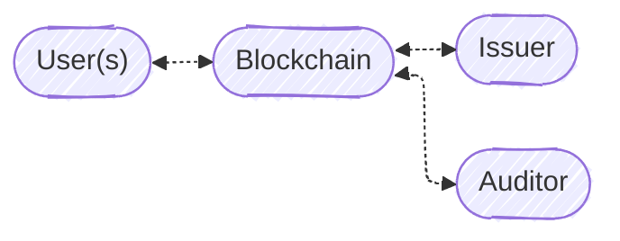
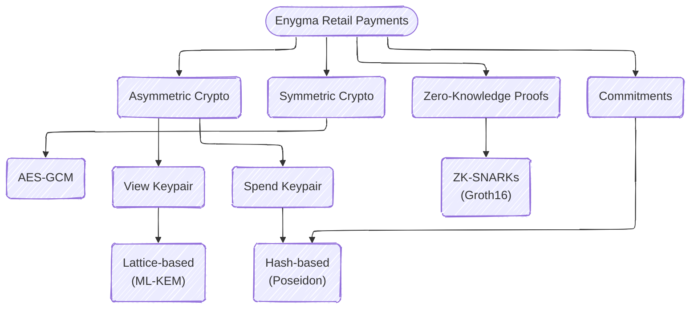

# Enygma Retail Payments

> **WARNING: Demo purposes only.**
> `enygmapayment.config.json` contains well-known [Hardhat default private keys](https://hardhat.org/hardhat-network/docs/reference#accounts) that are publicly visible on the internet. Do **not** use these keys on any real network or to hold real funds. Replace them with your own keys before any non-local deployment.

## Motivation

An anonymous payment system that is completely quantum-private and provides auditability. To make it quantum-secure end-to-end, one must simply update the ZK module to use a zero-knowledge proof scheme that is quantum-secure.

## Protocol Properties

## System Architecture

Our system is simple: **users** (e.g., a bank customers) are directly connected to **privacy nodes** (i.e., a high-performance single-node EVM blockchain). Each of the privacy nodes, is connected to a **private network hub**, which effectively acts as a bulletin board for all privacy nodes to leverage as a universal (encrypted) messaging layer and verification layer. **Issuer(s)** are the managers/admins of specific assets on the private network hub. Optionally, there is an **auditor** that oversees (some of) the transactions that take place in the network. A more formal protocol description is documented [here](./protocol_description.md).


```mermaid
---
config:
  theme: normal
  layout: elk
  look: handDrawn
---
flowchart LR
    U(["User(s)"])
    B(["Blockchain"])
    I(["Issuer"])
    A(["Auditor"])


    U <-.-> B <-.-> I & A
```

## Protocol Overview

TBD

## Cryptographic Primitives


```mermaid
---
config:
  theme: normal
  layout: elk
  look: handDrawn
---
flowchart TD
    A(["Enygma Retail Payments"])

    Asymmetric("Asymmetric Crypto")
    Symmetric("Symmetric Crypto")
    ZK("Zero-Knowledge Proofs")
    Commits("Commitments")

    A -->  Asymmetric & Commits & Symmetric & ZK

    Symmetric --> aes("AES-GCM")

    Asymmetric --> View("View Keypair") & Spend("Spend Keypair")

    View --> MLKEM("Lattice-based<br>(ML-KEM)")
    Spend --> Hash("Hash-based<br>(Poseidon)")

    ZK --> snarks("ZK-SNARKs<br>(Groth16)")
    Commits --> Hash
```

Note: We intend to update the ZK module to use a quantum-secure ZK scheme once the schemes become more practical/usable. This change will make the entire system quantum-secure (as opposed to quantum-private). We also intend to leverage the ability of having [Single-Server Private Outsourcing of zk-SNARKs
](https://eprint.iacr.org/2025/2113) to allow clients to submit ZK proofs to the Private Network Hub component of the system without incurring in unnecessary hardware costs.

## Repository Layout

```
enygma_retail_payments/
├── gnark_circuits/     # Gnark ZK server (Go module: gnark_server, port 8082)
│   ├── scripts/keys/   # Proving/verifying keys (PaymentPK/VK, PrivateMintPK/VK)
│   └── cmd/export_vk/  # Exports VK to circom JSON format for on-chain init
├── src/                # Core Go library (module: enygma_retail_payments/src)
├── test/               # Integration tests (module: enygma_retail_payments/test)
├── scripts/            # Deployment and initialization scripts
│   ├── deploy.go       # Deploys all contracts; writes build/receipts.json
│   └── init.go         # Initializes EnygmaDvp on-chain with VKs and vault
├── contracts/          # Solidity contracts
│   └── abis/           # Compiled contract ABIs (flat JSON files)
└── build/              # Deployment receipts + exported VK JSONs (gitignored)
```

> **Note on `PrivateMintPK.key` / `PrivateMintVK.key`:** These keys are copied from
> `enygma_dvp` and must not be regenerated. The `PrivateMintVerifier` contract bytecode
> has the dvp VK baked in at compile time — regenerating the keys here would cause
> proof verification to revert on-chain.

## Prerequisites

- Go 1.24+
- Node.js + npm (for Hardhat)
- A running instance of **[enygma_dvp](../enygma_dvp)** providing the Hardhat node on port 8545

> **Dependency on `enygma_dvp`:** `src/` and `test/` import `github.com/raylsnetwork/enygma_dvp/src`
> via a local `replace` directive. Both repos must be cloned **side-by-side** in the same
> parent directory:
> ```
> parent/
> ├── enygma_dvp/
> └── enygma_retail_payments/
> ```
> Once `enygma_dvp/src` is published as a versioned Go module the `replace` directives
> in `src/go.mod` and `test/go.mod` can be removed.

## Live Demo

A guided, presentation-first walkthrough of the whole protocol against real
contracts, a real Groth16 prover, and a real relayer. One command brings up the
entire stack on a fresh local chain:

```bash
cd demo && bash run.sh
# then open http://localhost:9091
```

The launcher starts a fresh Hardhat node, deploys and initialises the contracts,
starts the gnark prover and the relayer (wired to the tag registries it just
deployed), builds the demo server, and waits for each dependency before moving
on. Expect **15-30 s** on a warm Go build cache; the first run takes several
minutes while go-ethereum, gnark and the Hardhat dependencies compile and
install. `Ctrl-C` stops every component the script started.

### What the demo does

1. **Register parties** — generates spend and view keypairs for eight users and
   registers all eight with `UserRegistry`, then funds Alice, Bob and Charlie
   with one private 100-token note each. Registration order is the row index
   shared by both of the central tables.
2. **Act as** — switch between Alice, Bob and Charlie. Only the active party's
   `sk_spend` and `sk_view` are sent to the page, masked until you reveal them.
3. **Establish a channel** — pick a recipient and one of the four privacy modes
   (None, Subset, Rift, Full). The bitmap is computed and highlighted on screen
   *before* anything is published; pressing **Establish channel** sends that
   exact `(c1, c2, bitmap)` through the relayer, and the demo reads the record
   back from `TagChannelRegistry` to show that what you previewed is what was
   stored. Channels are directional.
4. **Send a payment** — rebuilds the Merkle proof from the vault's `Commitment`
   events, generates the Groth16 proof, relays `EnygmaDvp.payment()`, and
   publishes the encrypted note under a private tag in a separate transaction.
   Both new leaves, the nullifier, the tag and the new root are shown.
5. **Scan & decrypt** — switch to the party you paid and scan. Rows outside the
   bitmap skip the channel; decoy candidates decapsulate and fail AEAD
   authentication; the true recipient recovers the channel secret, decrypts the
   note, and recomputes the destination commitment.

State persists across actions, so you can send several payments and watch notes,
balances and the tree evolve. **To reset, restart the launcher** — that deploys a
fresh chain.

### Troubleshooting

Each component writes its own log under `demo/logs/`:

| File | Component |
| --- | --- |
| `hardhat.log` | Hardhat node (`:8545`) |
| `deploy.log` | VK export, contract deploy and init |
| `gnark.log` | Groth16 prover (`:8082`) |
| `relayer.log` | Relayer (`:8090`) |
| `demo.log` | Demo server (`:9091`) |

The launcher refuses to start if any of those four ports is already in use — a
leftover process from a previous run would be serving stale contract addresses.
Stop it and re-run. The header of the UI shows a live dot per dependency, and
failed actions report the underlying contract or relayer error rather than a
generic failure.

> **WARNING — local demo keys.** Every account in the demo is derived from the
> repo's public Hardhat mnemonic, and the demo server serves the active party's
> private keys to its own UI so they can be shown on screen. The server binds to
> `127.0.0.1` only. Never point it at a network holding value, and never reuse
> these keys.

## How to Run (manual, without the demo launcher)

### 1. Start the Hardhat node (from `enygma_dvp/`, keep running)

```bash
cd ../enygma_dvp
npx hardhat node
```

### 2. Deploy, export VK, and initialize contracts

Run `setup.sh` from the `enygma_retail_payments/` root. It compiles contracts,
regenerates Poseidon artifacts, copies the updated ABI, exports the Payment VK,
deploys all contracts, and initializes them on-chain.

```bash
bash setup.sh
```

<details>
<summary>Manual steps (equivalent to setup.sh)</summary>

```bash
# Compile Solidity contracts and regenerate Poseidon artifacts
cd ../enygma_dvp
npx hardhat compile
node regen_poseidon.mjs

# Copy updated ABI to retail payments
cp artifacts/contracts/core/contracts/vaults/Erc20CoinVault.sol/Erc20CoinVault.json \
   ../enygma_retail_payments/contracts/abis/Erc20CoinVault.json

# Export Payment VK to build/Payment.json
cd ../enygma_retail_payments/gnark_circuits
go run ./cmd/export_vk/ ../build

# Deploy contracts (writes build/receipts.json)
cd ../enygma_retail_payments
go build -C scripts -o /tmp/rp_deploy deploy.go && /tmp/rp_deploy

# Initialize contracts on-chain (registers VK and vault)
go build -C scripts -o /tmp/rp_init init.go && /tmp/rp_init
```

</details>

### 3. Start the gnark ZK server (port 8082, keep running)

```bash
cd gnark_circuits
go run main.go
```

The server loads proving/verifying keys from `./scripts/keys/` at startup. Pre-generated
keys are committed to the repo, so no key-generation step is needed for a standard run.
See [Regenerating Keys](#regenerating-provingverifying-keys) only if you change circuit parameters.

### 4. Run integration tests

```bash
cd test
go test ./... -v -timeout 600s
```

Requires the Hardhat node (step 1), deployed+initialized contracts (step 2), and the
gnark server (step 3).

## Regenerating Proving/Verifying Keys

> Only regenerate `PaymentPK.key` / `PaymentVK.key`. Do **not** regenerate the
> `PrivateMint` keys — see the note in the Repository Layout section above.

```bash
cd gnark_circuits
go run generation.go
```

After regenerating, re-run `setup.sh` (or the manual steps 2c–2e above) to export the
new VK and re-initialize the contracts.

## Implementation Details

TBD

## Performance

To show that our protocol runs on commodity hardware and does not come with extreme hardware requirements, we measured the performance of our design using a Mac mini M1 from 2020 with 16GB of memory. We obtained the following numbers:

- **Constraints:** TBD
- **(Groth16) Prover time:** TBD
- **(Groth16) Verifier cost:** TBD

## Peer-Reviewed Publications

TBD
