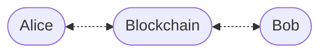

# Enygma Retail Payments Protocol

## System Entites
We assume a simple setting with three entities:
* Alice (the sender)
* Blockchain (the verification layer)
* Bob (the recipient)

  

### Adversarial Model
The goal of the adversary $$\mathcal{A}$$ is twofold: break the privacy of the system and disrupt the activity of the system. We assume that the adversary ...

---
## Key Generation

In this step, each user generates two key pairs: a view key pair (i.e., ML-KEM) and a spend key pair (i.e., a hash-based key). 

First, the user generates an ML-KEM keypair. The purpose of this key is to allow for quantum-secure key agreements in the various transactions that take place.

$$
(pk^{\text{view}}, sk^{\text{view}}) \longleftarrow \mathrm{ML\text{-}KEM.KeyGen}()
$$

Each user also generates a spend keypair:

$$
(pk^{\text{spend}}, sk^{\text{spend}}) \longleftarrow \mathrm{Hash.KeyGen}()
$$

We envision a simple key pair where the secret key is a simple preimage and the public key is a hash digest of said preimage. 

$$
sk_A^{\text{spend}} \longleftarrow \\{ 0,1\\}^\lambda
$$

$$
pk_A^{\text{spend}} = \mathrm{H}(sk_A^{\text{spend}})
$$

---
## Registration

Upon completion of the key generation stage, each user registers both public keys. Therefore, each user publishes:

$$
(id, pk_i^{\text{view}}, pk_i^{\text{spend}})
$$

The output of this stage once different users register is a public-key record layer of the following style:

| User | View Key | Spend Key |
|:----:|:--------:|:---------:|
| $A$ | $pk_A^{\text{view}}$ | $pk_A^{\text{spend}}$ |
| $B$ | $pk_B^{\text{view}}$ | $pk_B^{\text{spend}}$ |
| $\vdots$ | $\vdots$ | $\vdots$ |
| $Z$ | $pk_Z^{\text{view}}$ | $pk_Z^{\text{spend}}$ |

---

## Transaction Structure
We go over the case where Alice, who has an initial commitment $$C_{A}$$ sends Bob a payment. 
The goal of the protocol is for Alice to non-interactively have the ability to send funds to Bob. 

Each commitment is of the following form: 

$$ 
Commitment = H(pk^{\text{spend}}, salt, token_{id}, amount) 
$$

### Transaction Payload
Before proceeding with the description of the payment protocol, we higlight the tx structure of each private payment.

| Ciphertext (ML-KEM) | Destination Commitment | Change Commitment | Ciphertext (AES) | Nullifier | $\pi$ |
|:-------------------:|:----------------------:|:-----------------:|:----------------:|:---------:|:-----:|

### Retrieving Destination Keys
Before initiating a transfer, Alice must know the public keys associated with Bob. Therefore, Alice retrieves the pair $(pk_B^{\text{view}}$, $pk_B^{\text{spend}})$. 

### Transaction Amount(s)
We assume that the commitment owned by Alice (i.e., $$C_{A}$$) contains a max amount $$v$$ that Alice can spend. 
In our protocol, the sender (i.e., Alice) always sends the full amount in every transaction. The corresponding amount to the recipient and the remaining to a "change commitment". 

We denote $$v_{1}$$ the amount being sent and $$v_{2}$$ the change amount. The amount $$v = v_{1} + v_{2}$$ is the amount owned by Alice in $$C_{A}$$.

### Token IDs
Each transfer is related to a specific token ID. We enforce this by having each commitment linked to a token ID. In fact, the token ID is one of the inputs to the commitment. 

---
## Transaction Creation

### Step 1 — ML-KEM Encapsulation

Alice initiates a post-quantum key agreement step and obtains a ciphertext and a shared secret $$ss$$. 

$$
(\mathrm{ctxt}, ss) \leftarrow \mathrm{ML\text{-}KEM.Encaps}(pk_B^{\text{view}})
$$

---

### Step 2 — Hash-based Key Derivation
Upon generating the shared secret, Alice must derive two values: 

* a salt, which is used to mask/randomize the destination commitment
* a symmetric key, which is used to encrypt additional data that is appended to the transaction

We assume the existence of global system parameters: $$context_{k}$$ and $$context_{salt}$$, to be used as inputs to the Hash-based Key Derivation function to produce independent values to be used for encryption and randomness of the commitments. 

#### Deriving a symmetric key

$$
k = \mathrm{HKDF}(ss, context_{k}, len_{k})
$$

#### Deriving a salt

$$
\mathrm{salt_{B}} = \mathrm{HKDF}(ss, context_{salt}, len_{salt})
$$

---

### Step 3 — Commitment

Alice calculates the destination commitment (for Bob):

$$
\mathrm{Commitment_{B}}
= \mathrm{H}(pk_{B}^{\text{spend}} \parallel salt_{B} \parallel token_{id} \parallel v_{1})
$$

Alice calculates the change commitment (for Alice):

$$
\mathrm{Commitment_{A}}
= \mathrm{H}(pk_{A}^{\text{spend}} \parallel salt_{A} \parallel token_{id} \parallel v_{2})
$$

---

### Step 4 — Encrypt Transaction Data
We use $$[[m]]_{k}$$ to denote the symmetric encryption of message $$m$$ using key $$k$$. 

In this context, the message $$m$$ contains the information regarding the token id and the amount being transferred as demonstrated below:

$$
m = \mathrm{token\_id} \parallel \mathrm{amount}
$$

To make the variable more explicit in context, we denote the encryption of this transaction data as written below:

$$
\mathrm{[[TX_{DATA}]]_{k}} = \mathrm{AEAD.Enc}(k, m)
$$

---

### Step 5 — Nullifier

Let $\mathrm{leafIndex_{A}}$ be the index of the spent note $$C_{A}$$:

$$
nf = \mathrm{H}(sk_A^{\text{spend}} \parallel \mathrm{leafIndex}_{A})
$$

---

### Step 6 — Submission

Alice submits the following payload:

| ML-KEM.CTXT | $$\mathrm{Commitment_{B}}$$ | $$\mathrm{Commitment_{A}}$$ | $$\mathrm{[[TX_{DATA}]]_{k}}$$ | $$\mathrm{nf}$$ | $\pi$ |
|:-----------:|:---------------------------:|:---------------------------:|:------------------------------:|:---------------:|:-----:|

---

## 5. Transaction Processing (Bob)

Given $(\mathrm{ctxt}, \mathrm{commit}, \mathrm{enc})$:

### Step 1 — Private Information Retrieval
Bob performs a simple trivial private information retrieval protocol. Concretely, Bob downloads every single transaction that takes place in the network. Effectively, Bob is going to try to decrypt all transactions in the network and see if any contains funds for him. 

---

### Step 2 — ML-KEM Decapsulation
Upon downloading a transaction, Bob runs the ML-KEM Decapsulation algorithm to obtain the shared secret. We note that this operation will always return an output value. However, Bob will not be able to infer whether or not this value is valid. We address this subsequently in the protocol. 

$$
ss' \leftarrow \mathrm{ML\text{-}KEM.Decaps}(sk_B^{\text{view}}, \mathrm{ctxt})
$$

---

### Step 3 — Hash-based Key Derivation

Similarly to Alice, Bob must now derive the symmetric key and the salt from the shared secret value. 

#### Deriving a symmetric key

$$
k' = \mathrm{HKDF}(ss', context_{k}, len_{k})
$$

#### Deriving a salt

$$
\mathrm{salt'} = \mathrm{HKDF}(ss', context_{salt}, len_{salt})
$$

---

### Step 4 — Decrypt

We introduce a step to inform Bob if the shared secret is valid for this specific transaction or not. Since this is an authenticated encryption (with associated data) scheme, Bob will know if the key used to decrypt is correct as the authentication component of the cipher will succeed. 

Upon successful decryption, Bob obtains the information needed to open the received commitment (i.e., token id and received amount).

$$
(token_{id}, v') = \mathrm{AEAD.Dec}(k', \mathrm{enc}, \mathrm{ctxt})
$$

---

### Step 5 — Recompute Commitment

$$
\mathrm{Commit}' = \mathrm{Commit}(pk_B^{\text{spend}}, \mathrm{salt}', \mathrm{token\_id}, v')
$$

Accept iff:

$$
\mathrm{Commit}' = \mathrm{Commitment_{B}}
$$

Upon successful equality, Bob is now able to open the commitment and can spend the commitment using his spend key. 

---

## 7. Security Goals

* Privacy
* Auditability

---

## 8. Notes

- View keys are **ML-KEM keys (not Diffie–Hellman)**
- Single-input spend (no anonymity set)
- Recipient detection is implicit via decapsulation + AEAD check

### Zero-Knowledge Proof Remarks
The ZK proof submitted by Alice must include the following clauses:

* I am spending a commitment in the tree
* Here's a (private) Merkle Proof of inclusion to show that this commitment is part of the tree
* I know the spend key associated with the commitment being spent
* The nullifier $$nf_A$$ is obtained by hashing the spend key and the leafIndex where this commitment is located in the tree
* The destination amount is the same as the amount that I'm spending
